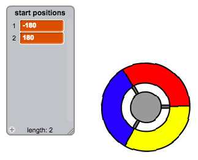
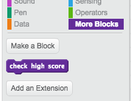

# Einführung { .intro }

In diesem Projekt lernst du, wie man ein Spiel herstellt, in welchem du die bunten Punkte dem dazu gehörigen, richtigen Teil des Controllers zuordnen musst.

<div class="scratch-preview">
  <iframe allowtransparency="true" width="485" height="402" src="https://scratch.mit.edu/projects/embed/44942820/?autostart=false" frameborder="0"></iframe>
  
</div>

# Schritt 1: Einen Controller herstellen { .activity }

Lass uns damit beginnen, einen Controller herzustellen, der dazu benutzt wird, um die Punkte einzufangen.

## Aktivitäts-Checkliste { .check }

+ Öffne das 'Catch the Dots' (Fang die Punkte) Scratch Projekt online unter <a href="http://jumpto.cc/dots-go" target="_blank">jumpto.cc/dots-go</a> oder lade es von <a href="http://jumpto.cc/dots-get" target="_blank">jumpto.cc/dots-get</a> herunter udn öffnes es dann, wenn du den offline Editor benutzt.

	Du solltest ein Controller Sprite sehen können:

	
	
	
+ Drehe deinen Controller nach rechts, wenn die rechte Pfeiltaste gedrückt wird:

	```Blöcke
		wenn Flagge geklickt wurde
		für immer
			wenn <Schlüssel [rechter Pfeil V] gedrückt?> dann
				um (3) Grad nach rechts drehen 
			beenden
		beenden
	```
+ Teste deinen Controller: Er sollte sich nach rechts drehen.

## Projekt speichern { .save }

## Aufgabe: Nach links drehen {.challenge}
Kannst du versuchen, dass dein Controller sich nach links dreht, wenn die linke Pfeiltaste gedrückt wird?

## Projekt speichern { .save }

# Schritt 2: Punkte einsammeln { .activity }

Lass uns ein paar Punkte hinzufügen, die der Spieler mit dem Controller einsammeln kann.

## Aktivitäts-Checkliste { .check }

+ Erstelle ein neues Sprite namens 'red' (rot). Dieses Sprite sollte ein kleiner roter Punkt sein.

	

+ Füge dieses Script zu deinem 'red' roten Punkt Sprite hinzu, um alle paar Sekunden einen neuen Punkt-Klon zu erstellen:

	```Blöcke
		wenn Flagge geklickt wurde
		verstecken
		(2) Sek. warten
		für immer
			erstelle einen Klon von [mir selbst V]
			(zufällig auswählen(5) bis (10)) Sek. warten
		beenden
	```

+ Wenn jeder Klon erstellt wurde, willst du, dass er in einer der 4 Ecken des Stadiums erscheint.

	

	Damit dies geschieht, musst du als erstes eine neue __Liste__ namens `start positions` {.blockdata} (Startpositionen) erstellen und auf das `(+)` klicken, um die Werte `-180` und `180` hinzuzufügen.

	

+ Du kannst diese 2 Listen-Artikel benutzen, um eine zufällige Ecke des Stadiums auszuwählen. Füge diesen Code zum 'dot' (Punkt) Sprite hinzu, sodass jeder neue Klon sich in eine zufällig ausgewählte Ecke bewegt und sich dann langsam auf den Controller zubewegt.

	```Blöcke
		wenn ich als Klon starte
		gehe zu x: (Artikel (zufällig ausgewählte V) der [Startpositionen V]) y: (Artikel (zufällig ausgewählte V) der [Startpositionen V]) 
		zeigt zum [Controller V]
		zeigen
		wiederholen bis <Berührung von [Controller V]?>
			um (1) Schritt bewegen
		beenden
	```

	Der o.g. Code wählt entweder `-180` oder `180` für die x _und_ y Positionen, was bedeutet, dass jeder Klon in einer Ecke des Stadiums beginnt.

+ Teste dein Projekt. Du solltest jetzt sehen können, dass ganz viele rote Punkte in jeder Ecke des Bildschirms erscheinen und sich langsam auf den Controller hinzubewegen.

	

+ Erstelle 2 neue Variable namens `lives` {.blockdata} (Leben) und `score` {.blockdata} (Punktzahl).

+ Füge den Code zu deinem Stadium hinzu, um die `lives` {.blockdata} Leben-Blockdaten auf 3 und die `score` {.blockdata} Punktzahl-Blockdaten auf 0 zu Beginn des Spiels einzustellen.

+ Du musst den Code zum Ende deines roten `when I start as a clone` {.blockcontrol} (wenn ich als Klon beginne) Punkt-Codes hinzufügen, damit entweder 1 zur `score` {.blockdata} (Punktzahl) des Spielers hinzugefügt wird, wenn die Farben zueinander passen oder 1 vom `lives` {.blockdata} Leben des Spielers abgezogen wird, wenn die Farben nicht zueinander passen.

	```Blöcke
		um (5) Schritt bewegen
		wenn <Farbe berühren [#FF0000]?> dann
			[Punktzahl V] um (1) ändern
			Sound [Pop V] spielen
		oder
			[Leben V] um (-1) ändern
			Sound [Laser1 V] spielen
		beenden
		diesen Klon löschen
	```

+ Füge diesen Code zum Ende deines Stadion-Scripts hinzu, damit das Spiel beendet wird, wenn der Spieler alle seine Leben verloren hat:

	```Blöcke
		warten bis <(Leben) < [1]>
		[alle V] stoppen
	```

+ Teste dein Spiel, um zu gewährleisten, dass dieser Code wie erwartet funktioniert.

## Projekt speichern { .save }

## Aufgabe: Noch mehr Punkte {.challenge}	
Kopiere dein 'red' (rotes) Punkt-Sprite zweimal und nenne die beiden neuen Sprites 'yellow' (gelb) und 'blue' (blau).


Bearbeite diese Sprites (füge deren Code hinzu), sodass jeder bunte Punkt zur richtigen Farbe auf dem Controller passt. Denk daran, dein Projekt zu testen und achte darauf, dass du jeweils zum richtigen Zeitpunkt entweder Punkte sammelst oder Leben verlierst und dass dein Spiel weder zu leicht noch zu schwer ist!


## Projekt speichern { .save }

# Schritt 3: Den Schwierigkeitsgrad steigern { .activity .new-page}

Lass uns das Spiel noch schwieriger gestalten, je länger der Spieler am Leben bleibt, indem wir langsam die Verzögerung zwischen dem Erscheinen der Punkte drosseln.

## Aktivitäts-Checkliste { .check }

+ Erstelle eine neue Variable namens`delay` {.blockdata} (Verzögerung).

+ Erstelle nun in deinem Stadium ein neues Script, welches die Verzögerung auf eine hohe Zahl einstellt und dann langsam diese Verzögerungszeit drosselt.

	```Blöcke
		wenn Flagge geklickt wurde
		[Verzögerung V] auf (8) einstellen
		wiederholen bis < (Verzögerung) = (2)>
			(10) Sek. warten
			[Verzögerung V] um (-0.5) ändern
		beenden
	```

	Merkst du, dass dies sehr ähnlich wie eine Spielzeituhr funktioniert?

+ Abschließend kannst du diese `delay` {.blockdata} (Verzögerung) Variable in deinen roten, gelben und blauen Punkten Scripts benutzen. Entferne den Code, der eine zufällig ausgewählte Zahl an Sekunden zwischen dem Erstellen von Klonen wartet und ersetze ihn mit deiner neuen `delay` {.blockdata} (Verzögerung) Variable:

	```Blöcke
		(Verzögerung) Sek. warten
	```

+ Teste deine neue `delay` {.blockdata} (Verzögerung) Variable und schau, ob die Verzögerung zwischen den einzelnen Punkten langsam gesenkt wird. Funktioniert dies bei allen 3 der bunten Punkte? Kannst du den Wert der `delay` {.blockdata} (Verzögerung) Variable sehen, wie er sich senkt?

## Projekt speichern { .save }

## Aufgabe: Sich schneller bewegende Punkte {.challenge}
Kannst du dein Spiel verbessern, indem du eine `speed` {.blockdata} (Geschwindigkeit) Variable hinzufügst, sodass die Punkte damit beginnen, sich je einen Schritt zur Zeit zu bewegen und dann langsam aber sicher schneller und schneller werden? Das funktioniert sehr ähnlich wie die `delay` {.blockdata} (Verzögrung) Variable, die du, wie o.g., benutzt hast und du kannst diesen Code benutzen, um dir hierbei zu helfen.

## Projekt speichern { .save }

# Schritt 4: Hohe Punktzahl { .activity }

Lass uns die hohe Punktzahl speichern, damit der Spieler sehen kann, wie gut sein Fortschritt ist.

## Aktivitäts-Checkliste { .check }

+ Erstelle eine neue Variable namens `high score` {.blockdata} (hohe Punktzahl).

+ Klicke auf dein Stadium und erstelle einen neuen, speziell angefertigten Block namens `check high score` {.blockmoreblocks} (hohe Punktzahl prüfen).

	

+ Füge deinen neuen, speziell angefertigten Block kurz vor Spielende hinzu.

	

+ Füge den Code zu deinem speziell angefertigten Block hinzu, um die aktuelle `score` {.blockdata}  (Punktzahl) als `high score` {.blockdata} (hohe Punktzahl) zu speichern`if` {.blockcontrol} (wenn) sie bis dahin die höchste Punktzahl ist:

	```Blöcke
		[hohe Punktzahl prüfen] definieren
		wenn <(Punktzahl) > (hohe Punktzahl)> dann
			[hohe Punktzahl V] auf (Punktzahl) einstellen
		beenden
	```

+ Teste den Code, den du hinzugefügt hast. Spiele dein Spiel, um zu prüfen, ob die `high score` {.blockdata} (hohe Punktzahl) korrekt aktualisiert wurde.

## Projekt speichern { .save }

## Aufgabe: Verbessere dein Spiel! {.challenge}
Kannst du an Wege denken, wie du dein Spiel verbessern könntest? Du könntest z. B. spezielle Punkte kreieren, die:

+ deine Punktzahl verdoppeln;
+ die Punkte verlangsamen;
+ alle anderen, sichtbaren Punkte auf dem Bildschirm verstecken!

## Projekt speichern { .save }

## Aufgabe: Spielmenü {.challenge}
Kannst du ein Menü (mit Tasten) zu deinem Spiel hinzufügen? Du könntest einen Spielanleitungsbildschirm hinzufügen oder einen separaten Bildschirm, um dort die hohe Punktzahl anzuzeigen. Falls du hierbei Hilfestellung benötigst, dann wird dir das 'Brain Game' Projekt hierbei nützlich sein.

