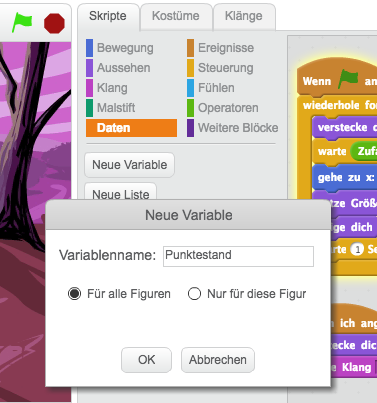
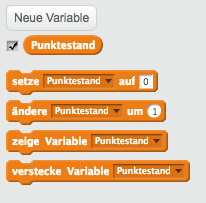
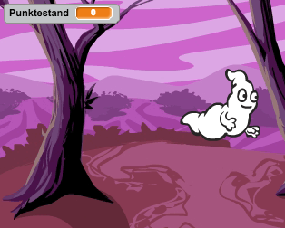
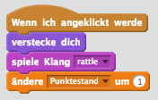
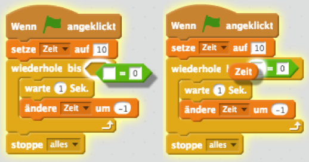
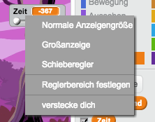
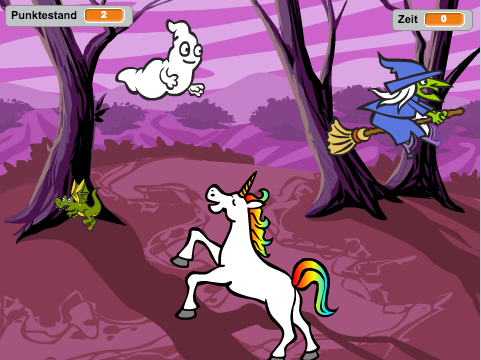

## Notiz: { .challenge .pdf-hidden }
Das 'Ballons'-Projekt wurde in den Bereich [Additional Scratch Projects](http://projects.codeclub.org.uk/en-GB/03_scratch_bonus/index.html) verschoben.

# Einführung { .intro }

Du wirst ein Gespensterjagd-Spiel machen!

<div class="scratch-preview">
  <iframe allowtransparency="true" width="485" height="402" src="http://scratch.mit.edu/projects/embed/60787262/?autostart=false" frameborder="0"></iframe>
  
</div>

# Schritt 1: Ein Gespenst bewegen { .activity }

## Arbeitsschritte { .check }

+ Starte ein neues Scratch-Projekt und lösche die Katzenfigur, so dass Dein Projekt leer ist. Du findest das Scratch-Bearbeitungsprogramm online auf <a href="http://jumpto.cc/scratch-new">jumpto.cc/scratch-new</a>.

+ Füge eine neue Gespenstfigur, sowie den passeden Bühnenhintergrund hinzu.

	

+ Füge Deinem Spiel diesen Code hinzu, um das Gespenst auftauchen und wieder verschwinden zu lassen:

	```blocks
		Wenn die grüne Flagge angeklickt
		wiederhole fortlaufend
			verstecke dich
			warte (1) Sek.
			zeige dich
			warte (1) Sek.
		Ende
	```

+ Teste Dein Gespenst, indem Du auf die grüne Fahne klickst.

## Speichere Dein Projekt { .save }

# Schritt 2: Zufällige Position { .activity }

Dein Gespenst kann ganz einfach gefangen werden, da es immer an der selben Stelle auftaucht!

## Arbeitsschritte { .check }

+ Damit dass das Gespenst nicht immer an der gleichen Stelle erscheint, kannst Du es bewegen. Hierfür sagst Du Scratch, dass es zufällige Positionen für die Koordinaten x und y vergeben soll. Füge Deinem Code einen `gehe zu` {.blockmotion} Block hinzu, so dass der Code so aussieht:

	```blocks
		Wenn die grüne Flagge angeklickt
		wiederhole fortlaufend
			verstecke dich
			warte (1) Sek.
			gehe zu x:(Zufallszahl von (-150) bis (150)) y:(Zufallszahl von (-150) bis (150))
			zeige dich
			warte (1) Sek.
		Ende
	```

+ Teste Dein Spiel und Du wirst sehen, dass das Gespenst nun jedes Mal an einer anderen Stelle auftaucht.

## Speichere Dein Projekt { .save }

## Herausforderung: Mehr Zufälligkeit {.challenge}
Kannst Du Dein Gespenst eine zufällige Zeit warten lassen, bevor es wieder auftaucht? Versuche es mit dem Befehl `warte` {.blockcontrol} und 'Zufallszahl'. Kannst Du Deinem Gespenst mit `setze Größe` {.blocklooks} jedes Mal eine zufällige Größe geben?

## Speichere Dein Projekt { .save }

# Schritt 3: Gespenster fangen { .activity }

Lass es uns dem Spieler erlauben, die Gespenster zu fangen!

## Arbeitsschritte { .check }

+ Damit der Spieler Gespenster fangen kann, füge diesen Code hinzu:

	```blocks
		Wenn ich angeklickt werde
		verstecke dich
	```

+ Teste Dein Projekt. Kannst Du die Gespenster fangen, sobald Sie auftauchen? Wenn Du es auf dem kleinen Bildschirm schwierig findest die Gespenster zu fangen, kannst Du auch in den Vollbildmodus wechseln, indem Du auf dieses Symbol klickst:

	

## Herausforderung: Klänge hinzufügen { .challenge }
Kannst Du einen Klang machen, jedes Mal, wenn das Gespenst gefangen wurde?

## Speichere Dein Projekt { .save }

# Schritt 4: Einen Punktestand hinzufügen { .activity .new-page }

Es wird noch spannender, wenn Du einen Punktestand hinzufügst!

## Arbeitsschritte { .check }

+ Um den Punktestand eines Spielers anzuzeigen, benötigst Du einen Bereich, wo dieser eingetragen werden kann. Eine __Variable__ ist solch eine Stelle, an der Daten gespeichert werden können, die sich eventuell verändern können. Wie zum Beispiel ein Punktestand.

	Um eine neue Variable zu erstellen, klicke auf den Skripte-Reiter, wähle `Daten` {.blockdata} aus und klicke auf 'Neue Variable'.

	

	Gib 'Punktestand' als den Variablennamen ein. Setze den Haken bei Für alle Figuren', damit die Punktestand-Variable für alle Figuren verfügbar ist, und klicke auf 'OK', um die Variable zu erstellen.
  Du wirst nun eine Menge Code-Blöcke sehen, die mit der Variable `Punktestand` {.blockdata} verfügbar sind.

	

	Den Punktestand siehst Du oben links in der Bühne.

	

+ Sobald ein neues Spiel startet (mit einem Klick auf die Fahne), solltest Du den Punktestand automatisch auf 0 setzen:

	```blocks
	Wenn die grüne Flagge angeklickt
	setze [Punktestand v] auf [0]
	```

+ Immer wenn ein Gespenst gefangen worden ist, ändere den Punktestand um 1:

	

+ Lasse das Programm noch einmal laufen und fange selbst einige Gespenster. Steigt Dein Punktestand?

## Speichere Dein Projekt { .save }

# Schritt 5: Eine Uhr hinzufügen { .activity }

Du kannst das Spiel noch interessanter gestalten, indem Du dem Spieler nur 10 Sekunden Zeit gibst, um so viele Gespenster wie möglich zu fangen.

## Arbeitsschritte { .check }

+ Du kannst eine weitere Variable benutzen, um die verbleibende Zeit anzeigen zu lassen. Klicke auf 'Daten' und erstelle eine neue Variable, die 'Zeit' heißt:

	

+ So sollte die Zeitanzeige funktionieren:

	+ Die Zeit sollte bei 10 Sekunden starten;
	+ Die Uhr sollte jede Sekunde runterrechnen;
	+ Die Uhr sollte bei 0 stoppen.

	Das ist der Code, den Du zu Deiner __Bühne__ hinzufügen kannst:

	```blocks
		Wenn die grüne Flagge angeklickt
		setze [Zeit v] auf [10]
		wiederhole bis <(Zeit) = [0]>
			warte (1) Sek.
			ändere [Zeit v] um (-1)
		Ende
		stoppe [alles v]
	```

	So fügst Du den Code `wiederhole bis`{.blockcontrol}`Zeit`{.blockdata}`= 0`{.blockoperators} hinzu:

	

+ Ziehe Deine 'Zeit'-Variable auf die rechte Seite der Bühne. Mit einem Rechtsklick kannst Du die Darstellung der Zeitvariable verändern.

	

+ Bitte Deine Familie oder Freunde, das Spiel zu testen. Wie viele Punkte können Sie erreichen? Wenn das Spiel zu einfach ist, kannst Du:

	+ Dem Spieler weniger Zeit geben;
	+ Das Gespenst seltener auftauchen lassen;
	+ Das Gespenst kleiner machen.

	Teste Dein Spiel einige Male, bis Du mit dem Schwierigkeitsgrad zufrieden bist.

## Speichere Dein Projekt { .save }

## Herausforderung: Mehr Figuren {.challenge}
Kannst Du mehr Figuren in Dein Spiel hinzufügen?



Zunächst musst Du über die Figuren nachdenken, die Du hinzufügen möchtest:

+ Wie groß sollen sie sein?
+ Werden sie öfter oder seltener als Dein Gespenst erscheinen?
+ Wie werden sie aussehen und klingen, wenn sie gefangen wurden?
+ Wie viele Punkte bekommt man, wenn man sie gefangen hat oder sie entwischt sind?

Wenn Du eine neue Figur hinzufügen möchtest, gehe einfach die Schritte von oben noch einmal durch!

## Speichere Dein Projekt { .save }

## Community Contributed Translation { .challenge .pdf-hidden }

This project was translated by Anastasia Heilmann. Our amazing translation volunteers help us give children around the world the chance to learn to code.  You can help us reach more children by translating a Code Club project via [Github](https://github.com/CodeClub/curriculum_documentation/blob/master/contributing.md) or by getting in touch with us at hello@codeclubworld.
