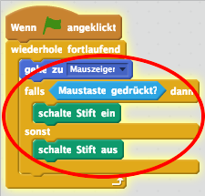
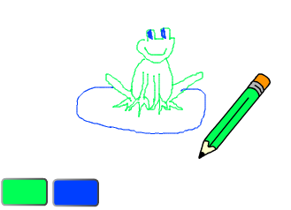
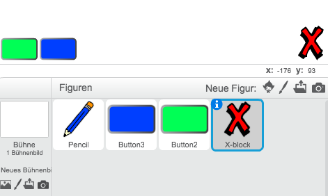
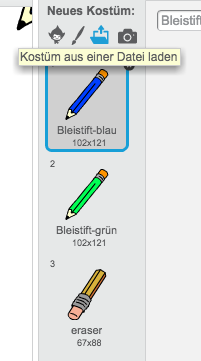
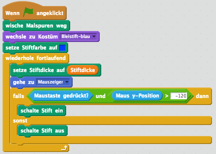
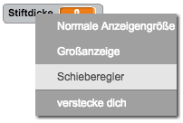
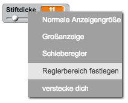
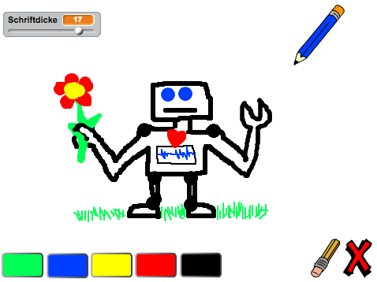

# Einführung { .intro }

In diesem Projekt wirst Du Dein eigenes Zeichen-Programm entwickeln!

<div class="scratch-preview">
  <iframe allowtransparency="true" width="485" height="402" src="http://scratch.mit.edu/projects/embed/63473366/?autostart=false" frameborder="0"></iframe>
  
</div>

# Schritt 1: Einen Bleistift entwerfen { .activity }

Lass uns damit starten, dass wir einen Bleistift entwerfen, mit dem man auf der Bühne zeichnen kann.

## Arbeitsschritte { .check }

+ Starte ein neues Scratch-Projekt und lösche die Katzenfigur, so dass Dein Projekt leer ist. Du findest das Scratch-Bearbeitungsprogramm online auf <a href="http://jumpto.cc/scratch-new">jumpto.cc/scratch-new</a>.

+ Füge Deinem Projekt diese Bleistift-Figur hinzu:

	

+ Klicke auf 'Kostüm' und lösche das 'Bleistift-b'-Kostüm.

	

+ Benenne Dein Kostüm in 'Bleistift-blau' um und benutze das 'Eine Kontur einfärben'-Werkzeug, um das Kostüm blau einzufärben.

	

+ Da Du die Maus zum Zeichnen benutzen wirst, möchtest Du, dass der Stift immer bzw. `wiederhole fortlaufend` {.blockcontrol} der Maus folgt. Füge Deiner Bleistift-Figur diesen Code hinzu:

	```blocks
      Wenn die grüne Flagge angeklickt
      wiederhole fortlaufend
       gehe zu [Mausanzeiger v]
      Ende
	```

+ Teste den Code, indem Du auf die Fahne klickst und die Maus auf der Bühne hin und her bewegst. Funktioniert es so, wie Du es Dir vorgestellt hast?

+ Hast Du bemerkt, dass es die Mitte des Bleistifts und nicht die Spitze ist, die der Mausbewegung folgt?

	

	Um dies zu ändern, klicke auf das 'Bleistift-blau'-Kostüm Deiner Bleistift-Figur und dann auf das 'Drehpunkt des Kostüms'-Symbol.

	

+ Du solltest feststellen, dass ein Kreuz erscheint. Du kannst nun knapp unter die Spitze des Bleistiftes klicken, um diese Stelle als das Zentrum der Figur zu definieren (Achtung: Nicht direkt auf die Bleistiftspitze klicken, da der Bleistift so nicht korrekt zeichnen wird).

	

+ Klicke auf den Skripte-Reiter und teste erneut Deinen Bleistift. Funktioniert es nun besser als zuvor?

+ Als nächstes, lass uns Deinen Bleistift zeichnen lassen, `wenn` {.blockcontrol} die Maus geklickt wird. Füge diesen Code Deiner Bleistift-Figur hinzu:

	

+ Teste wieder Deinen Code. Bewege dieses Mal den Bleistift auf der Bühne, während Du die Maustaste gedrückt hältst. Kannst Du mit Deinem Bleistift malen?

	

## Speichere Dein Projekt { .save }

# Schritt 2: Farbige Stifte { .activity }

Lass uns Deinem Projekt unterschiedlich farbige Bleistifte hinzufügen und es dem Nutzer so erlauben zwischen Ihnen zu wechseln.

## Arbeitsschritte { .check }

+ Klicke auf Deine Bleistift-Figur, klicke dann auf 'Kostüme' und dupliziere das 'Bleistift-blau'-Kostüm.

	

+ Benenne Dein Kostüm in 'Bleistift-grün' um und füge ihm grün als Farbe hinzu.

	

+ Erstelle zwei neue Figuren, welche Du benutzen wirst, um eine Farbe auszuwählen.

	

+ Wenn das Grün-Auswahl-Symbol angeklickt ist, musst Du der Bleistift-Figur die Nachricht senden (`sende an alle` {.blockevents}), die ihm mitteilt die Bleistiftfarbe in grün umzuwandeln.

Um dies zu tun, füge dem Grün-Auswahl-Symbol diesen Code hinzu:

	```blocks
        Wenn ich angeklickt werde
        sende [grün v] an alle
	```

	Um einen `sende an alle` {.blockevents}-Block zu erstellen, klicke auf den nach unten zeigenden Pfeil und wähle 'Neue Nachricht...' aus.

	

	Du kannst nun 'grün' eintippen, um Deine neue Nachricht zu erstellen.

	

+ Du musst Deiner Bleistift-Figur nun mitteilen was zu tu ist, wenn sie diese Nachricht erhält. Füge Deiner Figur diesen Code hinzu:

	```blocks
      Wenn ich [grün v] empfange
      wechsle zu Kostüm [Bleistift-grün v]
      setze Stiftfarbe auf [#00ff00]
	```

Um die Stiftfarbe auf grün zu setzen, klicke die grün gefärbte Box in dem `setze Schriftfarbe auf` {.blockpen}-Block an und klicke anschließend auf das Grün-Auswahl-Symbol.

+ Du kannst nun das Gleiche mit dem blauen Bleistift-Symbol tun, indem Du diesen Code zu der Blau-Auswahl-Figur hinzufügst:

	```blocks
      Wenn ich angeklickt werde
      sende [blau v] an alle
	```

	...und indem Du diesen Code zu der Bleistift-Figur hinzufügst:

	```blocks
      Wenn ich [blau v] empfange
      wechsle zu Kostüm [Bleistift-blau v]
      setze Stiftfarbe auf [#0000ff]
	```

+ Zuletzt musst Du Deiner Bleistift-Figur sowohl mitteilen, welches Kostüm und welche Stiftfarbe sie wählen soll, als auch den Bildschirm zu leeren, sobald ein neues Projekt begonnen wird. Füge diesen Code an den Anfang des `Wenn die grüne Flagge angeklickt` {.blockevents}-Code des Bleistifts hinzu (vor die `wiederhole fortlaufend` {.blockcontrol}-Schleife):

	```blocks
      wische Malspuren weg
      wechsle zu Kostüm [blau-Bleistift v]
      setze Stiftfarbe auf [#0000ff]
	```

	Wenn Du magst, kannst Du auch mit einer anderen Farbe anfangen!

+ Teste Dein Projekt. Kannst Du zwischen dem grünen und dem blauen Stift hin und her wechseln?

	

##  { .save }

# Schritt 3: Fehler machen { .activity .new-page }

Manchmal passieren Fehler. Lass uns also unserem Projekt einen 'wische Malspuren weg'-Knopf hinzufügen!

## Arbeitsschritte { .check }

+ Lass uns einen Knopf hinzufügen und die Bühne leeren. Um dies zu tun, füge die 'X-block'´-Buchstaben-Figur zu der Bühne hinzu und färbe sie rot.

	

+ Füge Deinem 'wische Malspuren weg'-Knopf diesen Code hinzu, damit die Bühne geleert wird, sobald dieser angeklickt wird:

	```blocks
      Wenn ich angeklickt werde
      wische Malspuren weg
	```

	Bemerke, dass Du keine Nachricht versenden musst, um die Bühne zu leeren, da jede Figur diese Fähigkeit besitzt.

+ Du kannst auch einen Radiergummi erstellen. Wenn der Club-Leiter euch einen 'Resources'-Ordner gegeben hat, klicke auf 'Figur aus einer Datei laden' und füge das 'eraser.svg'-Bild hinzu.

	

	Wenn Du das 'eraser.svg'-Bild nicht hast, erstelle stattdessen einfach einen neuen weißen Stift.

+ Du solltest das Radiergummi-Bild auch als eine neue Auswahl-Figur hinzufügen. So sollte Deine Bühne nun aussehen:

	

+ Du kannst die Radiergummi-Auswahl-Figur von 'eraser' zu 'Radiergummi' umbenennen, den Drehpunkt des Radiergummis kurz vor die Radiergummi-Spitze setzen (wie beim Bleistift) und dem Radiergummi diesen Code hinzufügen, um dem Stift mitzuteilen, zum Radiergummi zu wechseln:

	```blocks
  Wenn ich angeklickt werde
  sende [Radiergummi v] an alle
	```

+ Damit, sobald der Stift die Nachricht erhält, er zum Radiergummi wechselt und die Stiftfarbe ändert, füge ihm diesen Code hinzu:

	```blocks
  Wenn ich [Radiergummi v] empfange
  wechsle zu Kostüm [Radiergummi v]
  setze Stiftfarbe auf [#FFFFFF]
	```

+ Teste Dein Projekt, um zu sehen, ob Du die Bühne leeren und radieren kannst.

	

+ Es gibt noch ein kleines Problem mit dem Sift: Du kannst überall auf der Bühne malen, auch neben den Auswahl-Symbolen.

	

	Um dieses Problem zu lösen, musst Du dem Stift sagen nur dann zu malen, wenn die Maus angeklickt wird _und_ wenn die y-Position der Maus größer als -110 (`Maus y-Position`{.blocksensing}`> -120` {.blockoperators}) ist. Ändere die `wenn` {.blockcontrol}-Aussage Deines Stifts zu:

	

+ Teste Dein Projekt. Es sollte nun nicht mehr möglich sein in unmittelbarer Nähe der Auswahl-Blöcke zu malen.

	

## Speichere Dein Projekt { .save }

# Schritt 4: Die Stift-Dicke ändern { .activity .new-page }

Lass es uns dem Nutzer erlauben eine Vielzahl an unterschiedlichen Stiftdicken zu nutzen.

## Arbeitsschritte { .check }

+ Füge als Erstes eine neue Variable 'Stiftdicke' hinzu. Wenn Du Dir unsicher bist, wie das geht, wird Dir das Ballons-Projekt auf die Sprünge helfen.

+ Füge diese Code-Linie _innerhalb_ die `wiederhole fortlaufend` {.blockcontrol}-Schleife Deines Stift-Codes hinzu:

	```blocks
    setze Stiftdicke auf (Stiftdicke)
	```

	Die Dicke des Stiftes wird nun auf den Wert Deiner 'Stiftdicke'-Variable gesetzt.

+ Du kannst die vorgegebene Nummer der Variable mit einem Rechtsklick auf die Variable (auf der Bühne) und mit einem Klick auf 'Schieberegler' ändern.

	

	Du kannst nun den Schieberegler unter die Variable ziehen, um deren Wert zu ändern.

	

+ Teste Dein Projekt und siehe, ob Du die Stiftdicke verändern kannst.

	

	Wenn Du möchtest, kannst Du die Minimum- und Maximumdicke, die erlaubt ist, festlegen. Um dies zu tun, führe wieder einen Rechtsklick auf die Variable aus und wähle 'Regelbereich festlegen'. Setze den Minimum- und Maximumwert der Variable zu etwas sinnvollem wie 1 und 20.

	

	Teste solange weiter, bis Du mit der 'Stiftdicke'-Variable zufrieden bist.

## Speichere Dein Projekt { .save }

## Herausforderung: Tastenkürzel { .Herausforderung }
Kannst Du Tastenkürzel für Deine Befehle erstellen? Zum Beispiel:

+ b = Zum blauen Stift wechseln
+ g = Zum grünen Stift wechseln
+ r = Zum Radiergummi wechseln
+ l = Bühne leeren

Du kannst es dem User sogar erlauben, die Stiftdicke mit den Pfeil-Tasten zu verändern!

## Speichere Dein Projekt { .save }

## Herausforderung: Mehr Stifte { .Herausforderung }
Kannst Du rote, gelbe und schwarze Stifte zu dem Zeichen-Programm hinzufügen? Die Bilder, die Du hierfür brauchst, findest Du in dem Ressourcen-Ordner. Vergesse nicht Tastenkürzel für die Stifte hinzuzufügen!

Kannst Du mit den Stiften ein Bild malen?


