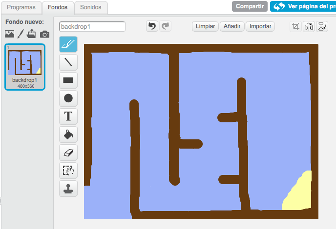
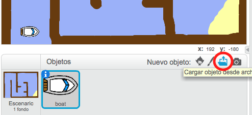
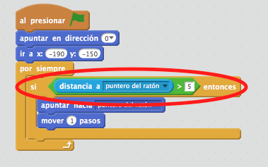
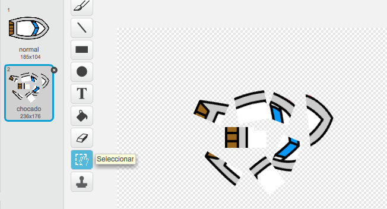
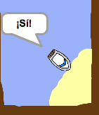
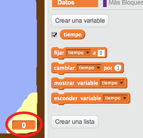
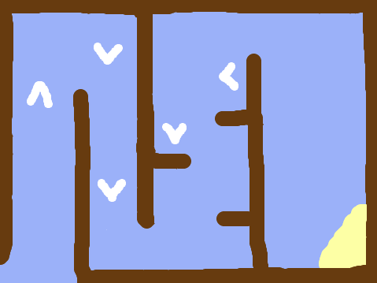
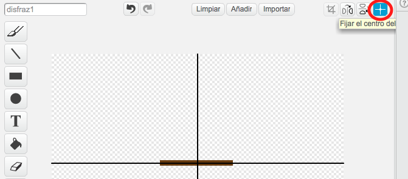
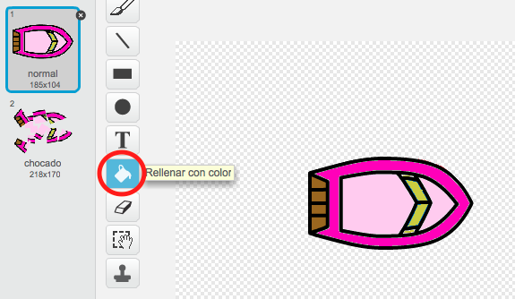

---
title: Carrera de botes
level: Scratch 1
language: es-ES
stylesheet: scratch
embeds: "*.png"
materials: ["Recursos para el líder del Club /*.*","Recursos del Proyecto /*.*"]
...

# Introducción { .intro }

Vas a aprender cómo crear un juego en el cual usarás el ratón para navegar tu bote a una isla desierta.

<div class="scratch-preview">
  <iframe allowtransparency="true" width="485" height="402" src="http://scratch.mit.edu/projects/embed/63957956/?autostart=false" frameborder="0"></iframe>
  
</div>

# Primer paso: Cómo planificar el juego { .activity }

## Lista de verificación de actividades { .check }

+ Comienza un nuevo proyecto Scratch, y borra el objeto gato para que tu proyecto esté vacío. Puedes encontrar el editor en línea de Scratch en <a href="http://jumpto.cc/scratch-new">jumpto.cc/scratch-new</a>.

+ Haz clic en el fondo de tu escenario y planifica tu nivel. Deberías agregar:
	+ Madera que tu bote tiene que evitar;
	+ Una isla desierta a la que tu bote tiene que llegar.

	Tu juego podría verse algo así:

	

# Segundo paso: Cómo controlar el bote { .activity }

## Lista de verificación de actividades { .check }

+ Si el líder de tu club te dio una carpeta de 'Recursos', haz clic en 'Cargar objeto del expediente' y agrega la imagen 'boat.png'. Deberías achicar el objeto y ubicarlo en la posición de comienzo.

	

	Si no tienes la imagen boat.png, ¡puedes dibujar tu propio bote!

+ Vas a controlar el bote con tu ratón. Agrega este código a tu bote:

	```blocks
		al presionar bandera verde
		apuntar en dirección (0 v)
		ir a x: (-190) y: (-150)
		por siempre
			apuntar hacia [puntero del mouse v]
			mover (1) pasos
		fin
	```

+ Prueba tu bote haciendo clic en la bandera y moviendo el ratón. ¿Navega el bote hacia el ratón?

	

+ ¿Qué sucede si el bote llega al apuntador del ratón?

	Para que esto no suceda, necesitarás agregar un bloque 'si'{.blockcontrol} a tu código, para que el bote solo se mueva si está a más de 5 píxeles del ratón.

	

+ Prueba tu bote una vez más para ver si el problema ha sido resuelto.

## Guarda tu proyecto { .save }

# Tercer paso: ¡Choques! { .activity .new-page }

¡Tu bote puede navegar a través de barreras de madera! Arreglemos eso.

## Lista de verificación de actividades { .check }

+ Necesitarás 2 disfraces para tu bote, uno normal y otro para cuando el bote choca. Duplica el disfraz de tu bote y nómbralos 'normal' y 'chocado'.

+ Haz clic en tu disfraz 'chocado', y elige la herramienta 'Seleccionar' para tomar partecitas del bote y moverlas y rotarlas por todos lados. Haz que parezca que tu bote ha chocado.

	

+ Agrega este código a tu bote, dentro del loop `por siempre` {.blockcontrol}, para que choque cuando toca cualquier trocito de madera marrón:

	```blocks
	si <¿tocando el color [#603C15]?> entonces
   		cambiar disfraz a [hit v]
   		decir [Noooooo!] por (1) segundos
   		cambiar disfraz a [normal v]
   		apuntar en dirección (0 v)
   		ir a x:(-215) y:(-160)
	fin
	```

	Este código está dentro del loop `por siempre` {.blockcontrol}, para que tu código constantemente verifique si tu bote ha chocado.

+ También deberías asegurarte de que al comienzo tu bote siempre se vea 'normal'.

+ Ahora si tratas de navegar a través de una barrera de madera, deberías ver que tu bote choca y vuelve al inicio.

	

## Guarda tu proyecto { .save }

## Desafío: ¡Ganar! {.challenge}
¿Puedes agregar otra declaración `si` {.blockcontrol} al código de tu bote, para que el jugador gane cuando llegue a la isla desierta?

Cuando el bote llega a la isla desierta amarilla, debería decir 'YEAH!' y el juego debería terminar. Tendrás que usar este código:

```bloques
	decir [YEAH!] por (1) segundos
	terminar [all v]
```



## Guarda tu proyecto { .save }

## Desafío: Efectos de sonido {.challenge}
Puedes agregar efectos de sonido a tu juego para cuando el bote choca y para cuando llega a la isla al final del juego. Incluso puedes agregar música de fondo (si necesitas ayuda con esto mira el proyecto 'Banda de Rock' anterior).

## Guarda tu proyecto { .save }

# Cuarto paso: Prueba del cronómetro { .activity }

Agreguemos a tu juego un crnómetro, para que el jugador tenga que llegar a la isla lo más rápido posible.

## Lista de verificación de actividades { .check }

+ Agrega a tu escenario una nueva variable que se llame `tiempo` {.blockdata}. También puedes cambiar cómo se ve tu nueva variable. Si necesitas ayuda, mira el proyecto "Globos".

	

+ Agrega este código a tu __escenario__, para que el cronómetro cuente hasta que el bote llega a la isla desierta:

	```blocks
		al presionar bandera verde
		fijar [time v] a [0]
		por siempre
			esperar (0.1) segundos
			cambiar [time v] por (0.1)
		fin
	```

+ ¡Ya está! ¡Prueba tu juego para ver qué tan rápido puedes llegar a la isla desierta!

	

## Guarda tu proyecto { .save }

# Quinto paso: Obstáculos y fuentes de energía { .activity }

Este juego es _demasiado_ fácil – agreguemos cosas para hacerlo más interesante.

## Lista de verificación de actividades { .check }

+ Primero agreguemos algunos "estímulos" a tu juego, que harán que el bote navegue más rápido. Edita el fondo de tu scenario y agrega algunas flechas blancas de energía.

	

+ Ahora puedes agregar código al loop `por siempre` {.blockcontrol} de tu bote, para que se mueva 2 _pasos extra_ cada vez que toca una fuente de energía blanca.

	```blocks
	si <¿tocando el color [#FFFFFF]?> entonces
   		mover (3) pasos
	fin
	```

+ También puedes agregar una puerta giratoria, que tu bote tiene que evitar. Agrega un nuevo objeto que se llame 'puerta', y que se vea así:

	

	Asegúrate de que el color de la puerta sea igual al color de las otras barreras de madera.

+ Fija el centro del objeto puerta.

	

+ Agrega código a tu puerta para hacerla que lentamente gire `por siempre` {.blockcontrol}.

+ Prueba tu juego. Ahora deberías tener una puerta giratoria que tienes que evitar.

	

## Guarda tu proyecto { .save }

## Desafío: ¡Más obstáculos! {.challenge .new-page}
¿Puedes agregar más obstáculos a tu juego? Aquí te damos algunas ideas:

+ Podrías agregar cieno verde a tu scenario, lo que frena al jugador cuando lo toca. Para hacerlo puedes usar un bloque `espera` {.blockcontrol}:

	```blocks
		esperar (0.01) segundos
	````


+ ¡Podrías agregar un objeto en movimiento, como un tronco o un tiburón!


Estos bloques pueden ayudarte:

	```blocks
		mover (1) pasos
		rebotar si toca un borde
	````

Si tu nuevo objeto no es marrón, tendrás que agregar esto al código de tu bote:
	
	```blocks
	si <<¿tocando el color [#603C15]?> o <¿tocando [shark v]?>> entonces
	fin
	```

## Guarda tu proyecto { .save }

## Desafío: ¡Más botes! {.challenge .new-page}
¿Puedes convertir tu juego en una carrera entre 2 jugadores?

+ Duplica el bote, renómbralo 'Jugador 2' y cámbiale el color.



+ Cambia este código para cambiar la posición de comienzo del Jugador 2:

	```blocks
		ir a x: (-190) y: (-150)
	```

+ Borra el código que usa el ratón para controlar el bote:

	```blocks
		si < (distancia a [puntero del mouse v]) > [5] > entonces
			apuntar hacia [apuntador del ratón v]
			mover (1) pasos
		fin
	```

...y reemplázalo con código para controlar el bote usando las teclas de flechas.

Este es el código que necesitas para mover el bote hacia adelante:

	```blocks
		si <¿tecla [flecha arriba v] presionada?> entonces
   		mover (1) pasos
	fin
	```

También necesitarás un código para `doblar` {.blockmotion} el bote cuando se presionan las teclas de flechas izquierda y derecha.

## Guarda tu proyecto { .save }

## Desafío: ¡Más niveles! {.challenge .new-page}
¿Puedes crear escenarios adicionales y permitirle al jugador que elija entre niveles?

	```blocks
		al presionar tecla [espacio v]
		siguiente fondo
	```

## Guarda tu proyecto { .save }

## Community Contributed Translation { .challenge .pdf-hidden }

This project was translated by María Alejandra Aguada from Translators Without Borders. Our amazing translation volunteers help us give children around the world the chance to learn to code.  You can help us reach more children by translating a Code Club project via [Github](https://github.com/CodeClub/curriculum_documentation/blob/master/contributing.md) or by getting in touch with us at hello@codeclubworld.
