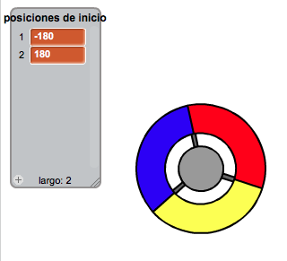
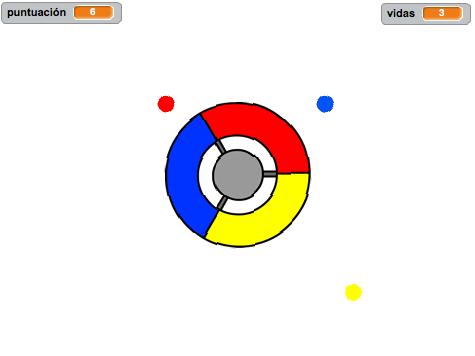
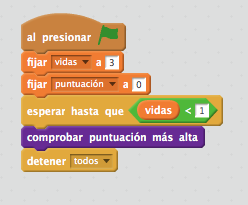

# Introducción { .intro }

En este proyecto vas a aprender a crear un juego en el que tendrás que hacer coincidir puntos de colores con la parte correcta del controlador.

<div class="scratch-preview">
  <iframe allowtransparency="true" width="485" height="402" src="https://scratch.mit.edu/projects/embed/44942820/?autostart=false" frameborder="0"></iframe>
  
</div>

# Paso 1: Crear un controlador { .activity }

Empezaremos por crear un controlador, que usaremos para recoger los puntos.

## Lista de tareas de la actividad { .check }

+ Empieza un nuevo proyecto de Scratch, y elimina el objeto gato para que el proyecto esté vacío. Puedes encontrar el editor en línea de Scratch en <a href="http://jumpto.cc/scratch-new">jumpto.cc/scratch-new</a>.

+ Si el líder de tu club te ha dado una carpeta de 'Recursos', haz clic en 'Cargar objeto desde archivo' y añade la imagen 'controller.svg'. Tendrás que mover el objeto al centro del escenario.

	

	Si no tienes esta imagen, ¡puedes dibujarla tú!

+ Haz que el controlador gire hacia la derecha cuando presiones la tecla de flecha derecha:

	```blocks
		al presionar bandera verde
		por siempre
   			si <¿tecla [flecha derecha v] presionada?> entonces
      			girar ↻ (3) grados
   			fin
		fin
	```
+ Prueba tu controlador. Debería girar hacia la derecha.

## Guarda tu proyecto { .save }

## Desafío: Girar hacia la izquierda {.challenge}
¿Puedes hacer que el controlador gire hacia la izquierda cuando se presione la tecla de flecha izquierda?

## Guarda tu proyecto { .save }

# Paso 2: Recoger puntos { .activity }

Vamos a añadir algunos puntos que el jugador tendrá que recoger con el controlador.

## Lista de tareas de la actividad { .check }

+ Crea un nuevo objeto llamado 'rojo'. Este objeto debería ser un pequeño punto rojo.

	

+ Añade estas instrucciones al objeto punto 'rojo', para que se cree un nuevo clon del punto cada determinados segundos:

	```blocks
		al presionar bandera verde
		esperar (2) segundos
		por siempre
   			crear clon de [mí mismo v]
   			esperar (número al azar entre (5) y (10)) segundos
		fin
	```

+ Cuando se crea un clon, queremos que aparezca en una de las 4 esquinas del escenario.

	

	Para hacer esto, primero tendrás que crear una nueva lista llamada `posiciones de inicio` {.blockdata} y hacer clic en `(+)` para añadir los valores `-180` y `180`.

	

+ Puedes usar estos dos elementos de la lista para escoger una esquina del escenario al azar. Añade este código al objeto 'punto', para que todos los nuevos clones vayan a una esquina al azar y a continuación se muevan lentamente hacia el controlador.

	```blocks
		al comenzar como clon
		ir a x:(elemento (al azar v) de [posiciones de inicio v]) y:(elemento (al azar v) de [posiciones de inicio v])
		apuntar hacia [controller v]
		mostrar
		repetir hasta que <¿tocando [controller v]?>
   			mover (1) pasos
		fin
	```

	Este código escoge `-180` o bien `180` para las posiciones x _e_ y, lo que significa que todos los clones empezarán en una de las esquinas del escenario.

+ Prueba tu proyecto. Deberías de ver cómo aparecen un montón de puntos rojos en cada una de las esquinas del escenario y se mueven lentamente hacia el controlador.

	

+ Crea 2 nuevas variables con los nombres `vidas` {.blockdata} y `puntuación` {.blockdata}.

+ Añade código al escenario para fijar las `vidas` {.blockdata} a 3 y la `puntuación` {.blockdata} a 0 cuando empieza el juego.

+ Tendrás que añadir instrucciones al final del código del punto rojo `al comenzar como clon` {.blockcontrol}, para que o se sume 1 a la `puntuación` {.blockdata} del jugador si los colores coinciden, o se reste 1 de las `vidas` {.blockdata} del jugador si los colores no coinciden.

	```blocks
		mover (5) pasos
		si <¿tocando el color [#FF0000]?> entonces
   			cambiar [puntuación v] por (1)
   			tocar sonido [pop v]
		si no
   			cambiar [vidas v] por (-1)
   			tocar sonido [laser1 v]
		fin
		borrar este clon
	```

+ Añade este código al final de las instrucciones del escenario, para que el juego termine cuando el jugador pierda todas las vidas:

	```blocks
		esperar hasta que <(vidas) < [1]>
		detener [todos v]
	```

+ Prueba tu juego para asegurarte de que el código funciona correctamente.

## Guarda tu proyecto { .save }

## Desafío: Más puntos {.challenge}
Duplica el punto 'rojo' dos veces, y llama a los dos nuevos objetos 'amarillo' y 'azul'.


Edita estos objetos (incluido el código), para que el color de cada uno de los puntos tenga que coincidir con el color correcto del controlador. Recuerda probar el proyecto, y comprueba si consigues puntos y pierdes vidas cuando corresponde, ¡y que el juego no sea demasiado fácil ni difícil!



## Guarda tu proyecto { .save }

# Paso 3: Aumentar la dificultad { .activity .new-page}

Vamos a hacer que el juego sea más difícil cuanto más tiempo consiga sobrevivir el jugador, reduciendo lentamente el intervalo entre los puntos que aparecen.

## Lista de tareas de la actividad { .check }

+ Crea una nueva variable con el nombre `intervalo` {.blockdata}.

+ En el escenario, crea nuevo código que fije el intervalo en un número alto, y que lentamente vaya reduciendo el valor del intervalo.

	```blocks
		al presionar bandera verde
		fijar [intervalo v] a (8)
		repetir hasta que <(intervalo) = (2)>
   			esperar (10) segundos
   			cambiar [intervalo v] por (-0.5)
		fin
	```

	¡Fíjate que esto es muy parecido a cómo funciona un cronómetro en el juego!

+ Para acabar, puedes utilizar la variable `intervalo` {.blockdata} en el código de tus puntos rojo, amarillo y azul. Elimina el código que espera un número al azar de segundos para crear clones, y sustitúyelo con tu nueva variable `intervalo` {.blockdata}:

	```blocks
		esperar (intervalo) segundos
	```

+ Prueba tu nueva variable `intervalo` {.blockdata}, y comprueba si el intervalo entre los puntos se reduce lentamente. ¿Funciona para los 3 puntos de colores? ¿Puedes ver cómo se reduce el valor de la variable `intervalo` {.blockdata}?

## Guarda tu proyecto { .save }

## Desafío: Puntos que se mueven más rápido {.challenge}
¿Puedes mejorar el juego añadiendo una variable de `velocidad` {.blockdata}, para que los puntos empiecen moviéndose 1 paso cada vez y progresivamente se muevan cada vez más rápido? Esto funcionará de una forma muy parecida a la variable de `intervalo` {.blockdata} que hemos usado arriba, y puedes utilizar ese código como ayuda.

## Guarda tu proyecto { .save }

# Paso 4: Puntuación más alta { .activity }

Vamos a guardar la puntuación más alta, para que los jugadores vean qué tal lo están haciendo.

## Lista de tareas de la actividad { .check }

+ Crea una nueva variable con el nombre `puntuación más alta` {.blockdata}.

+ Haz clic en el escenario, y crea un nuevo bloque personalizado que se llame `comprobar puntuación más alta` {.blockmoreblocks}.

	

+ Justo antes de que acabe el juego, añade tu nuevo bloque personalizado.

	

+ Añade código a tu bloque personalizado para guardar la `puntuación` {.blockdata} actual como la `puntuación más alta` {.blockdata} `si` {.blockcontrol} es la máxima puntuación hasta el momento:

	```blocks
		definir [comprobar puntuación más alta]
		si <(puntuación) > (puntuación más alta)> entonces
   			fijar [puntuación más alta v] a (puntuación)
		fin
	```

+ Prueba el código que has añadido. Juega para comprobar si la `puntuación más alta` {.blockdata} se actualiza correctamente.

## Guarda tu proyecto { .save }

## Desafío: ¡Mejora tu juego! {.challenge}
¿Se te ocurren maneras de mejorar tu juego? Por ejemplo, podrías crear puntos especiales que:

+ dupliquen tu puntuación;
+ reduzcan la velocidad de los puntos;
+ ¡hagan desaparecer al resto de puntos en la pantalla!

## Guarda tu proyecto { .save }

## Desafío: Menú del juego {.challenge}
¿Puedes añadir un menú (con botones) a tu juego? Podrías añadir una pantalla de instrucciones, o una pantalla aparte para mostrar la puntuación más alta. Si necesitas ayuda con esto, el proyecto 'Juego de cálculo mental' puede ser útil.

## Community Contributed Translation { .challenge .pdf-hidden }

This project was translated by Montse Verdaguer. Our amazing translation volunteers help us give children around the world the chance to learn to code.  You can help us reach more children by translating a Code Club project via [Github](https://github.com/CodeClub/curriculum_documentation/blob/master/contributing.md) or by getting in touch with us at hello@codeclubworld.
