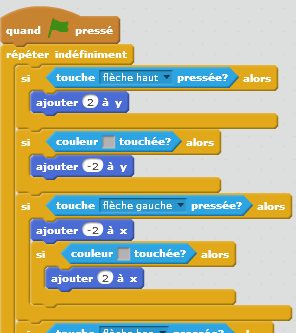
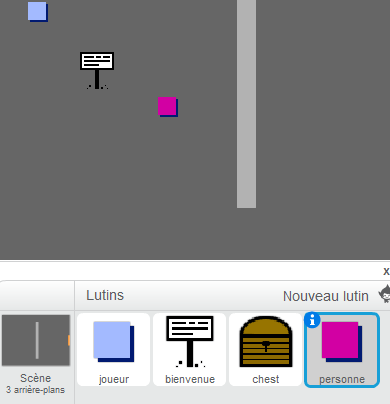
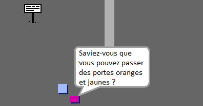
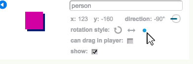
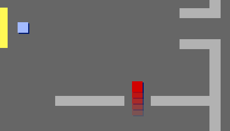

---
title: Créez votre monde
level: Scratch 2
language: fr-FR
stylesheet: scratch
embeds: "*.png"
materials: ["Club Leader Resources/*.*","Project Resources/*.*"]
...

# Introduction { .intro }

Ce projet te permettra d'apprendre comment créer ton propre monde pour un jeu d'aventure. 

<div class="scratch-preview">
  <iframe allowtransparency="true" width="485" height="402" src="http://scratch.mit.edu/projects/embed/34248822/?autostart=false" frameborder="0"></iframe>
  
</div>

# Première étape : Coder ton joueur { .activity }

Commençons par créer un personnage qui se deplacera dans ton monde. Let's start by creating a player that can move around your world.

## Liste d'action pour l'activité { .check }

+ Lance un nouveau project Scratch et efface l'image du Lutin Félix le chat pour que ton projet soit vide. Tu peux trouver l'editeur Scratch en ligne sur  <a href="http://jumpto.cc/scratch-new">jumpto.cc/scratch-new</a>.

+ Pour ce projet, tu devrais trouver un dossier "ressources projet" contenant toutes les images dont tu aura besoin. Assures toi de bien l'avoir et contactes le leader de ton club si tu ne le trouves pas.

	

+ Ajoutes l'image "Salle1.png" comme arrière-plan et utilises l'image "Joueur1.png" comme photo de ton nouveau personnage. Si tu ne trouves pas ces images, dessines les toi même! Voici ce a quoi ton projet devrait maintenant ressembler:

	

+ Utilisons les touches flèches pour faire bouger le personnage. Lorsque le joueur appuye sur le flèche du haut, le personnage doit monter. Cela se fait en changeant ses coordonnées Y. Ajoutes ce code au personnage :

	```blocks

quand ⚑ pressé
répéter indéfiniment
   si <touche [flèche haut v] pressée?> alors
      ajouter (2) à y
   fin
fin
	```
+ Test ton personnage en cliquant le drapeau puis en maintenant la flèche du haut appuiée. Est ce que ton personnage monte?

	

+ Pour que ton personnage bouge vers la gauche, tu dois ajouter un nouveau code `if` {.blockcontrol}, qui modifiera les coordonnées X de ton personnage.
```blocks

quand ⚑ pressé
répéter indéfiniment
   si <touche [flèche haut v] pressée?> alors
      ajouter (2) à y
   fin
   si <touche [flèche gauche v] pressée?> alors
      ajouter (-2) à x
   fin
fin
```

## Défi : Bouger dans toutes les directions {.challenge}
Peux tu ajouter des lignes de codes supplémentaires a ton personnage pour qu'il puisse se déplacer vers le haut, le bas, la gauche et la droite? Utilises le code que l'on t'a donné pour t'aider!
 
## Sauvegardes ton projet { .save }


+ Teste ton personnage de nouveau, tu verras qu'il peut traverser les murs gris clair.
	

+ Pour remedier à ce problème, il faut que le personnage puisse bouger, mais qu'il revienne sur ses pas s'il touche un mur gris clair. Voici le code qui te permettra d'y parvenir :

	```blocks

quand ⚑ pressé
répéter indéfiniment
   si <touche [flèche haut v] pressée?> alors
      ajouter (2) à y
      si <couleur [#BABABA] touchée?> alors
         ajouter (-2) à y
      fin
   fin
fin
```

	Remarques que le nouveau code `if`{.blockcontrol}`touching color`{.blocksensing} est situé dans le code `if`{.blockcontrol}`key [up arrow]`{.blocksensing}

+ Teste ce nouveau code en deplaçant ton personnage vers le mur - tu ne devrais plus pouvoir le traverser.

	

+ Faisons de même pour la commande flèche gauche, en reculant si le personnage touche un mur. Le code de ton personnage devrait ressembler a ceci :

	

## Defi : Régler les mouvements de ton personnage {.challenge}
Ajoute des lignes de code a ton personnage pour que tu ne puisses plus marcher à travers les murs, dans aucune direction. Utilise le code que l'on t'a donné pour t'aider!

## Sauvegrades ton projet { .save }

# Deuxième étape : coder ton monde { .activity }

Faisons en sorte que ton personnage puisse passer les portes pour d'autres salles!

## Liste d'action pour cette activité { .check }

+ Ajoutes 2 arrière-plans à ton monde ('room2.png' et 'room3.png'), tu devrais avoir 3 arrière-plans au total. Assures toi qu'ils sont dans le bon ordre - sinon cela compliquera les choses par la suite.


	

+ Il te faut une nouvelle variable appellée `salle` {.blockdata} afin de savoir dans quelle pièce ton personnage se trouve.

	

+ Lorsque le personnage touche la porte orange dans la première pièce, le prochain arrière-plan doit apparaitre et le personnage doit se retrouver sur le côté gauche de l'écran. Voici les lignes de code qui te permettrons d'en faire ainsi - elles doivent s'inscrire au sein du code `forever` {.blockcontrol} de ton personnage :

	```blocks
si <couleur [#F2A24A] touchée?> alors
   basculer sur l'arrière-plan [arrière-plan suivant v]
   aller à x:(-200) y:(0)
   ajouter à [room v] (1)
fin
```


+ Ajoutes ce code au début du code de ton personnage (avant la boucle `forever` {.blockcontrol}) pour t'assurer que tout soit remis a zero lorsque le drapeau est cliqué.

	```blocks
[room v] prend la valeur (1)
aller à x:(-200) y:(0)
basculer sur l'arrière-plan [room1 v]
```


+ Clique sur le drapeau et positionne ton personnage sur la porte orange. Est ce que ton personnage se déplace sur l'autre écran? est ce que la variable `room` {.blockdata} change a 2?

	


## Défi : Te déplacer dans la pièce précédente {.challenge}
Peux tu faire se déplacer ton joueur dans la pièce précédente lorsqu'il touche la porte jaune? Rappelles toi que ce code sera _très_ similaire à celui que tu as écrit pour le faire se déplacer dans la pièce suivante.

## Sauvegardes ton projet { .save }


# Troisième étape : Signalisations { .activity }

Ajoutons des panneaux à ton monde pour guider ton personnage dans leur voyage.

## Liste d'action pour cette activité { .check }

+ Télécharge l'image 'sign.svg' en temps que nouveau "lutin" et renomme la 'Panneau de Bienvenue'

	
+ Ce panneau ne doit être visible que dans la premiére salle, ajoutons donc quelques lignes de code pour nous en assurer:

	```blocks

quand ⚑ pressé
répéter indéfiniment
   si <(room) = [1]> alors
      montrer
   sinon
      cacher
   fin
fin
```


+ Test ton panneau : déplaces toi entre les salles : le panneau ne devrait être visible que dans la première salle. 

	

+ Un panneau n;est pas très utilie s'il n'y a rien d;écrit dessus! Ajoutons un peu de code (dans un block différent) pour afficher un message lorsque la panneau touche le personnage. 

	```blocks

quand ⚑ pressé
répéter indéfiniment
   si <[player v] touché?> alors
      dire [Bienvenue ! Peux tu trouver le trésor ?]
   sinon
      dire []
   fin
fin
```

+ Teste ton panneau, tu devrais voir le message lorsque ton personnage le touche.  out your sign, and you should see a message when the player touches it.

	

## Sauvegardes ton projet { .save }

## Défi : Trésor ! {.challenge}
Peux tu ajouter un coffre a trésor (lutin) en utilisant l'image 'chest.svg' ? Ce coffre doit être placé dans la troisième salle et le message 'Bravo !' doit appariatre lorsqu'il est touché par un personnage. 


## Sauvegardes ton projet { .save }

# Quatrième étape : les gents { .activity }

Ajoutons d'autres lutins a ton monde pour que la joueur puisse interragir avec eux. 

## Liste d'action pour cette activité  { .check }

+ Ajoute un nouveau lutin, en utilisant l'image 'person.png'.

	

+ Ajoutes ce code pour que le lutin puisse parler a ton joueur. Ce code est très similaire a celui que tu as écrit pour les panneau : 

	```blocks

quand ⚑ pressé
aller à x:(-200) y:(0)
répéter indéfiniment
   si <[player v] touché?> alors
      dire [Savais-tu que tu peux traverser les portes jaunes et organges ?]
   sinon
      dire []
   fin
fin
```


+ Tu peux également permettre a ce lutin de bouger en utilisant ces deux blocks : 
```blocks
avancer de (1)
rebondir si le bord est atteint
```


	le lutin se déplacera de façon différente selon l'endroit ou tu place ce code : au sein de la boucle`forever` {.blockcontrol} ou dans le `if` {.blockcontrol} block. Essaye les deux et choisit celui que tu préfères. 

	

+ As tu remarqué que le lutin marche sur la tête ? Pour l'en empécher, cliques sur l'icone d'information sur le lutin (`i`{.blockmotion}) et cliques sur le points pour régler les paramètres de rotation. 

	

## Défi : Amméliorer ton lutin {.challenge}
Peux tu ajouter du code a ton nouveau lutin pour qu'il n'apparaisse que cans la premiére salle ? Attention : n'oublies pas de tester ton nouveau code ! 

## Sauvegardes ton projet { .save }

+ Tu peux également ajouter des énemis qui patrollerons ton monde : lorsque ton joueur les touche la partie se termine. Ajoute un énemi et changes les paramètres de rotation, comme tu l'a fait pour le lutin. 

+ Ajoutes les lignes de codes a ton énemi pour quil n'apparaisse que dans la deuxième salle. 

+ Il ne reste plus qu'a ajouter le code pour terminer la partie si le joueur touche l'énemi. C'es plus facile a faire dans des blocks de codes séparés. Le code de ton énemi doit ressembler à cela : 

	

+ Teste ton énemi et assures toi : out your enemy, to make sure that:
	+ Qu'il ne soit visible que dans la deuxième salle 
	+ Qu'il patrolle la salle
	+ Que la partie se termine si le joueur le touche

## Sauvegardes ton projet { .save }

## Défi : Crée plus d'énemis {.challenge}
Peux tu créer un énemi dans la salle 3 qui patrolle de haut en bas en passant par l'ouverture dans le mur ? 



## Sauvegardes ton projet { .save }

# Cinquième étape : Collecter des pièces { .activity }

## Activity Checklist { .check }

+ Ajoutes àton projet une nouvelle variable que l'on appelera `pièce` {.blockdata}.

+ Ajoutes une nouveau 'lutin' Pièce a ton projet.


+ Ajoutes du code a ta pièce pour qu'elle n'apparaisse qua dans la première salle. 

+ Ajoutes du code a ton 'lutin' pièce pour ajouter '1' a ton nombre de pièces {.blockdata} dès que la pièce a été collectée : 

	```blocks

quand ⚑ pressé
attendre jusqu’à <[player v] touché?>
ajouter à [coins v] (1)
stop [autres scripts du lutin v]
cacher
```


	Le code `stop other scripts in sprite` {.blockcontrol} est nécessaire pour que la pièce n'apparaisse plus dans la première salle lorsqu'elle a été collectée. 

+ Il te faut maintenant ajouter quelques lignes de code pour que le nombre de 'pièce' {.blockdata} soit 0 au début du jeu.

+ Teste ton projet - en collectant la pièce ton score doit passer de 0 a 1.

## Défi : plus de pièces {.challenge}
Peux tu ajouter plus de pièces dans ton jeu ? elle peuvent se trouver dans differentes salles et certaines pièces peuvent également être gardées par des patrouilles d'énemis ! 

# Sixième étape : Portes et clefs { .activity }

## Liste d'action pour cette activité { .check }

+ Crée un nouveau lutin à partit de l'image 'Clef Bleue.svg'. Positionne toi dans ton arrière plan 3 et place la clef quelque part difficile d'accès ! 

 	

+ Assures toi que la clef ne soit visible que dans la troisième salle.

+ Crée une nouvelle liste variable que l'on appelera 'inventaire' {.blockdata}. C'est ici que tu stockera tous les objets que ton personnage collecte pendant la partie.

+ Le code pour collecter la clef est très similaire à celui pour collecter les pièces. La différence et que tu ajoutes la clef a ton inventaire. 

	```blocks

quand ⚑ pressé
attendre jusqu’à <[player v] touché?>
ajouter [clef bleue] à [inventaire v]
stop [autres scripts du lutin v]
cacher
```

+ Teste ta clef : essaye de la collecter et l'ajouter dans ton inventaire. N'oublies pas d'ajouter le code pour vider ton inventaire au début de la partie.  

	```blocks
supprimer l'élément (tout v) de la liste [inventaire v]
```


+ Crée un nouveau lutin avec l'image 'porte bleue.png', et place la porte bleue dans un des trou dans les murs.

	

+ Ajoutes du code a ta porte pour qu'elle ne soit visible que dans la troisième salle. 

+ Il faut que la porte bleu disparaisse pour que ton joueur puisse passer lorsqu'ils ont la clef bleue dans leur inventaire. 

	```blocks

quand ⚑ pressé
attendre jusqu’à <[Inventaire v] contient [clef bleue]>
stop [autres scripts du lutin v]
cacher
```


+ Teste ton projet et voit si tu peux collecter la pièce bleue et ouvrir la porte bleue ! 

## Sauvegardes ton projet { .save }

## Défi : Crée ton propre monde {.challenge}
Tu peux maintenant continuer de créer ton propre monde. Quelque idées : 

+ Change les paramètres de ton jeu et les images ; 
+ Ajoutes des sons et de la musique àton jeu ;
+ Ajoute des gens, énemis, panneaus et pièces ;
+ Ajoutes des portes jaumes, rouges etc. Chaque porte devra avoir sa propre clef ; 
+ Ajoute des pièces a ton monde ;
+ Ajoute d'autres objects utiles ;
+ Utilise des pièces pour obtenir de informations d'autres personnes ;

	

+ Tu pourrais même ajouter des portes vers le nord et le sud pour que ton joueur se déplace dans toutes les directions. Par example si tu avais 3 salles tu pourrais les positionner comme une grille 3x3. Tu pourrai ajouter 3  au numéro de la salle pour descendre d'un niveau. 

	

## Sauvegarde ton projet { .save }

## Community Contributed Translation { .challenge .pdf-hidden }

This project was translated by Virginie Faivre. Our amazing translation volunteers help us give children around the world the chance to learn to code.  You can help us reach more children by translating a Code Club project via [Github](https://github.com/CodeClub/curriculum_documentation/blob/master/contributing.md) or by getting in touch with us at hello@codeclubworld.