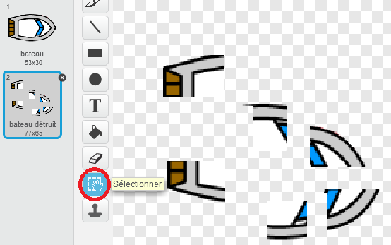
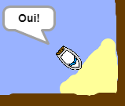
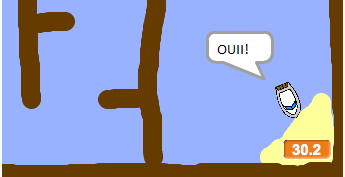
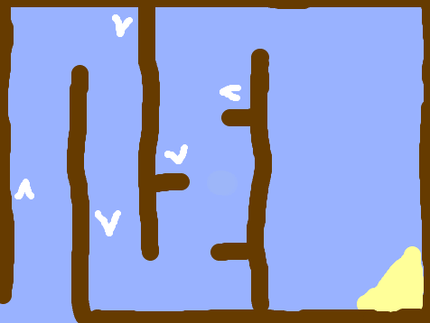
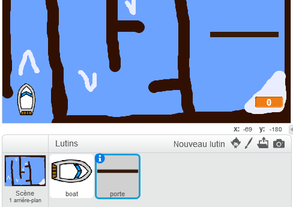
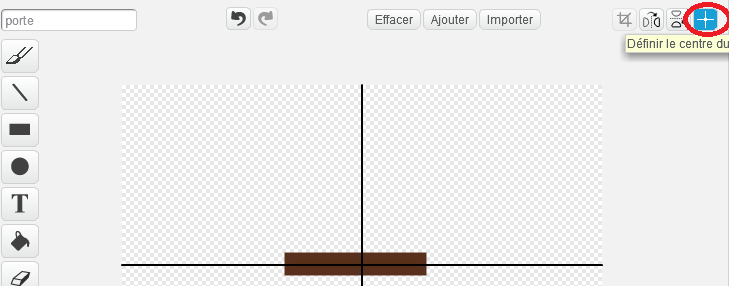
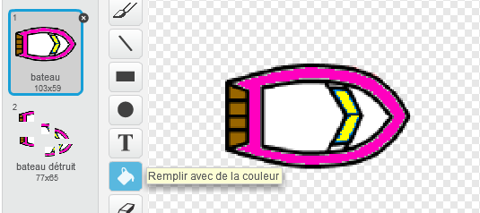

# Introduction { .intro }

Vous allez apprendre à faire un jeu, dans lequel vous utiliserez la souris pour faire naviguer un bateau vers une île déserte.

<div class="scratch-preview">
 <iframe allowtransparency="true" width="485" height="402" src="http://scratch.mit.edu/projects/embed/63957956/?autostart=false" frameborder="0"></iframe>
 
</div>

# Étape 1: Planifier votre jeu { .activity }

## Liste de contrôle d'activité { .check }

+ Commencez un nouveau projet de scratch et supprimez le lutin de chat pour que votre projet soit vide. Vous pouvez trouver le logicel scratch en ligne à <a href="http://jumpto.cc/scratch-new">jumpto.cc/scratch-new</a>.

+Clic sur votre scène et arrière-plan de votre niveau. Vous devriez ajouter :
	 + le Bois que votre bateau doit éviter;
	 + une île déserte vers laquelle votre bateau doit ce rendre.

	Voici à quoi votre jeu pourrait ressembler :

	

# Étape 2 : Direction du bateau { .activity }

## Liste de contrôle d'Activité { .check }

+ Si votre leader de club vous a donné un dossier 'Ressources', cliquez 'importer un lutin depuis un fichier' et ajouter l'image 'boat.png'. Vous devriez faire rétrécir le lutin et y mettre la position de départ.

	

	Si vous n'avez pas l'image de 'boat.png', vous pouvez dessiner votre propre bateau!

+ Vous allez contrôler le bateau avec votre souris. Ajoutez ce code à votre bateau:

	```blocks
		quand le drapeau pressé
		s'orienter vers (0 v)
		aller à x: (-190) y: (-150)
		répéter indéfiniment
			s'orienter vers [mouse-pointer v]
			avancer de (1)
		end
	```

+ Testez votre jeu, en cliquant sur le drapeau et en déplaçant la souris. Le bateau navigue-t-il vers la souris ?

	

+ Qu'est ce qui arrive si le bateau atteint l'indicateur de souris ?

	Pour arrêter cet événement, vous devrez ajouter le block 'si' {.blockcontrol} à votre code, pour que le bateau se déplace seulement si votre souris est à plus de 5 pixels.

	

+ Testez votre bateau de nouveau, vérifier si le problème a été résolut.

## Sauvegarder votre projet { .save }

# Étape 3 : Effondrement! { .activity .new-page }

Votre bateau peut naviguer à travers les barrières en bois!

## liste de contrôle d'activté { .check }

+ Vous aurez besoin de 2 costumes pour votre bateau, un costume normal et un pour quand le bateau explose. Dupliquez de votre costume de bateau et nommez-les 'normal' et 'coup'.

+ Cliquez sur le costume 'coup' choisissez ' Sélectionner' l'outil pour saisir et déplacer les morceaux du bateau  et les faire tourner autour. Faites semblant que votre bateau est explosé.

	

+ Ajoutez ce code à votre bateau, à l'intérieur de la boucle 'répéter indéfiniment' {.blockcontrol}, pour qu'il s'effondre quand il touche des morceaux en bois :

	```blocks
		si <couleur [#603C15] touché?> alors
			basculer sur costume [hit v]
			dire [Noooooon!] pendant (1) secondes
			basculer sur costume [normal v]
			s'orienter vers (0 v)
			aller à x: (-215) y: (-160)
		end
	```

	Ce code est à l'intérieur de la boucle 'répéter indéfiniment' {.blockcontrol}, pour que votre code continue de vérifier si le bateau est explosé.

+ Vous devriez aussi vous assurer que votre bateau commence toujours sur le costume 'normal'.

+ Maintenant si vous essayez de naviguer par une barrière en bois, vous devriez voir que votre bateau explose et revient au début.

	

## Sauvegarder votre projet { .save }

## Défi : Victoire! {.challenge}
Pouvez vous ajouter un autre block `si` {.blockcontrol} au code de votre bateau, pour que le joueur gagne quand ils arrivent à l'île déserte ?

Quand le bateau arrive à l'île déserte, il devrait dire ' Oui! ' Et ensuite le jeu devrait s'arrêter. Vous devrez utiliser ce code :

```blocks
	dire [Ouii!] pendant (1) secondes
	stop [all v]
```



## Sauvegarder votre projet { .save }

## Défi : Effets sonores{.challenge}
Pouvez vous ajouter des effets sonores à votre jeu, si le bateau explose, ou atteint l'île à la fin. Vous pourriez même ajouter la musique de fond (voir le projet 'groupe rock' précédent si vous avez besoin d'aide).

## Sauvegarder votre projet{ .save }

# Étape 4 : Course contre la montre { .activity }

Ajoutons un minuteur à votre jeu, pour que le joueur arriver à l'île déserte aussi vite que possible.

## Liste de contrôle d'Activité { .check }

+ Ajoutez une nouvelle variable appelée `temps` {.blockdata} à votre scène. Vous pouvez aussi changer la présentation de votre nouvelle variable. Si vous avez besoin d'aide, regardez le projet 'Ballon'.

	

+ Ajoutez ce code à votre scène , pour que le minuteur compte jusqu'a ce que le bateau atteignent l'île déserte :

	```blocks
		quand le drapeau cliqué
		mettre [time v] à [0]
		répéter indéfiniment
			attendre (0.1) secondes
			mettre [time v] à (0.1)
		end
	```

+ C'est ça! Testez votre jeu et essayer d'aller le plus rapidement possible à l'île déserte!

	

## Sauvegarder votre projet { .save }

# Étape 5 : Obstacles et difficulté  { .activity }

Ce jeu est trop facile ajoutons des choses pour le rendre plus intéressant.

## Liste de contrôle d'activité { .check }

+ D'abord ajoutons quelques 'boosts' à votre jeu, qui accélérera le bateau. Éditez votre scène et ajoutez quelques flèches blanches de rappel.

	

+ Vous pouvez maintenant ajouter un code à votre bateau la boucle `repeter indefiniement` {.blockcontrol}, pour qu'il ce déplace 2x plus vite en touchant un booster blanc.

	```blocks
		si < couleur[#FFFFFF] touché?> alors
			avancer de (3)
		end
	```

+ Vous pouvez aussi ajouter une porte tournante, que votre bateau doit éviter. Ajoutez un nouveau lutin appelé 'porte', qui ressemble à ceci :

	

	Assurez-vous que la porte est la même couleur que les autres barrières en bois.

+ Mettez le centre du lutin 'porte'.

	

+ Ajoutez le code à votre porte pour le faire tourner lentement dans le block 'répéter indéfiniment' {.blockcontrol}.

+ Testez votre jeu. Vous devriez maintenant avoir une porte tournante que vous devez éviter.

	

## Sauvegarder votre projet { .save }

## Défi : Plus d'obstacles! {.challenge .new-page}
Pouvez-vous ajouter plus d'obstacles pour votre jeu ? Voici quelques idées :

+ Vous pourriez ajouter des marais vert à votre scène, qui ralentirait le joueur quand il les touchent. Vous pouvez utiliser le bloc `attendre` {.blockcontrol}pour faire ceci :

```blocks
	attendre (0.01) secondes
````


+ Vous pourriez ajouter un objet qui se déplace, comme un rondin ou un requin!


Ces blocs peuvent vous aider :

```blocks
	avancer de (1)
	rebondir si le bord est atteint
````

Si votre nouvel objet n'est pas brun, vous devrez ajouter à votre code de bateau :

```blocks
	si <  <couleur [#603C15] touchée?> ou <touché [shark v]?> > alors
	end
```

## Sauvegarder votre projet { .save }

## Défi : Plus de bateaux! {.challenge .new-page}
Pouvez-vous transformer votre jeu en course entre 2 joueurs ?

+ Dupliquez du bateau, rebaptisez le 'Joueur 2' et changez sa couleur.



+ Changez le Joueur 2 la position de départ, en changeant ce code:

```blocks
	aller à x: (-190) y: (-150)
```

+ Supprimez le code qui utilise la souris pour contrôler le bateau :

```blocks
	si < (distance de [mouse-pointer v]) > [5] > alors
		s'orienter vers [mouse-pointer v]
		avancer de (1)
	end
```

...Et remplacez le code pour contrôler le bateau en utilisant les touches de direction.

Ceci est le code pour faire avancer le bateau avec les fleches :

```blocks
	si < touche [up arrow v] pressé? > alors
		avancer de (1)
	end
```

Vous aurez aussi besoin du block `tourner` {.blockmotion} pour que le bateau tourne quand les touches de direction gauches et droites sont appuyées.

## Sauvegarder votre projet{ .save }

## Défi : Plus de niveaux! {.challenge .new-page}
Pouvez-vous créer des fonds supplémentaires et permettre au joueur de choisir entre les niveaux ?

```blocks
	quand [space v] est pressé
	arrière-plan suivant
```

## Sauvegarder votre projet { .save }
