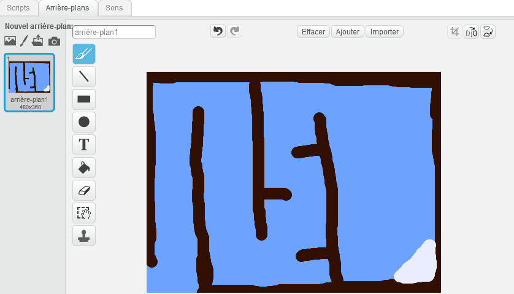
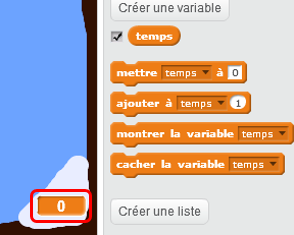
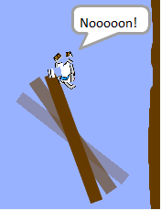
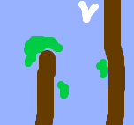

# Introduction { .intro }

Vous allez apprendre à faire un jeu dans lequel vous utiliserez la souris pour faire naviguer un bateau vers une île déserte.

<div class="scratch-preview">
<iframe allowtransparency="true" width="485" height="402" src="https://scratch.mit.edu/projects/embed/63957956/?autostart=false" frameborder="0"></iframe>

</div>

# Étape 1: Planifier votre jeu { .activity }

## Liste de contrôle d'activité { .check }

+ Commencez un nouveau projet de scratch et supprimez le lutin de chat pour que votre projet soit vide. Vous pouvez trouver le logiciel scratch en ligne à <a href="http://jumpto.cc/scratch-new">jumpto.cc/scratch-new</a>.

+ Cliquez sur votre scène et arrière-plan de votre niveau. Vous devriez ajouter :
	 + Le bois que votre bateau doit éviter;
	 + Une île déserte vers laquelle votre bateau doit se rendre.

	Voici à quoi votre jeu pourrait ressembler :

	

# Étape 2 : Direction du bateau { .activity }

## Liste de contrôle d'activité { .check }

+ Si votre leader de club vous a donné un dossier 'Ressources', cliquez 'importer un lutin depuis un fichier' et ajouter l'image 'boat.png'. Vous devriez faire rétrécir le lutin et y définir la position de départ.

	

	Si vous n'avez pas l'image de 'boat.png', vous pouvez dessiner votre propre bateau!

+ Vous allez contrôler le bateau avec votre souris. Ajoutez ce code à votre bateau:

	```blocks
		quand ⚑ cliqué
		s'orienter à (0 v)
		aller à x:(-190) y:(-150)
		répéter indéfiniment
		   s'orienter vers [pointeur de souris v]
		   avancer de (1)
		fin
	```

+ Testez votre jeu en cliquant sur le drapeau et en déplaçant la souris. Le bateau navigue-t-il vers la souris?

	

+ Qu'est-ce qui arrive si le bateau atteint le curseur de souris?

	Pour arrêter ce comportement, vous devrez ajouter le bloc 'si' {.blockcontrol} à votre code pour que le bateau se déplace seulement si votre souris est à plus de 5 pixels.

	

+ Testez votre bateau de nouveau, vérifiez si le problème a été résolu.

## Sauvegarder votre projet { .save }

# Étape 3 : Collision! { .activity .new-page }

Votre bateau peut naviguer à travers les barrières en bois! Arrangeons cela.

## liste de contrôle d'activité { .check }

+ Vous aurez besoin de 2 costumes pour votre bateau, un costume normal et un pour quand le bateau est détruit. Dupliquez votre costume de bateau et nommez-les 'bateau' et 'bateau détruit'.

+ Cliquez sur le costume 'bateau détruit' et choisissez l'outil 'Sélectionner' pour saisir et déplacer les morceaux du bateau et les faire tourner autour. Faites semblant que votre bateau est détruit.

	

+ Ajoutez ce code à votre bateau, à l'intérieur de la boucle 'répéter indéfiniment' {.blockcontrol}, pour qu'il se détruise lorsqu'il touche des morceaux en bois :

	```blocks
		si <couleur [#603C15] touchée?> alors
		   basculer sur costume [bateau détruit v]
		   dire [Noooooon!] pendant (1) secondes
		   basculer sur costume [bateau v]
		   s'orienter à (0 v)
		   aller à x:(-215) y:(-160)
		fin
	```

	Ce code est à l'intérieur de la boucle 'répéter indéfiniment' {.blockcontrol} pour que votre code vérifie continuellement si le bateau entre en collision.

+ Vous devriez aussi vous assurer que votre bateau commence toujours sur le costume 'bateau'.

+ Maintenant si vous essayez d'entrer en collision avec une barrière en bois, vous devriez voir que votre bateau se détruit puis revient au début.

	

## Sauvegarder votre projet { .save }

## Défi : Victoire! {.challenge}
Pouvez vous ajouter un autre bloc `si` {.blockcontrol} au code de votre bateau pour que le joueur gagne quand il arrive à l'île déserte?

Quand le bateau arrive à l'île déserte, il devrait dire 'Oui!' et ensuite le jeu devrait s'arrêter. Vous devrez utiliser ce code :

```blocks
		dire [Oui!] pendant (1) secondes
		stop [tout v]
```


## Sauvegarder votre projet { .save }

## Défi : Effets sonores{.challenge}
Pouvez vous ajouter des effets sonores à votre jeu si le bateau entre en collision ou atteint l'île à la fin. Vous pourriez même ajouter une musique de fond (voir le projet 'Groupe de rock' précédent si vous avez besoin d'aide).

## Sauvegarder votre projet{ .save }

# Étape 4 : Course contre la montre { .activity }

Ajoutons un minuteur à votre jeu, pour que le joueur arrive à l'île déserte le plus rapidement possible.

## Liste de contrôle d'Activité { .check }

+ Ajoutez une nouvelle variable appelée `temps` {.blockdata} à votre scène. Vous pouvez aussi changer la présentation de votre nouvelle variable. Si vous avez besoin d'aide, regardez le projet 'SOS Fantômes'.

	

+ Ajoutez ce code à votre scène pour que le minuteur compte jusqu'à-ce que le bateau atteigne l'île déserte :

	```blocks
		quand ⚑ cliqué
		[temps v] prend la valeur [0]
		répéter indéfiniment
		   attendre (0.1) secondes
		   [temps v] prend la valeur (0.1)
		fin
	```

+ C'est ça! Testez votre jeu et essayez d'aller le plus rapidement possible à l'île déserte!

	

## Sauvegarder votre projet { .save }

# Étape 5 : Obstacles et difficulté  { .activity }

Ce jeu est trop facile, ajoutons des choses pour le rendre plus intéressant.

## Liste de contrôle d'activité { .check }

+ D'abord, ajoutons quelques zones d'accélération à votre jeu qui accéléreront le bateau lorsqu'il les traversera. Modifiez votre scène et ajoutez quelques flèches blanches.

	

+ Vous pouvez maintenant ajouter du code à la boucle `répéter indéfiniement` {.blockcontrol} de votre bateau pour qu'il se déplace de trois pixels supplémentaires en touchant une flèche blanche.

	```blocks
		si <couleur [#FFFFFF] touchée?> alors
		   avancer de (3)
		fin
	```

+ Vous pouvez aussi ajouter une porte tournante que votre bateau doit éviter. Ajoutez un nouveau lutin appelé 'porte' qui ressemble à ceci :

	

	Assurez-vous que la porte est de la même couleur que les autres barrières en bois.

+ Définissez le centre du lutin 'porte'.

	

+ Ajoutez le code à votre porte pour la faire tourner lentement dans le bloc 'répéter indéfiniment' {.blockcontrol}.

+ Testez votre jeu. Vous devriez maintenant avoir une porte tournante que vous devez éviter.

	

## Sauvegarder votre projet { .save }

## Défi : Plus d'obstacles! {.challenge .new-page}
Pouvez-vous ajouter plus d'obstacles à votre jeu? Voici quelques idées :

+ Vous pourriez ajouter des marais verts à votre scène qui ralentiraient le joueur quand il les touche. Vous pouvez utiliser le bloc `attendre` {.blockcontrol} pour faire celà :

```blocks
	attendre (0.01) secondes
```



+ Vous pourriez ajouter un objet qui se déplace, comme un tronc ou un requin!


Ces blocs peuvent vous aider :

```blocks
	avancer de (1)
	rebondir si le bord est atteint
```

Si votre nouvel objet n'est pas brun, vous devrez ajouter à votre code de bateau :

```blocks
	si <<couleur [#603C15] touchée?> ou <[requin v] touché?>> alors
	fin
```

## Sauvegarder votre projet { .save }

## Défi : Plus de bateaux! {.challenge .new-page}
Pouvez-vous transformer votre jeu en course entre 2 joueurs?

+ Dupliquez le bateau, renommez le 'Joueur 2' et changez sa couleur.


+ Changez la position de départ du Joueur 2, en changeant ce code:

```blocks
	aller à x:(-190) y:(-150)
```

+ Supprimez le code qui utilise la souris pour contrôler le bateau :

```blocks
		si <(distance de [pointeur de souris v]) > [5]> alors
		   s'orienter vers [pointeur de souris v]
		   avancer de (1)
		fin
```

...Et remplacez le code pour contrôler le bateau en utilisant les touches de direction.

Ceci est le code pour faire avancer le bateau avec les flèches :

```blocks
	si <touche [flèche haut v] pressée?> alors
   	avancer de (1)
	fin
```

Vous aurez aussi besoin du bloc `tourner` {.blockmotion} pour que le bateau tourne quand les touches de direction gauches et droites sont appuyées.

## Sauvegarder votre projet{ .save }

## Défi : Plus de niveaux! {.challenge .new-page}
Pouvez-vous créer des scènes supplémentaires et permettre au joueur de choisir entre les niveaux?

```blocks
	quand [espace v] est pressé
	arrière-plan suivant
```

## Sauvegarder votre projet { .save }
