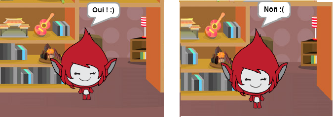
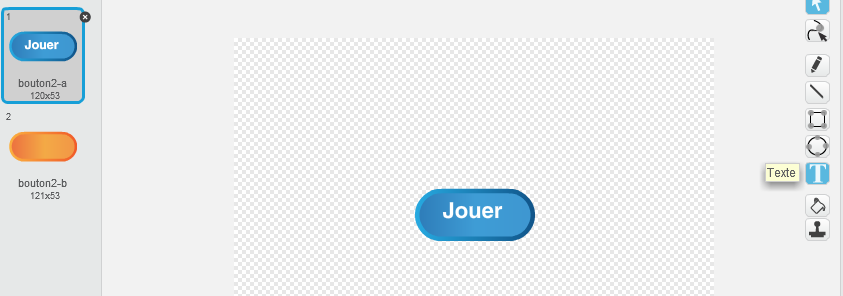
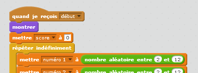
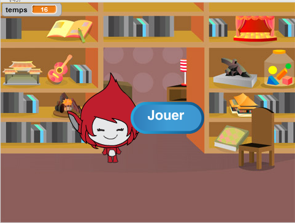
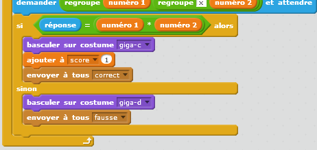
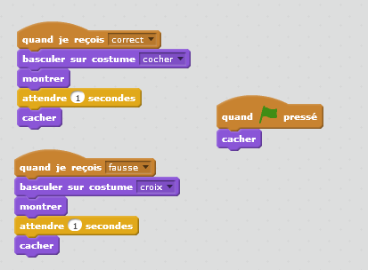
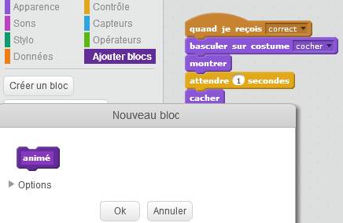
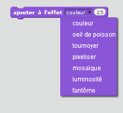

# Introduction { .intro }

Dans ce projet, vous apprendrez à créer un questionnaire sur les tables de multiplication, dans lequel vous devez obtenir autant de bonnes réponses que vous le pouvez en 30 secondes.

<div class="scratch-preview">
 <iframe allowtransparency="true" width="485" height="402" src="https://scratch.mit.edu/projects/embed/42225768/?autostart=false" frameborder="0"></iframe>
 
</div>

# Étape 1 : Création des questions { .activity }

Commençons en créant des questions aléatoires pour le joueur.

## Liste de contrôle d'Activité { .check }

+ Commencez un nouveau projet Scratch et supprimez le lutin de chat pour que votre projet soit vide. Vous pouvez trouver l'éditeur Scratch en ligne à <a href="http://jumpto.cc/scratch-new">jumpto.cc/scratch-new</a>.

+ Choisissez un personnage et un arrière-plan pour votre jeu. Vous pouvez choisir ce que vous aimez! Voici un exemple :

	

+ Créez 2 nouvelles variables appelées ` numéro 1` {.blockdata} Et 'numéro 2'{.blockdata}. Ces variables stockeront les 2 nombres qui seront multipliés ensemble.

	

+ Ajoutez le code à votre personnage afin de mettre ces deux variables à un 'nombre aléatoire entre' {.blockoperators} 2 et 12.

	```blocks
		quand le drapeau pressé
		ajouter [numéro 1 v] au (nombre aléatoire (2) à (12))
		ajouter [numéro 2 v] au (nombre aléatoire (2) à (12))
	```

+ Vous pouvez alors demander la réponse au joueur et lui indiquer si c'était vrai ou faux. 

	```blocks
		quand le drapeau pressé
		ajouter [numéro 2 v] à (nombre aléatoire (2) à (12))
		demander (regroupe (numéro 1)(regroupe [ x ] (numéro 2))) et attendre
		si <(réponse) = ((numéro 1)*(numéro 2))> alors
			dire [oui! :)] pendant (2) secondes
		sinon
			dire [non :(] pendant (2) secondes
		end
	```

+ Testez votre projet entièrement en répondant une fois avec une bonne réponse et une fois avec une mauvaise réponse.

+Ajoutez la boucle 'répéter indéfiniment' {.blockcontrol} autour de ce code, afin que plusieurs questions soient posées au joueur.

+ Créez une minuterie sur la scène en utilisant une variable appelée 'temps' {.blockdata}. Si vous avez besoind d'aide, le projet 'GhostBuster' possède des instructions sur comment créer une minuterie (dans l'étape 6).

+ Testez votre projet de nouveau, vous devriez pouvoir continuer à poser des questions jusqu'à ce que le temps soit écoulé.

## Sauvegarder votre projet { .save }

## Défi : Changement de costumes{.challenge}

Pouvez-vous changer les costumes de votre personnage afin qu'il ressemble à la réponse du joueur ?



## Défi : Ajout d'un pointage {.challenge}

Pouvez-vous ajouter un pointage à votre jeu? Vous pouvez ajouter un point pour chaque bonne réponse. Si vous vous sentez malin, vous pourriez même remettre le pointage du joueur à 0 s'il obtient une mauvaise réponse!

## Sauvegarder votre projet { .save }

# Étape 2 : jeux multiples{ .activity .new-page}

Ajoutons un bouton 'jeu' à votre jeu, pour que vous puissiez jouer plusieurs fois.

## Liste de contrôle d'activité { .check }

+ Créez un nouveau lutin du bouton 'Jouer', sur lequel votre joueur cliquera pour commencer un nouveau jeu. Vous pouvez le dessiner vous-même, ou modifier un lutin de la bibliothèque de Scratch.

	

+ Ajoutez ce code à votre nouveau bouton.

	```blocks
		quand le drapeau pressé
		montrer

		quand le drapeau pressé
		cacher
		envoyer à tous [début v]
	```

	Ce code montre le bouton de jeu lorsque votre projet est commencé. Quand le bouton est cliqué, il est caché et diffuse ensuite un message qui commencera le jeu.

+ Vous devrez modifier le code de votre personnage afin que le jeu débute lorsqu'il recevra le message 'début'{.blockevents} et non pas quand le drapeau est cliqué.

	Remplacez le code ` quand le drapeau cliqué ` {.blockevents} par ` quand je reçois le début `{.blockevents}.

	

+ Cliquez sur le drapeau vert et cliquez ensuite sur votre nouveau bouton de jeu pour le tester. Vous devriez voir que le jeu ne débute pas tant que vous ne cliquez pas sur le bouton.

+ Avez-vous remarqué que la minuterie commence lorsque le drapeau vert est cliqué et non quand le jeu commence?

	

	Pouvez-vous réparer ce problème ?

+ Cliquez sur la scène et remplacez le bloc 'arrêter tout'  {.blockcontrol} avec le message 'fin' {.blockevents}.

	

+ Vous pouvez maintenant ajouter ce code à votre bouton pour le montrer de nouveau à la fin de chaque jeu.

	```blocks
		quand je reçois [end v]
		montrer
	```

+ Vous devrez aussi arrêter votre personnage qui pose des questions à la fin de chaque jeu :

	```blocks
		quand je reçois [end v]
		stop [D'autres scénarios dans lutin v]
	```

+ Testez votre bouton de jeu en jouant deux ou trois fois. Vous devriez remarquer que le bouton de jeu apparaît après chaque jeu. Pour le tester plus facilement, vous pouvez raccourcir chaque jeu afin qu'il ne dure seulement que quelques secondes.

	```blocks
		mettre [time v] à [10]
	```

+ Vous pouvez même changer l'apparence du bouton lorsque la souris le survole.

	```blocks
		quand le drapeau pressé
		montrer
		répéter indéfiniment
		si <touché [pointeure de souris v]?> alors
			mettre l'effet [oeil de poisson v] à (30)
		else
			mettre l'effet [oeil de poisson v] à (0)
		end
		end
	```

	

## Sauvegarder votre projet { .save }

## Défi : Écran du début{.challenge}
Pouvez-vous ajouter un autre arrière-plan à votre scène? Il deviendra l'écran d'accueil de votre jeu. Vous pouvez utiliser les blocs ` quand je reçois début ` {.blockevents} et ` quand je reçois fin` {.blockevents} pour passer d'un arrière-plan à l'autre. 

Vous pouvez aussi montrer et cacher votre personnage ainsi que votre minuterie, en utilisant ces blocs :
```blocks
montrer la variable [time v]
```
```blocks
cacher la variable [time v]
```


## Sauvegarder votre projet { .save }

# Étape 3 : Ajout de graphisme { .activity .new-page}

Afin que votre personnage ne dise pas seulement ` oui! :) ` ou ` non `, ajoutons un graphisme qui permettra au joueur de savoir si la réponse est bonne ou mauvaise.

+ Créez un nouveau lutin appelé 'le Résultat', qui contient les costumes 'coché' et ' croix '.

	

+ Changez le code de votre personnage afin qu'il diffuse les messages 'correct'{.blockevents} et 'mal' {.blockevents} au lieu de dire `oui` et `non`.

	

+ Vous pouvez maintenant utiliser ces messages afin de montrer le costume 'coché' ou ' croix '. Ajoutez ce code à votre nouveau lutin 'résultat' :

	

+ Testez votre jeu de nouveau. Vous devriez voir un crochet quand vous obtenez une bonne question et une croix quand vous obtenez une mauvaise réponse!

	

+ Avez-vous remarquer que le code ` quand je reçois correct ` {.blockevents} et ` quand je reçois mal ` {.blockevents} est presque identique ? Créons une fonction pour rendre la modifiation du code plus facile.

	Sur votre lutin 'Résultat', cliquez sur ` Ajouter blocs ` {.blockmoreblocks} et cliquez ensuite sur ' Créer un Bloc '. Créez une nouvelle fonction appelée 'animée' {.blockmoreblocks}.

	

+Vous pouvez alors ajouter le code d'animation dans votre nouvelle fonction d'animation et utiliser la fonction deux fois:

	

+ Maintenant, si vous voulez montrer l'animation plus longtemps, vous devez faire un seul changement à votre fonction. Essayez-le!

+ Plutôt que de simplement afficher et cacher le crochet et la croix, vous pourriez changer votre fonction d'animation afin que le graphisme apparaisse en fondu. 

	```blocks
		definir [animé]
		mettre l'effet [fantôme v] à (100)		
		montrer
		répéter (25)
			ajouter à l'effet [fantôme v] (-4)
		end
		cacher
	```

## Sauvegarder votre projet { .save }

## Défi : Animation améliorée {.challenge}

Pouvez-vous améliorer l'animation de votre graphisme? Vous pourriez coder le crochet et la croix afin qu'ils disparaissent en fondu. Sinon, vous pourriez utiliser d'autres effets:



## Sauvegarder votre projet { .save }

## Défi : Son et musique {.challenge}

Pouvez-vous ajouter des effets sonores et de la musique à votre jeu ? Par exemple :

+ Jouer un son quand le joueur obtient une bonne ou mauvaise réponse;
+ Ajouter un son coché a votre minuterie;
+ Jouer un son lorsque le temps est fini;

	```blocks
		jouer du tambour (10 v) pendant (0.1) temps
	```

+ Vous pourriez aussi jouer de la musique en boucle (si vous n'êtes pas certains comment le faire, l'étape 4 du projet de 'Rock Band' vous aidera).

## Sauvegarder votre projet { .save }

## Défi : Course à 10 points {.challenge}

Au lieu de répondre au plus grand nombre de réponses possibles en 30 secondes, pouvez-vous changer votre jeu afin qu'il demande au joueur d'obtenir 10 bonnes réponses le plus rapidement possible?  

Pour ce faire, vous devrez seulement changer votre code de minuterie. Pouvez-vous voir quoi doit être modifié?

```blocks
	quand je reçois [début v]
	mettre [temps v] à (30)
	répéter jusqu'à <(temps) = [0]>
		attendre (1) secondes
		ajouter à [temps v] (-1)
	end
	envoyer à tous [fin v]
```

## Sauvegarder votre projet { .save }

## Défi : Écran d'instruction{.challenge}

Pouvez-vous ajouter un écran d'instructions à votre jeu qui dira à votre joueur comment jouer au jeu? Vous aurez besoin d'un bouton 'Instructions' et une autre image de fond.


Vous aurez peut-être besoin d'un bouton 'retour' pour vous rendre au menu principal.

```blocks
	envoyer à tous [menu principal v]
```

## Sauvegarder votre projet { .save }
