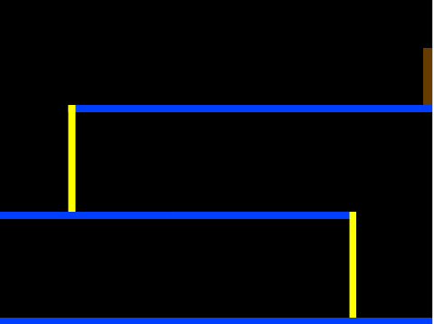
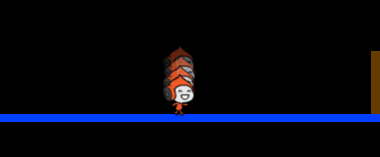
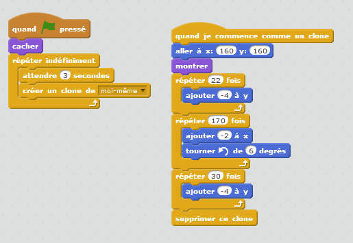
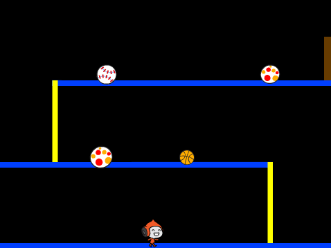
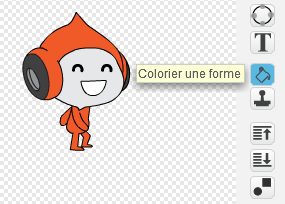

# Introduction { .intro }

Dans ce projet vous apprendrez à créer un jeu de plateforme dans lequel vous devez esquiver les balles qui se déplacent et atteindre la fin du niveau.


<div class="scratch-preview">
 <iframe allowtransparency="true" width="485" height="402" src="https://scratch.mit.edu/projects/embed/39740618/?autostart=false" frameborder="0"></iframe>
 
</div>

# Étape 1 : Mouvement du personnage  { .activity }

Commençons par créer un personnage qui peut se déplacer à gauche et à droite et monter sur des échelles.

## Liste de contrôle d'activité { .check }

+ Commencez un nouveau projet de Scratch et supprimez le lutin de chat pour que votre projet soit vide. Vous pouvez trouver l'éditeur de Scratch en ligne à <a href="http://jumpto.cc/scratch-new">jumpto.cc/scratch-new</a>.

+ Pour ce projet, vous devriez avoir un dossier de 'Ressources du Projet', contenant toutes les images dont vous aurez besoin. Assurez-vous que vous pouvez trouver ce dossier et demander à votre leader de club si vous ne trouvez pas cela.

	

+ Ajoutez l'image 'background.png' comme nouveau fond de scène ou dessinez le vôtre! Si vous dessinez votre propre niveau, assurez-vous que les échelles et les planchers sont d'une couleur différente et qu'il y a une porte (ou quelque chose de semblable) que votre joueur doit atteindre. Voici ce que votre projet doit ressembler :

	

+ Ajoutez un nouveau lutin qui sera votre personnage. Cela serait préférable si vous choisissez un lutin avec plusieurs costumes pour que vous puissiez le faire marcher.

	

+ Utilisons les touches de direction pour déplacer votre personnage. Quand le joueur appuie sur la flèche droite, vous voulez que votre personnage pointe à droite, se déplace de quelques pas et change de costume:

	```blocks
		quand le drapeau cliqué
		répéter indéfiniment
			si <touche [right arrow v] pressée? > alors
				avancer de (3)
				costume suivant
			end
		end
	```

+ Testez votre personnage en cliquant sur le drapeau et maintenez la touche de direction droite. Votre joueur se déplace-t-il à droite ? Votre personnage marche-t-il ?

	

+ Pour déplacer votre personnage vers la gauche, vous devrez ajouter un autre `si` {.blockcontrol} à l'intérieur de votre `répéter indéfiniment` {.blockcontrol} pour déplacer votre personnage à gauche. Rappelez-vous de tester votre nouveau code pour vous assurer ça marche !

+ Pour monter une échelle rose, votre personnage devrait avancer légèrement en haut quand la flèche du haut est appuyée et qu'il touche la bonne couleur. Ajoutez ce code à l'intérieur de la boucle `répéter indéfiniment` {.blockcontrol} de votre personnage :

	```blocks
		Si < <touche [up arrow v] pressé?> et <couleur touche [#FFFF00]?> > alors
			ajouter (4) à y
		end
	```

+ Testez votre personnage - pouvez-vous monter sur les échelles roses et arriver à la fin de votre niveau ?

	

## Sauvegarder votre projet { .save }

## Défi : Achèvement du niveau {.challenge}
Pouvez-vous ajouter plus de codage à votre personnage pour qu'il dise quelque chose `si` {.blockcontrol} il arrive à la porte ?


## Sauvegarder votre projet { .save }

# Étape 2 : Gravité et saut { .activity }

Déplaçons votre personnage plus réellement en ajoutant de la gravité et en lui permettant de sauter.

## Liste de contrôle d'activité { .check }

+ Vous pouvez remarquer que votre personnage peut s'éloigner d'une plateforme dans les airs. Essayez de marcher hors d'une plateforme et regardez ce qu'il se produit.

	

+ Pour régler cela, ajoutons de la gravité à votre jeu. Créez une nouvelle variable appelée `Gravité ` {.blockdata}. Vous pouvez cacher cette variable de votre scène si vous voulez.

	

+ Ajoutez ce nouveau bloc de code ce qui ajuste la gravité à un nombre négatif. Celui-ci sera ensuite utilisé à plusieurs reprises pour changer la coordonnée Y de votre personnage.

	```blocks
		quand le drapeau pressé
		mettre [gravity v] à [-4]
		répeter indéfiniment
			ajouter y par (gravity)
		end
	```

+ Cliquez sur le drapeau et traînez ensuite votre personnage au sommet de la scène. Qu'est-ce qui arrive ? La gravité marche-t-elle ?

	

+ La gravité ne devrait pas déplacer votre personnage à travers une plateforme ou une échelle! Ajoutez un bloc `si ` {.blockcontrol} à votre code pour que la gravité puisse marcher seulement quand votre personnage est dans les airs. Le code de gravité devrait maintenant ressembler à ceci :

	```blocks
		quand le drapeau est pressé
		mettre [gravity v] à [-4]
		répéter indéfiniment
			Si < non < <couleur [#0000FF] touchée?> ou <couleur [#FFFF00] touchée?> > > alors
				ajouter y par (gravity)
			end
		end
	```

+ Testez la gravité de nouveau. Votre personnage s'arrête-t-il quand il est sur une plateforme ou une échelle ? Pouvez-vous vous éloignez du bord des plateformes et atterir sur le niveau ci-dessous ?

	

+  Faisons aussi un saut lorsque le joueur appuie sur la barre d'espace. Il suffit uniquement de déplacer votre personnage en haut à plusieurs reprises en utilisant ce code :

	```blocks
		quand [space v] est pressé
		répéter (10) fois
			ajouter (4) à y
		end
	```

	Comme la gravité pousse constamment votre personnage en bas par 4 pixels, vous devez choisir un nombre plus grand que 4 dans votre ` Changer y par (4) ` {.blockmotion}. Changez ce nombre jusqu'à ce que vous soyez heureux avec la hauteur de vos sauts.


+ Si vous testez ce code, vous remarquerez que ça marche, mais le mouvement n'est pas très cohérent. Pour améliorer cela, vous devrez déplacer votre personnage par des quantités de plus en plus petites jusqu'à ce qu'il ne saute plus.

+ Pour ceci faire, créez une autre variable appelée `hauteur saut` {.blockdata}. Vous pouvez cacher cette variable encore un fois si vous préférez.

+ Supprimez le premier code de saut que vous avez ajouté à votre personnage et remplacez-le par ce code :

	```blocks
		quand [space v] est pressé
		mettre [hauteur saut v] à [8]
		répéter jusqu'à < (hauteur saut) = [0] >
			ajouter (hauteur saut) à y
			ajouter [hauteur saut v] à (-0.5)
		end
	```

	Ce code déplace votre personnage vers le haut par 8 pixels, 7.5 pixels, 7 pixels, etc... jusqu'à ce que votre personnage ait fini de sauter.

+ Changez la valeur de départ de votre `hauteur saut` {.blockdata} et testez jusqu'à ce que vous soyez heureux avec la hauteur de vos sauts.

## Sauvegarder votre projet { .save }

## Défi : Bond Amélioré {.challenge}
Votre personnage peut sauter lorsque la barre d'espace est appuyée même s'il est déjà dans les airs. Vous pouvez tester cette fonction en maintenant la barre d'espace. Pouvez-vous réparer cela pour que votre personnage puisse seulement sauter 'si' {.blockcontrol} il touche une plateforme bleue?

## Sauvegarder votre projet { .save }

# Étape 3 : Esquive des balles { .activity .new-page}

Maintenant que vous avez votre déplacement de personnage, ajoutons quelques balles que votre personnage puisse éviter.

## Liste de contrôle d'activité { .check }

+ Créez un nouveau lutin de balle. Vous pouvez choisir n'importe quel type de balle que vous aimez.

	

+ Redimensionnez votre balle pour que votre personnage puisse y sauter par-dessus. Essayez de sauter par-dessus la balle pour le tester.

	

+ Ajoutez ce code à votre balle :

	

	Ce code crée une nouvelle balle à chaque 3 secondes. Chaque nouveau clone avance tout au long de la plateforme supérieure.

+ Cliquez sur le drapeau pour tester ceci.

	

+ Ajoutez plus de codage à votre lutin de balle pour qu'ils traversent sur toutes les 3 plateformes.

	

+ Finalement, vous aurez besoin d'un code pour les fois où votre personnage sera frappé par une balle! Ajoutez ce code à votre lutin de balle :

	```blocks
		quand je commence comme un clone
		répéter indéfiniment
			Si < touché [Pico walking v]? > alors
				envoyer à tous [hit v]
			end
		end
	```

+ Vous devrez aussi ajouter ce code à votre personnage afin qu'il retourne à la position initiale lorsqu'il est frappé:

	```blocks
		quand je recois [hit v]
		s'orienter à  (90 v)
		aller à x: (-210) y: (-120)
	```

+ Testez votre personnage et vérifiez s'il retourne au début lorsqu'il est frappé par une balle.

## Sauvegarder votre projet { .save }

## Défi : balles aléatoires {.challenge}
Les balles que votre personnage doit esquiver ont tous la même apparence et apparaissent toujours à chaque 3 secondes. Pouvez-vous les améliorer pour qu'elles :

+ ne se ressemblent pas ?
+ apparaissent après un temps aléatoire ?
+ soient d'une taille aléatoire ?



## Sauvegarder votre projet { .save }

# Etape 4 : Lasers!{ .activity .new-page}

Rendez votre jeu un peu plus compliqué en ajoutant des lasers!

## Liste de contrôle d'activité { .check }

+ Ajoutez un nouveau lutin appelé 'Laser' à votre jeu. Il devrait avoir 2 costumes appelés 'on' et 'off'.

	

+ Placez votre nouveau laser n'importe où entre 2 plateformes.

	

+ Ajoutez le code à votre laser pour qu'il puisse changer entre les 2 costumes.

	```blocks
		quand le drapeau pressé
		répéter indéfiniment
			basculer sur costume [on v]
			attendre (2) secondes
			basculer sur costume [off v]
			attendre (2) secondes
		end
	```

	Si vous préférez, vous pouvez 'Attendre' {.blockcontrol} un temps 'aléatoire' {.blockoperators} entre les changements de costume.

+ Finalement, ajoutez le code à votre laser pour que le message 'hit' soit diffusé quand le laser touche votre personnage. Ce code sera le même que vous avez ajouté à votre lutin de balle.

	Vous n'avez pas à ajouter plus de codes à votre personnage, il sait déjà quoi faire lorsqu'il est frappé!

+ Testez votre jeu pour voir si vous pouvez arriver devant le laser. Changer le temps 'attendre' {.blockcontrol} dans votre code si les lasers sont trop faciles ou trop difficiles.

## Défi : Plus d'obstacles {.challenge}
Si vous pensez que votre jeu est trop facile, vous pouvez ajouter plus d'obstacles à votre niveau. Vous pouvez ajouter tout ce que vous souhaitez, mais voici quelques idées :

+ Un papillon tueur volant;
+ Des plateformes qui apparaissent et disparaissent;
+ Une chute des balles de tennis qui doivent être évitées.


Vous pourriez même créer plus qu'un fond et vous déplacer vers le niveau suivant lorsque votre personnage atteint la porte verte :

```blocks
	Si <couleur [#714300] touchée?> alors
		basculer sur l'arrière-plan [next backdrop v]
		aller à x: (-210) y: (-120)
		attendre (1) secondes
	end
```

## Sauvegarder votre projet { .save }

## Défi : gravité améliorée {.challenge}
Il y a un autre petit bogue dans votre jeu : la gravité ne tire pas votre personnage vers le bas si n'importe quelle de ses parties touchent une plateforme bleue ! Vous pouvez tester cela en montant sur une échelle et en vous déplaçant ensuite à gauche.


Pouvez-vous corriger ce bogue ? Pour faire cela, vous devez changer la couleur du pantalon de votre personnage (Sur tous les costumes)...



... et remplacez ensuite le code:

```blocks
	< couleur [#0000FF] touchée? >
```

avec:

```blocks
	< couleur [#00FF00] touchée [#0000FF]? >
```

N'oubliez pas de tester vos améliorations pour vous assurer que vous avez corrigé le bogue!

## Sauvegarder votre projet { .save }

## Défi : Plus de vies {.challenge}
Pouvez-vous donner 3 'vies' à votre joueur {.blockdata} au lieu de les renvoyer à la position de départ à chaque fois ? Voici comment votre jeu pourrait marcher :

+ Votre joueur commence par 3 vies;
+ Lorsque votre joueur est frappé, une vie est perdue et ils doivent retourner à la position intiale;
+ S'il ne reste plus de vies, c'est la fin du jeu.

## Sauvegarder votre projet { .save }
