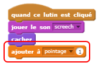

# Introduction { .intro }

Vous allez créer un jeu pour attraper des phantômes !

<div class="scratch-preview">
  <iframe allowtransparency="true" width="485" height="402" src="https://scratch.mit.edu/projects/embed/60787262/?autostart=false" frameborder="0"></iframe>
  
</div>

# Étape 1: Animer un fantôme { .activity }

## Liste de contrôle d'Activité { .check }

+ Démarrer un nouveau projet Scratch , et supprimer le lutin "chat" pour que votre projet soit vide. Vous pouvez trouver l'éditeur Scratch en ligne via <a href="http://jumpto.cc/scratch-new" target="_blank">jumpto.cc/scratch-new</a>.

+ Ajouter un nouveau lutin"phantôme" et un arrière-plan approprié.

	

+ Ajouter ce code pour le phantôme, il va apparaître et disparaître en boucle :

	```blocks
		when flag clicked
		forever
			hide
			wait (1) secs
			show
			wait (1) secs
		end
	```

+ Tester le code de votre phantôme, en appuyant sur le drapeau vert.

## Sauvegarder votre projet { .save }

# Étape 2: Phantômes aléatoires { .activity }

Votre phantôme est vraiment trop facile à attraper, car il ne bouge pas !

## Liste de contrôle d'Activité { .check }

+ Au lieu de rester au même endroit, Scratch peut choisir les coordonnées x et y de façon aléatoire. Ajouter un bloc `go to` {.blockmotion} [en français : `aller à`] au code du phantôme pour que ça ressemble à :

	

+ Tester votre phantôme de nouveau, et vous devrez remarquer qu'il apparaisse chaque fois à un endroit différent.

## Sauvegarder votre projet { .save }

## Challenge: Plus aléatoire {.challenge}
Pouvez-vous faire [en français : `attendre`] `wait` {.blockcontrol} votre phantôme pendant une durée aléatoire avant de réapparaître ?  Pouvez-vous utiliser le bloc [en français : `mettre à de la taille initiale`] `set size` {.blocklooks} pour donner une taille alétoire à votre phantôme chaque fois qu'il apparaît ?

## Sauvegarder votre projet { .save }

# Étape 3: Attraper des phantômes { .activity }

Donnons la possibilité au joueur d'attraper les phantômes !

## Liste de contrôle d'Activité { .check }

+ Pour permettre au joueur d'attraper un phantôme, ajouter ce code :

	```blocks
		when this sprite clicked
		hide
	```

+ Tester votre projet. Pouvez-vous attraper les phantômes quand qu'ils apparaissent ? Si vous avez du mal à les attraper, vous pouvez jouer en plein écran en cliquant sur le bouton suivant :

	

## Challenge: Ajouter du son { .challenge }
Pouvez-vous ajouter un bruitage chaque fois qu'on attrape un phantôme ?

## Sauvegarder votre projet { .save }

# Étape 4: Ajouter le score { .activity .new-page }

Rendons les choses plus intéressantes en gardant le score.

## Liste de contrôle d'Activité { .check }

+ Pour garder le score du joueur, il faut le stocker quelque part.Une __variable__ est un endroit pour garder des données qui peuvent changer, commme un score.

	Pour créer une variable, cliquer sur l'onglet 'Scripts', selectionnner `Données` {.blockdata} puis cliquer sur 'Créer une variable'.

	

	Taper 'score' comme nom de variable, vérifier qu'elle est disponible pour tous les lutins, et cliquer sur 'OK' pour la créer. Vous allez ensuite voir un nombre de blocs de code qui peuvent être utilisés avec votre variable `score` {.blockdata}.

	

	Vous allez aussi voir le score en haut à gauche de la scène.

	

+ Quand nous lançons un nouveau jeu (en cliquant sur le drapeau), vous devez remettre le score à 0 :

	```blocks
	when flag clicked
	set [score v] to [0]
	```

+ Quand on attrape un phantôme, vous devez ajouter 1 au score :

	

+ Executer votre programme de nouveau et attraper quelques phantômes. Est-ce que votre score change ?

## Sauvegarder votre projet { .save }

# Étape 5: Ajouter un compte à rebours { .activity }

Vous pouvez rendre votre jeu encore plus intéressant, en limitant votre jeu à 10 secondes pour attraper autant de phantômes que possible.

## Liste de contrôle d'Activité { .check }

+ Vous pouvez utiliser une autre variable pour stocker le temps qui vous reste. Cliquer sur la scène, et créer une nouvelle variable nommée 'time' :

	

+ Le compte à rebours devrait fonctionner ainsi :

	+ Le compte à rebours devrait commencer à 10 secondes ;
	+ Le compte à rebours devrait décompter chaque seconde ;
	+ Le jeu devrait s'arreter quand le compte à rebours arrive à 0.

	Voici tout le code afin de réaliser ceci, ce que vous pouvez ajouter à votre __scène__ :

	```blocks
		when flag clicked
		set [time v] to [10]
		repeat until <(time) = [0]>
			wait (1) secs
			change [time v] by (-1)
		end
		stop [all v]
	```

	Voilà comment ajouter le code de `repeat until`{.blockcontrol}`time`{.blockdata}`= 0`{.blockoperators} :

	

+ Tirer votre variable 'time' vers la droite de votre scène. Vous pouvez aussi faire clique-droit sur l'affichage de la variable et choisir 'grande lecture' afin de changer comment le temps est présenté.

	

+ Demander à un ami de tester votre jeu. Il peut marquer combien de points ? Si votre jeu est trop facile, vous pouvez :

	+ Donner moins de temps au joueur ;
	+ Faire en sorte que les phantômes apparaissent moins souvent ;
	+ Réduire la taille des phantômes.

	Tester votre jeu à quelques reprises jusqu'à vous êtes satisfait qu'il correspond au bon niveau de difficulté.

## Sauvegarder votre projet { .save }

## Challenge: Plus d'objets {.challenge}
Pouvez-vous ajouter d'autres objets à votre jeu ?


Vous devrez penser aux objets que vous alles ajouter. Réfléchir à :

+ Sa taille ?
+ Apparait-il plus ou moins souvent que les phantômes ?
+ A quoi correspond-il au niveau image et son quand on l'attrape ?
+ Combien de points devrait-on gagner (ou perdre) quand on l'attrape ?

Si vous avez besoin d'aide en ajoutant un autre objet, vous pouvez suivre de nouveau les étapes ci-dessus !

## Sauvegarder votre projet { .save }
