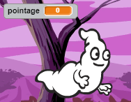

# Introduction { .intro }

Vous allez créer un jeu pour attraper des fantômes!

<div class="scratch-preview">
  <iframe allowtransparency="true" width="485" height="402" src="https://scratch.mit.edu/projects/embed/172595411/?autostart=false" frameborder="0"></iframe>
  
</div>

# Étape 1: Animer un fantôme { .activity }

## Liste de contrôle d'activité { .check }

+ Démarrez un nouveau projet Scratch et supprimez le lutin "chat" pour que votre projet soit vide. Vous pouvez trouver l'éditeur Scratch en ligne via <a href="http://jumpto.cc/scratch-new" target="_blank">jumpto.cc/scratch-new</a>.

+ Ajoutez un nouveau lutin "fantôme" et un arrière-plan approprié.

	

+ Ajoutez ce code pour le fantôme, il va apparaître et disparaître en boucle :

	```blocks
    quand ⚑ cliqué
    répéter indéfiniment
       cacher
       attendre (1) secondes
       montrer
       attendre (1) secondes
    fin
	```

+ Testez le code de votre fantôme en appuyant sur le drapeau vert.

## Sauvegarder votre projet { .save }

# Étape 2: Fantômes aléatoires { .activity }

Votre fantôme est vraiment trop facile à attraper, car il ne bouge pas!

## Liste de contrôle d'activité { .check }

+ Au lieu de rester au même endroit, Scratch peut choisir les coordonnées x et y de façon aléatoire. Ajouter un bloc `aller à` {.blockmotion} au code du fantôme pour que ça ressemble à :

	

+ Testez votre fantôme de nouveau et vous remarquerez qu'il apparaît chaque fois à un endroit différent.

## Sauvegarder votre projet { .save }

## Challenge: Plus aléatoire {.challenge }
Pouvez-vous faire `attendre` {.blockcontrol} votre fantôme pendant une durée aléatoire avant de réapparaître?  Pouvez-vous utiliser le bloc `mettre à (  ) % de la taille initiale` {.blocklooks} pour donner une taille aléatoire à votre fantôme chaque fois qu'il apparaît?

## Sauvegarder votre projet { .save }

# Étape 3: Attraper des fantômes { .activity }

Donnons la possibilité au joueur d'attraper les fantômes!

## Liste de contrôle d'activité { .check }

+ Pour permettre au joueur d'attraper un fantôme, ajoutez ce code :

	```blocks
    quand ce lutin est cliqué
    cacher
	```

+ Testez votre projet. Pouvez-vous attraper les fantômes lorsqu'ils apparaissent ? Si vous avez du mal à les attraper, vous pouvez jouer en plein écran en cliquant sur le bouton suivant :

	

## Challenge: Ajouter du son { .challenge }
Pouvez-vous ajouter un bruitage chaque fois qu'on attrape un fantôme?

## Sauvegarder votre projet { .save }

# Étape 4: Ajouter le pointage { .activity .new-page }

Rendons les choses plus intéressantes en gardant le pointage.

## Liste de contrôle d'activité { .check }

+ Pour garder le pointage du joueur, il faut le stocker quelque part. Une __variable__ est un endroit pour garder des données qui peuvent changer, comme un pointage.

	Pour créer une variable, cliquez sur l'onglet 'Scripts', selectionnnez `Données` {.blockdata} puis cliquez sur 'Créer une variable'.

	

	Tapez 'pointage' comme nom de variable, vérifiez qu'elle est disponible pour tous les lutins et cliquez sur 'OK' pour la créer. Vous allez ensuite voir un nombre de blocs de code qui peuvent être utilisés avec votre variable `pointage` {.blockdata}.

	

	Vous allez aussi voir le pointage en haut à gauche de la scène.

	

+ Quand nous lançons un nouveau jeu (en cliquant sur le drapeau), vous devez remettre le pointage à 0 :

	```blocks
    quand ⚑ cliqué
    [pointage v] prend la valeur [0]
	```

+ Quand on attrape un fantôme, vous devez ajouter 1 au pointage :

	

+ Executez votre programme de nouveau et attrapez quelques fantômes. Est-ce que votre pointage change?

## Sauvegarder votre projet { .save }

# Étape 5: Ajouter un compte à rebours { .activity }

Vous pouvez rendre votre jeu encore plus intéressant, en limitant votre jeu à 10 secondes pour attraper autant de fantômes que possible.

## Liste de contrôle d'activité { .check }

+ Vous pouvez utiliser une autre variable pour stocker le temps qu'il vous reste. Cliquez sur la scène, et créez une nouvelle variable nommée 'temps' :

	

+ Le compte à rebours devrait fonctionner ainsi :

	+ Le compte à rebours devrait commencer à 10 secondes ;
	+ Le compte à rebours devrait décompter chaque seconde ;
	+ Le jeu devrait s'arrêter quand le compte à rebours arrive à 0.

	Voici tout le code afin de réaliser ceci, ce que vous pouvez ajouter à votre __scène__ :

	```blocks
    quand ⚑ cliqué
    [temps v] prend la valeur [10]
    répéter jusqu’à <(temps) = [0]>
       attendre (1) secondes
       ajouter à [temps v] (-1)
    fin
    stop [tout v]

	```

	Voilà comment ajouter le code de `répéter jusqu’à`{.blockcontrol}`temps`{.blockdata}`= 0`{.blockoperators} :

	

+ Déplacez votre variable 'temps' vers la droite de votre scène. Vous pouvez aussi faire clique-droit sur l'affichage de la variable et choisir 'grande lecture' afin de changer comment le temps est présenté.

	

+ Demandez à un ami de tester votre jeu. Combien de points peut-il marquer? Si votre jeu est trop facile, vous pouvez :

	+ Donner moins de temps au joueur ;
	+ Faire en sorte que les fantômes apparaissent moins souvent ;
	+ Réduire la taille des fantômes.

	Testez votre jeu à quelques reprises jusqu'à vous soyez satisfait qu'il correspond au bon niveau de difficulté.

## Sauvegarder votre projet { .save }

## Challenge: Plus d'objets {.challenge}
Pouvez-vous ajouter d'autres objets à votre jeu ?


Vous devrez penser aux objets que vous allez ajouter. Réfléchissez à :

+ Leur taille?
+ Apparaissent-ils plus ou moins souvent que les fantômes?
+ A quoi correspondent-ils au niveau image et son quand on l'attrape?
+ Combien de points devrait-on gagner (ou perdre) quand on l'attrape?

Si vous avez besoin d'aide en ajoutant un autre objet, vous pouvez suivre de nouveau les étapes ci-dessus!

## Sauvegarder votre projet { .save }
