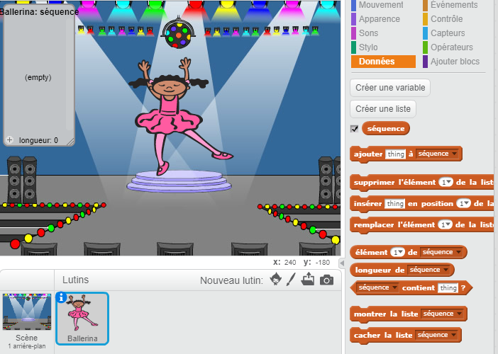
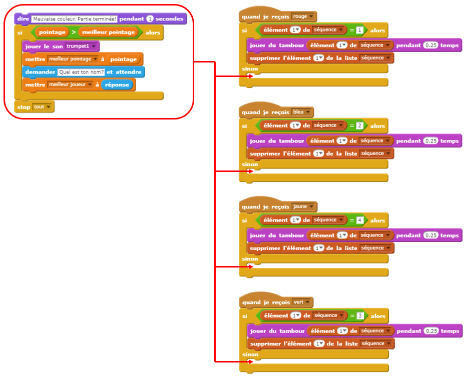
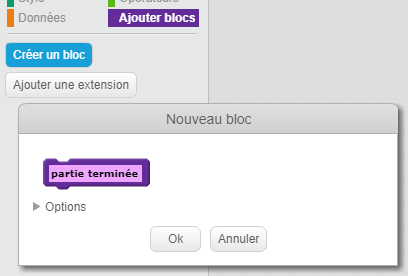
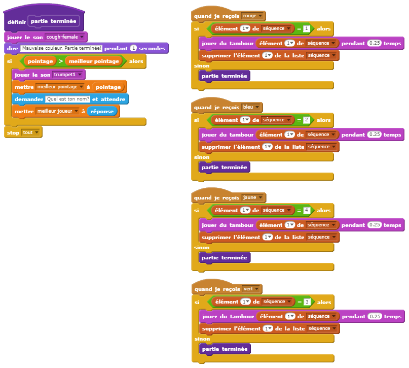
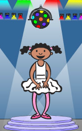

# Introduction { .intro }

Dans ce projet, vous allez créer un jeu de mémoire où vous devez mémoriser et répéter une séquence aléatoire de couleurs !

<div class="scratch-preview">
  <iframe allowtransparency="true" width="485" height="402" src="https://scratch.mit.edu/projects/embed/172305882/?autostart=false" frameborder="0"></iframe>
  
</div>

# Étape 1: Des couleurs aléatoires { .activity }

D'abord, créons un personnage qui peut se transformer dans une séquence aléatoire de couleurs à mémoriser par le joueur.

## Liste de contrôle { .check }

+ Démarrer avec un nouveau projet Scratch, et supprimer le lutin chat pour commencer d'un projet vide. L'éditeur en ligne se trouve à <a href="http://jumpto.cc/scratch-new" target="_blank">jumpto.cc/scratch-new</a>.

+ Choisir un lutin et un arrière-plan. Votre personnage n'a pas besoin d'être un humain, mais doit pouvoir changer de couleur.

	

+ Dans votre jeu, vous allez utiliser un chiffre différent pour représenter chaque couleur :

	+ 1 = rouge;
	+ 2 = bleu;
	+ 3 = vert;
	+ 4 = jaune.

	Donnez à votre personnage 4 des costumes avec 4 couleurs différentes, un pour chacune des 4 couleurs ci-dessus. Vérifier le bon ordre de vos costumes.

	

+ Pour créer une séquence aléatoire, vous avez besoin de créer une __liste__. Une liste est simplement une variable qui stocke des données _dans un certain ordre_. Créer une nouvelle liste nommée `séquence` {.blockdata}. Seul votre personnage a besoin de voir la liste, donc nous pouvons choisir 'Pour ce lutin uniquement'.

	

	Votre liste vide devrait apparaître en haut à gauche de votre scène, ainsi que beaucoup de nouveaux blocs à utiliser avec des listes.

	

+ Ajouter ce code à votre personnage afin d'ajouter un chiffre aléatoire à votre liste (et montrer le bon costume) 5 fois :

	```blocks
    quand ⚑ cliqué
    supprimer l'élément (tout v) de la liste [séquence v]
    répéter (5) fois
      ajouter (nombre aléatoire entre (1) et (4)) à [séquence v]
      basculer sur costume (élément (last v) de [séquence v])
      attendre (1) secondes
    fin
	```

	Vous pouvez remarquer que vous avez aussi vidé la liste avant de commencer.

## Défi : Ajouter du son {.challenge}
Tester votre projet plusieurs fois. Vous pouvez remarquer que parfois le même chiffre est choisi deux fois (ou plus) de suite, rendant la séquence plus difficile à mémoriser. Pouvez-vous faire jouer le son d'un tambour chaque fois que le personnage change de costume ?

Saurez-vous faire changer le son du tambour selon le chiffre aléatoire choisi ? Ceci sera _très_ similaire par rapport à votre code pour changer le costume du personnage.

## Sauvegarder votre projet { .save }

# Étape 2: Répéter la séquence { .activity }

Ajoutons 4 boutons, pour que le joueur répète la séquence mémorisée.

## Liste de contrôle { .check }

+ Ajouter 4 lutins à votre projet, qui vont devenir des boutons. Modifier vos 4 lutins pour avoir un de chaque couleur utilisée.

	

+ Quand on clique sur le tambour rouge, il faut envoyer le message à votre personnage, pour faire savoir que le bouton rouge a été cliqué. Ajouter ce code à votre tambour rouge :

	```blocks
    quand ce lutin est cliqué
    envoyer à tous [rouge v]
	```

+ Quand votre personnage reçoit ce message, il doit vérifier si le chiffre 1 est au début de la liste (ce qui veut dire que rouge est la prochaine couleur dans la séquence). Si ça correspond, c'est que la réponse est bonne. Sinon, c'est "Partie terminée!"

	```blocks
    quand je reçois [rouge v]
    si <(élément (1 v) de [séquence v]) = [1]> alors
      supprimer l'élément (1 v) de la liste [séquence v]
    sinon
      dire [Partie terminée!] pendant (1) secondes
      stop [tout v]
    fin
	```

+ Vous pouvez aussi faire clignoter des lumières une fois la liste vide, pour signifier que vous avez bien deviné la séquence entière correctement. Ajouter ce code à la fin du script `quand ⚑ cliqué` {.blockevents} de votre personnage :

	```blocks
    attendre jusqu’à <(longueur de [séquence v]) = [0]>
    envoyer à tous [gagné v] et attendre
	```

+ Cliquez sur votre scène, et ajouter ce code pour jouer __n'importe quel__ son et faire changer la couleur du fond une fois que le joueur a gagné la partie.

	```blocks
    quand je reçois [gagné v]
    jouer le son [drum machine v]
    répéter (50) fois
      ajouter à l'effet [couleur v] (25)
      attendre (0.1) secondes
    fin
    annuler les effets graphiques
	```

## Défi : Créer 4 boutons {.challenge}
Répéter les étapes ci-dessus pour vos boutons de couleur bleu, vert et jaune. Quel code restera pareil et quel code faudrait-il modifier pour chaque bouton?

Vous pouvez aussi ajouter des sons quand on appuie sur les boutons.

Pensez à tester le code que vous venez d'ajouter! Vous arrivez à mémoriser une séquence de 5 couleurs? Est-ce que la séquence change chaque fois?

## Sauvegarder votre projet { .save }

# Étape 3: De multiples niveaux { .activity .new-page }

Jusqu'alors, le joueur n'a qu'à se souvenir de 5 couleurs. Nous allons améliorer notre jeu en rendant la séquence plus longue.

## Liste de contrôle { .check }

+ Créer une nouvelle variable nommée `pointage` {.blockdata}.

	

+ Ce `pointage` {.blockdata} sera utilisé pour décider la longueur de la séquence que le joueur doit mémoriser. Alors, pour commencer le pointage (et la taille de la séquence) sera de 3. Ajouter ce bloc de code tout au début du code `quand ⚑ cliqué` {.blockevents} de votre personnage :

	```blocks
	  [pointage v] prend la valeur [3]
	```

+ Au lieu de toujours créer une séquence de 5 couleurs, vous voulez maintenant que le `pointage` {.blockdata} détermine la longueur de séquence. Changer la boucle `répéter` {.blockcontrol} de votre personnage (pour créer la séquence) en :

	```blocks
    répéter (pointage) fois
    fin
	```

+ Si la séquence a été correctement identifiée, vous devez ajouter 1 au pointage, pour augmenter la longueur de la séquence.

	```blocks
	  ajouter à [pointage v] (1)
	```

+ Enfin, vous avez besoin d'ajouter une boucle `répéter indéfiniment` {.blockcontrol} autour du code qui génère la séquence, pour créer une nouvelle séquence pour chaque niveau. Le code de votre lutin devrait apparaître comme suit :

	```blocks
    quand ⚑ cliqué
    [pointage v] prend la valeur [3]
    répéter indéfiniment
       supprimer l'élément (tout v) de la liste [séquence v]
       répéter (pointage) fois
          ajouter (nombre aléatoire entre (1) et (4)) à [séquence v]
          basculer sur costume (élément (dernier v) de [séquence v])
          attendre (1) secondes
       fin
       attendre jusqu’à <(longueur de [séquence v]) = [0]>
       envoyer à tous [gagné v] et attendre
       ajouter à [pointage v] (1)
    fin
	```

+ Demander à vos amis de tester votre jeu. Pensez à cacher la liste `séquence` {.blockdata} avant de lancer le jeu!

## Sauvegarder votre projet { .save }

# Étape 4: Meilleur pointage { .activity }

Ajoutons la possibilité d'enregistrer le meilleur pointage, pour pouvoir jouer contre vos amis.

## Liste de contrôle { .check }

+ Ajuter 2 nouvelles variables à votre projet, nommées `meilleur pointage` {.blockdata} et `meilleur joueur` {.blockdata}.

+ Si jamais le jeu s'arrête (en appuyant sur le mauvais bouton), vous aurez besoin de vérifier si le pointage du joueur est meilleur que le meilleur pointage actuel. Si c'est le cas, vous devez enregistrer le pointage comme le nouveau meilleur pointage, et enregistrer le nom du joueur. Voici à quoi devrait correspondre votre bouton rouge :

	```blocks
    quand je reçois [rouge v]
    si <(élément (1 v) de [séquence v]) = [1]> alors
       supprimer l'élément (1 v) de la liste [séquence v]
    sinon
       dire [Partie terminée!] pendant (1) secondes
       si <(pointage) > (meilleur pointage)> alors
          [meilleur pointage v] prend la valeur (pointage)
          demander [Meilleur pointage! Quel est ton nom?] et attendre
          [meilleur joueur v] prend la valeur (réponse)
       fin
       stop [tout v]
    fin
	```

+ Vous aurez besoin d'ajouter ce nouveau code aux 3 autres boutons aussi! Avez-vous remarqué que le code 'Partie terminée' est identique pour chacun des 4 boutons?

	

+ Si jamais vous changez une partie du code, par exemple pour ajouter un son ou changer le message 'Partie terminée!', vous devrez le changer 4 fois! Ça devient embêtant, et vous perdez beaucoup de temps.

	À la place, vous pouvez définir vos propres blocs, pour les réutiliser dans votre projet! Pour le faire, cliquer `Ajouter blocs` {.blockmoreblocks}, puis sur 'Créer un bloc'. Nommer ce nouveau bloc 'partie terminée'.

	

+ Ajouter le code du bloc `sinon` {.blockcontrol} du bouton rouge au nouveau bloc que vous voyez :

	

+ Désormais vous avez crée une nouvelle _fonction_ qui s'appelle `partie terminée` {.blockmoreblocks}, que vous pouvez utiliser où vous voulez. Tirez votre nouveau bloc `partie terminée` {.blockmoreblocks} vers les 4 scripts pour les boutons.

	

+ Ensuite, ajouter un son quand on clique sur le mauvais bouton. Vous n'avez besoin que d'ajouter ce code _une fois_ dans le bloc `partie terminée` {.blockmoreblocks} que vous venez de créer, et pas 4 fois à 4 endroits différents!

	

## Défi : Créer d'autres blocs {.challenge}
Est-ce que vous voyez d'autres parties de code qui sont les même pour les 4 boutons?


Pouvez-vous créer un autre bloc 'personnalisé', à utiliser pour chaque bouton?

## Sauvegarder votre projet { .save }

## Défi : Un autre costume {.challenge}
Avez-vous remarqué que votre jeu démarre avec votre personnage montrant une des 4 couleurs et qu'il s'affiche toujours la dernière couleur de la séquence pendant que le joueur répète la séquence?

Pouvez-vous ajouter un costume blanc à votre lutin, qui sera affiché au début du jeu, ainsi que quand le jouer tente de copier la séquence ?



## Sauvegarder votre projet { .save }

## Défi : Niveau de difficulté {.challenge}
Pouvez-vous laisser votre joueur choisir entre des niveaux 'mode Facile' (utilisant que les tambours rouge et bleu) et 'mode Normal' (qui utilise les 4 tambours)?

Vous pourriez imaginer même un mode 'Difficile", qui utilise un 5è tambour!

## Sauvegarder votre projet { .save }
