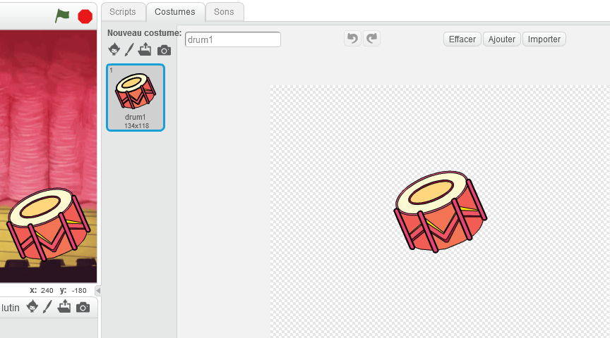
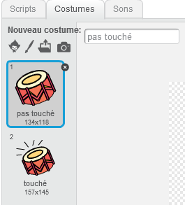
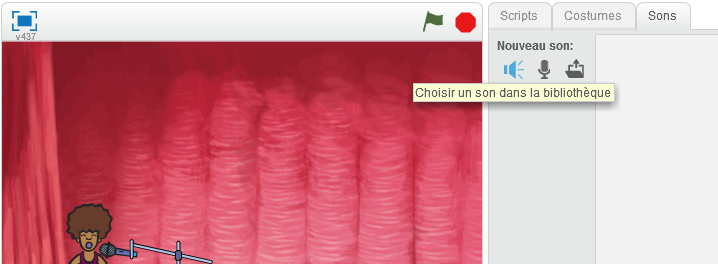

# Introduction { .intro }

Dans ce projet vous apprendrez à coder vos propres instruments de musique!

<div class="scratch-preview">
 <iframe allowtransparency="true" width="485" height="402" src="https://scratch.mit.edu/projects/embed/26741186/?autostart=false" frameborder="0"></iframe>
 
</div>

# Étape 1 : Fabrication d'un Tambour { .activity }

D'abord, créons un tambour qui produit un son lorsqu'il est frappé.

## Liste de contrôle d'Activité { .check }

+ Commencez un nouveau projet de Scratch et supprimez le lutin du chat pour que votre projet soit vide. Vous pouvez trouver l'éditeur de scratch en ligne à <a href="http://jumpto.cc/scratch-new">jumpto.cc/scratch-new</a>.

+ Ajoutez un lutin de tambour à votre projet et vous pouvez aussi ajoutez une image de fond appropriée à l'étape.

	

	Si vous n'êtes pas sûr de comment faire cela, le projet ' Lost in space ' vous aidera!

+ Programmons le tambour pour jouer un son lorsqu'il est cliqué. Assurez-vous que le lutin de tambour soit choisi et ajoutez ce code :

	```blocks
		quand ce lutin est cliqué
		jouer tambour (1 v) pendant (0.25) temps
	```

+ Cliquez sur le tambour pour essayer votre nouvel instrument!

+ Vous pouvez aussi changer l'aspect du tambour lorsqu'il est cliqué en créant un nouveau costume. Cliquez sur l'onglet 'Costumes' et vous verrez l'image du tambour.

	

+ Faites un clic droit sur le costume et peser sur 'dupliquer' afin de créer une copie du costume.

	

+ Faites un clic sur le nouveau costume (appelé 'drum2') et choisissez l'outil de ligne. Ensuite, vous devez tracer des lignes pour donner l'impression que le tambour joue un son.

	

+ Les noms des costumes ne sont pas très utiles à l'heure actuelle. Renommez les 2 costumes à 'not hit' et 'hit' en tapant le nouveau nom de chaque costume dans la boîte de texte.

	

+ Maintenant que vous avez 2 costumes différents pour votre tambour, vous pouvez choisir quel costume est affiché! Ajoutez ce code à votre tambour :

	```blocks
		quand le drapeau pressé
		basculer sur costume [not hit v]

		quand ce lutin est cliqué
		basculer sur costume [hit v]
		jouer tambour (1 v) pendant (0.25) temps
		basculer sur costume [not hit v]
	```

	Le bloc de code pour changer le costume est dans la section `Apparences` {.blocklooks}.

+ Testez votre tambour. Lorsque le tambour est cliqué, il devrait maintenant changer de costume afin de montrer qu'il a été frappé.

## Sauvegarder votre projet { .save }

## Défi : Amélioration de votre tambour { .challenge }

+ Pouvez-vous changer le son de votre tambour lorsqu'il est cliqué ?


+ Pouvez-vous aussi faire un son quand la barre d'espace est appuyée ? Vous devrez utiliser les blocs `Événement` {.blockevents}:

```blocks
	quand [space v] est pressé
```

 Vous pouvez copier votre code existant en y faisant un clic droit et en cliquant sur 'dupliquer'.


## Sauvegarder votre projet { .save }

# Étape 2 : Création d'un Chanteur { .activity .new-page }

Ajoutons un chanteur à votre orchestre!

## Liste de contrôle d'Activité { .check }

+ Ajoutez 2 autres lutins, un chanteur et un micro à votre étape.

	

+ Avant que vous ne puissiez faire chanter votre chanteur, vous devez ajouter un son à votre lutin. Assurez-vous que vous avez choisi votre chanteur, cliquez ensuite sur l'onglet 'Sons' et cliquer sur ' Choisir un son dans la bibliothèque ' :

	

+ Si vous cliquez sur 'chants' du côté gauche, vous pourrez alors choisir un son approprié pour votre lutin.

	

+ Maintenant que le son a bien été ajouté, vous pouvez ajouter ce code à votre chanteur :

	```blocks
		quand ce lutin est cliqué
		jouer le son [singer1 v] jusqu'au bout
	```

+ Cliquez sur votre chanteur pour bien s'assurer qu'il chante.

## Sauvegarder votre projet { .save }

## Défi : Changement du costume de votre chanteur { .challenge }
Pouvez-vous faire  semblant  que votre chanteur chante lorsque vous cliqué ? Si vous avez besoin d'aide, vous pouvez utiliser les instructions pour créer un tambour ci-dessus.


Rappelez-vous de tester votre nouveau code !

## Sauvegardez votre projet { .save }

## Défi : Faites votre propre orchestre { .challenge }
L'utilisation que vous avez appris dans ce projet de faire votre propre orchestre! Vous pouvez maintenant créer n'importe quel instrument que vous aimez, mais vérifiez les sons qui sont disponibles et les instruments afin d'obtenir quelques idées pour votre création.


Vos instruments ne doivent pas être raisonnables quoi que ce soit. Par exemple, vous pourriez faire un piano fait de muffins!


Si vous avez un microphone, vous pouvez enregistrer vos propres sons, ou même utiliser une web cam pour frapper vos instruments!


## Sauvegarder votre projet { .save }
