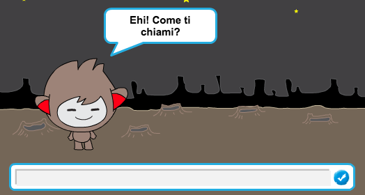
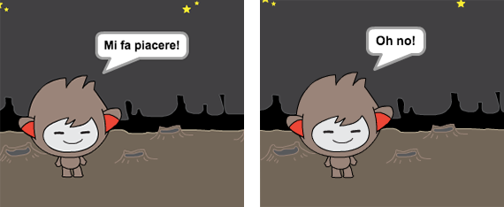
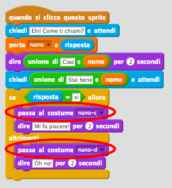
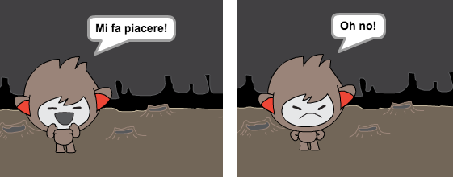
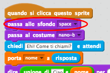
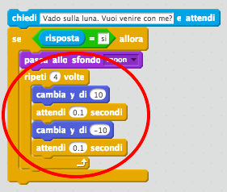

# Introduzione {.intro}

Imparerai a programmare il tuo robot parlante!

<div class="scratch-preview">
  <iframe allowtransparency="true" width="485" height="402" src="https://scratch.mit.edu/projects/embed/26762091/?autostart=false" frameborder="0"></iframe>
  
</div>

# Passo 1: Il tuo chatterbot { .activity }

## Lista delle attività { .check}

+ Prima di iniziare a creare il tuo chatterbot, dovrai decidere la sua personalità. __Pensa a__:
	+ Come si chiama?
	+ Dove vive?
	+ È felice? Serio? Divertente? Timido? Simpatico?

+ Inizia un nuovo progetto Scratch, e cancella lo sprite del gatto così che il tuo progetto sia vuoto. Puoi trovare l'editore Scratch online a <a href="http://jumpto.cc/scratch-new" target="_blank">jumpto.cc/scratch-new</a>.

+ Scegli uno di questi sprite di personaggi e aggiungilo al tuo progetto:

	

+ Scegli uno scenario che si adatti alla personalità del tuo chatterbot. Ecco un esempio, ma il tuo non deve essere uguale a questo:

	

## Salva il progetto {.save}

# Passo 2: Un chatterbot parlante { .activity }

Adesso che hai un chatterbot con la sua personalità, programmiamolo per farlo parlare.

## Lista delle attività { .check}

+ Clicca sul tuo personaggio chatterbot e aggiungi questo codice:

	```blocks
		quando si clicca questo sprite
		chiedi [Ehi! Come ti chiami?] e attendi
		dire [Che bel nome!] per (2) secondi
	```

+ Clicca sul tuo chatterbot per testarlo. Dopo che ti verrà chiesto il nome, digitalo nella casella al fondo del quadro.

	

+ Il tuo chatterbot risponderà semplicemente 'Che bel nome!' ogni volta. + Puoi personalizzare la risposta del chatterbot, usando le risposte dell'utente. Cambia il codice del chatterbot, in modo che sia così:

	```blocks
		quando si clicca questo sprite
		chiedi [Ehi! Come ti chiami?] e attendi
		dire (unione di [Ciao] e (risposta)) per (2) secondi
	```

	Per creare l'ultimo blocco, dovrai prima trascinare un blocco 'unisci' verde {.blockoperators}, e poi trascinarlo sul blocco 'dici' {.blocklooks}.

	

	Poi, puoi cambiare il testo 'hello' per dire 'Ciao', e trascinare il blocco azzurro 'risposta' {.blocksensing} (dalla sezione 'Sensori') sul testo 'world'.

	

+ Prova questo nuovo programma. Funziona come previsto? Se noti dei problemi, sai come risolverli? (Suggerimento: puoi provare ad aggiungere uno spazio dove vuoi!)

+ Puoi anche volere salvare il nome dell'utente in una variabile, in modo che tu possa usarlo di nuovo. + Crea una nuova variabile chiamata `nome` {.blockdata}. Se non ti ricordi come si fa, il progetto 'Ghostbusters' ti aiuterà.

+ L'informazione che hai inserito è già salvata in una variabile speciale chiamata 'risposta' {.blocksensing}.  Vai al gruppo di blocchi Sensori e clicca il blocco di risposta in modo da far apparire una spunta. L'attuale valore in 'risposta' {.blocksensing} dovrebbe essere visualizzato in alto a sinistra del quadro.

+ Una volta creata la tua nuova variabile, assicurati che il codice del tuo chatterbot sia così:

	```blocks
		quando si clicca questo sprite
		chiedi [Ehi! Come ti chiami?] e attendi
		porta [nome v] a (risposta)
		dire (unione di [Ciao ] e (nome)) per (2) secondi
	```

+ Se testi di nuovo il programma, noterai che la risposta è salvata nella variabile 'nome' {.blockdata}, ed è visualizzata in alto a sinistra del quadro.  La variabile 'nome' {.blockdata} adesso dovrebbe contenere lo stesso valore della variabile 'risposta' {.blocksensing}.

	

	Se preferisci non vedere le variabili sul quadro, puoi cliccare la spunta accanto alle variabili dei nomi nel tab 'Scritte' per nasconderle.

## Salva il progetto {.save}

## Sfida: Altre domande { .challenge }

Programma il tuo chatterbot a fare un'altra domanda. Riesci a salvare la sua risposta in una variabile?


## Salva il progetto {.save}

# Passo 3: Prendere decisioni { .activity }

Puoi programmare il tuo chatterbot a decidere cosa fare, a seconda delle risposte dell'utente.

## Lista delle attività { .check}

+ Facciamo in modo che il tuo chatterbot faccia una domanda all'utente che abbia come risposta 'sì' o 'no'. Ecco un esempio, ma se preferisci puoi cambiare la domanda:

	```blocks
		quando si clicca questo sprite
		chiedi [Ehi! Come ti chiami?] e attendi
		porta [nome v] a (risposta)
		dire (unione di [Ciao ] e (nome)) per (2) secondi
		chiedi (unione di [Stai bene ] e (nome)) e attendi
		se ((risposta) = [si]) allora 
  			dire [Mi fa piacere!] per (2) secondi
		end
	```

	Nota che hai ora salvato il nome dell'utente in una variabile, e puoi usarlo ogni volta che vorrai.

+ Per testare correttamente questo programma, dovrai provarlo due volte - una volta digitando 'no' come risposta, e un'altra volta digitando 'sì'. Otterrai una reazione dal tuo chatterbot 'se' {.blockcontrol} rispondi 'sì'.

+ Il problema del chatterbot è che non dà una risposta se l'utente risponde 'no'. Puoi risolvere questo problema cambiando il blocco 'se' {.blockcontrol} a un blocco 'se/altrimenti' {.blockcontrol}, in modo che il tuo codice adesso sia così:

	```blocks
		quando si clicca questo sprite
		chiedi [Ehi! Come ti chiami?] e attendi
		porta [nome v] a (risposta)
		dire (unione di [Ciao ] e (nome)) per (2) secondi
		chiedi (unione di [Stai bene ] e (nome)) e attendi
		se ((risposta) = [si]) allora 
  			dire [Mi fa piacere!] per (2) secondi
  		altrimenti
  			dire [Oh no!] per (2) secondi	
		end
	```

+ Se provi il tuo codice, vedrai che avrai una reazione quando rispondi 'sì' o 'no'. Il tuo chatterbot risponderà 'Mi fa piacere!' quando tu rispondi 'sì', ma risponderà 'Oh no!' se digiti qualsiasi altra risposta ('altrimenti' {.blockcontrol} significa 'diversamente').

	

+ Dentro un blocco 'se' {.blockcontrol} o 'altrimenti' {.blockcontrol} puoi mettere qualsiasi codice, e non solo il codice che fa parlare il tuo chatterbot. Per esempio, puoi cambiare il costume del chatterbot er farlo combaciare con la risposta.

	Se dai un'occhiata agli costummi del chatterbot, noterai che ce ne sono più di uno. (Se non ci sono, puoi sempre aggiungerli tu!)

	

	Puoi usare questi costumii come parte della risposta del tuo chatterbot, aggiungendo questo codice:

	

+ Prova il tuo programma e vedrai che la faccia del tuo chatterbot cambierà in base alla risposta che dai.

	

## Salva il progetto {.save}

## Sfida: Altre decisioni { .challenge }

Programma il tuo chatterbot a fare un'altra domanda - che abbia come risposta 'sì' o 'no'. Sai come far reagire il tuo chatterbot alla risposta?


## Salva il progetto {.save}

# Passo 4: Cambia posizione { .activity }

Puoi anche programmare il tuo chatterbot a cambiare la sua posizione.

## Lista delle attività { .check}

+ Aggiungi un altro scenario al tuo quadro,per esempio lo scenario 'luna'.

	

+ Ora puoi programmare il tuo chatterbot a cambiare posizione, aggiungendo questo codice al tuo chatterbot:

	```blocks
		chiedi [Vado sulla luna. Vuoi venire con me?] e attendi
		se ((risposta) = [si]) allora 
  			passa allo sfondo [moon v]
		end
	```

Devi anche assicurarti che il tuo chatterbot sia fuori quando inizi a parlarci. Aggiungi questo blocco in cima al codice chatterbot:

	

+ Prova il tuo programma, e rispondi 'sì' quando ti viene chiesto se vuoi andare sulla luna. Vedrai che la posizione del chatterbot è cambiata.

	

+ Il tuo chatterbot cambia posizione se digiti 'no'? Che succede se digiti 'non lo so'?

+ Puoi anche aggiungere questo codice dentro il blocco 'se' {.blockcontrol}, per far saltare il tuo chatterbot su e giù per 4 volte se la risposta è 'sì':

	```blocks
	ripeti (4) volte 
  		cambia y di (10)
  		attendi (0.1) secondi
  		cambia y di (-10)
  		attendi (0.1) secondi
	end
	```

	

+ Prova di nuovo il codice. Il tuo chatterbot salta su e giù se rispondi 'sì'?

## Salva il progetto {.save}

## Sfida: Crea il tuo chatterbot {.challenge}
Utilizza quello che hai imparato per completare la creazione del tuo chatterbot interattivo. Ecco alcune idee:


Una volta finito di creare il tuo chatterbot, invita i tuoi amici a fare una conversazione con lui! Ai tuoi amici piace il personaggio? Hanno notato qualche problema?

## Salva il progetto {.save}
