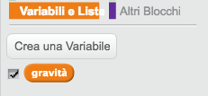
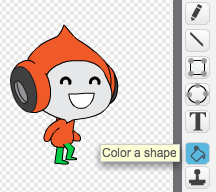

# Introduzione {.intro}

In questo progetto imparerai a creare un gioco a piattaforme in cui dovrai schivare le palle in movimento e raggiungere la fine del livello.

<div class="scratch-preview">
  <iframe allowtransparency="true" width="485" height="402" src="https://scratch.mit.edu/projects/embed/39740618/?autostart=false" frameborder="0"></iframe>
  
</div>

# Passo 1: Movimento del personaggio { .activity }

Iniziamo creando un personaggio che può muoversi a destra e a sinistra, e anche salire le scale.

## Lista delle attività { .check}

+ Apri il progetto Scratch online 'Dodgeball' a <a href="http://jumpto.cc/dodge-go" target="_blank">jumpto.cc/dodge-go</a> o scaricalo da <a href="http://jumpto.cc/dodge-get" target="_blank">jumpto.cc/dodge-get</a> e poi apri se stai usando l'editore offline.

	Il progetto contiene uno sfondo con piattaforme:

	

+ Aggiungi un nuovo sprite che sarà il tuo personaggio. È meglio se scegli uno sprite che abbia molteplici costumi, in modo che tu possa farlo apparire come se stesse camminando.

	

+ Usiamo i tasti freccia per muovere il personaggio. Quando il giocatore preme la freccia destra, vogliamo che il personaggio punti a destra, si muova di qualche passo e cambi al prossimo costume:

	```blocks
		quando si clicca sulla bandiera verde
		per sempre
  			se <tasto [freccia destra v] premuto> allora
   				punta in direzione (90 v)
    			fai (3) passi
    			passa al costum.e seguente
  			end
		end
	```

+ Prova il tuo personaggio cliccando la bandiera e poi tenendo premuta la freccia destra. Il tuo giocatore si muove verso destra? Sembra che il tuo personaggio stia camminando?

	

+ Per muovere il tuo personaggio a sinistra, dovrai aggiungere un altro blocco 'se' {.blockcontrol} dentro il loop 'per sempre' {.blockcontrol}, che muove il tuo personaggio a sinistra.

+ Prova il tuo nuovo codice per assicurarti che funzioni. Il tuo personaggio si capovolge quando cammina a sinistra?

	

	In quel caso, puoi risolvere questo bug cliccando l'icona '(i)' {.blocksensing} sullo sprite del personaggio, e poi clicca le frecce dstra-sinistra.

	

	Oppure, se preferisci, puoi aggiungere questo blocco all'inizio del testo del tuo personaggio:

	```scratch
	porta stile rotazione a [sinistra-destra v]
	```

+ Per salire una scala rosa, il tuo personaggio dovrebbe muoversi leggermente verso l'alto ogni volta che la freccia in su è premuta e sta toccando il colore corretto. Aggiungi questo codice dentro il loop 'per sempre' {.blockcontrol} del tuo personaggio:

	```blocks
		se <<tasto [freccia su v] premuto> e <sta toccando il colore [#FF69B4]>> allora
  			cambia y di (4)
		end
	```

+ Prova il personaggio - riesci a salire le scale rosa e a raggiungere la fine del livello?

	

## Salva il progetto {.save}

## Sfida: Completare il livello {.challenge}
Puoi aggiungere un altro codice al tuo personaggio, in modo che dica qualcosa 'se' {.blockcontrol} raggiunge la porta verde?


## Salva il progetto {.save}

# Passo 2: Gravità e salti { .activity }

Facciamo muovere il perosnaggio in maniera più realistica, aggiungendo la gravità e permettendogli di saltare.

## Lista delle attività { .check}

+ Avrai notato che il tuo personaggio può scendere dalla piattaforma a mezz'aria. Prova a scendere da una piattaforma e vedi cosa succede.

	

+ Per risolverlo, aggiungiamo la gravità al tuo gioco. Crea una nuova variabile chiamata `gravità` {.blockdata}. Se vuoi, puoi nascondere questa variabile dal quadro.

	

+ Aggiungi questo nuovo codice, che colloca la gravità a un numero negativo, e poi usalo per cambiare ripetutamente la coordinata y del tuo personaggio.

	```blocks
		quando si clicca sulla bandiera verde
		porta [gravità v] a [-4]
		per sempre
  			cambia y di (gravità)
		end
	```

+ Clicca sulla bandiera e poi trascina il personaggio nella parte alta del quadro. Cosa succede? La gravità funziona come previsto?

	

+ La gravità non dovrebbe muovere il tuo personaggio attraverso una piattaforma o una scala! Aggiungi un blocco 'se' {.blockcontrol} al tuo codice, in modo che la gravità funzioni solo quando il personaggio si trova a mezz'aria. Il codice della gravità ora dovrebbe apparire così:

	```blocks
		quando si clicca sulla bandiera verde
		porta [gravità v] a [-4]
		per sempre
  			se <non <<sta toccando il colore [#0000FF]> o <sta toccando il colore [#FF69B4]>>> allora
    			cambia y di (gravità)
  			end
		end
	```

+ Prova di nuovo la gravità. Il tuo personaggio si ferma quando si trova su una piattaforma o una scala? Puoi scendere dal bordo della piattaforma al livello inferiore?

	

+ Facciamo anche saltare il personaggio quando il giocatore preme la barra spaziatrice. Si può fare facilmente facendo muovere un po' di volte il personaggio verso l'alto, usando questo codice:

	```blocks
		quando si preme il tasto [spazio v]
		ripeti (10) volte
  			cambia y di (4)
		end
	```

	Siccome la gravità continua a spingere il personaggio verso il basso di 4 pixel, dovrai scegliere un numero maggiore di 4 nel tuo blocco 'cambia y di (4)' {.blockmotion}. Cambia questo numero fino ad arrivare all'altezza desiderata dei salti.

+ Se provi questo codice, noterai che funziona, ma che il movimento non è molto naturale. Per rendere il salto più naturale, dovrai muovere il personaggio in quantità sempre più piccole, finché non salta più.

+ Per fare ciò, crea un'altra variabile chiamata 'altezza salto' {.blockdata}. Come prima, puoi nascondere questa variabile se preferisci.

+ Cancella il codice del salto che hai aggiunto al personaggio, e sostituiscilo con questo codice:

	```blocks
		quando si preme il tasto [spazio v]
		porta [altezza salto v] a [8]
		ripeti fino a quando <(altezza salto) = [0]>
  			cambia y di (altezza salto)
  			cambia [altezza salto v] di (-0.5)
		end
	```

	Questo codice fa salire il tuo personaggio di 8 pixel, poi 7,5, poi 7, e così via, finché il personaggio smette di saltare. Questo rende il salto molto più naturale.

+ Cambia il valore iniziale della variabile 'altezza salto' {.blockdata} e provalo finché raggiungi l'altezza desiderata.

## Salva il progetto {.save}

## Sfida: Salto migliorato {.challenge}
Il tuo personaggio è in grado di saltare ogni volta che si preme la barra spaziatrice, anche se si trova già a mezz'aria. Puoi provare tenendo premuta la barra spaziatrice. Puoi fare in modo che il personaggio salti solo 'se' {.blockcontrol} sta toccando una piattaforma blu?

## Salva il progetto {.save}

# Passo 3: Palle da schivare { .activity .new-page}

Adesso che sei riuscito a far muovere il tuo personaggio, aggiungiamo delle palle che deve evitare.

## Lista delle attività { .check}

+ Crea un nuovo sprite per la palla. Puoi scegliere il tipo di palla che desideri.

	

+ Ridimensiona la palla in modo che il tuo personaggio possa saltare oltre essa. Prova a saltare oltre la palla per vedere se funziona.

	

+ Aggiungi questo codice alla tua palla:

	

	Questo codice crea un nuovo clone di palla ogni 3 secondi. Ogni nuovo clone si muove lungo la piattaforma superiore.

+ Clicca sulla bandiera per provare.

	

+ Aggiungi un altro codice allo sprite della palla in modo che possa muoversi in tutte e 3 le piattaforme.

	

+ Infine, ti servirà un codice per quando il personaggio viene colpito ('hit') da una palla! + Aggiungi questo codice allo sprite della palla:

	```blocks
		quando vengo clonato
		per sempre
  			se <sta toccando [Pico walking v]> allora
    			invia a tutti [hit v]
  			end
		end
	```

+ Dovrai aggiungere anche un codice al personaggio per farlo tornare all'inizio quando viene colpito:

	```blocks
		quando ricevo [hit v]
		punta in direzione (90 v)
		vai a x: (-210) y: (-120)
	```

+ Prova il tuo personaggio e vedi se ritorna all'inizio quando viene colpito da una palla.

## Salva il progetto {.save}

## Sfida: Palle a caso {.challenge}
Le palle che il personaggio deve schivare sono tutte uguali e appaiono sempre ogni 3 secondi. Puoi migliorarle in modo che:

+ non sembrino tutte uguali?
+ appaiano dopo un periodo di tempo casuale?
+ siano di una misura a caso?


## Salva il progetto {.save}

# Passo 4: Laser! { .activity .new-page}

Rendiamo il gioco un po' più difficile aggiungendo dei laser!

## Lista delle attività { .check}

+ Aggiungi un nuovo sprite al tuo gioco, chiamato 'Laser'. Dovrebbe avere 2 costumi, chiamati 'on' e 'off'.

	

+ Posiziona il tuo nuovo laser dove preferisci tra le 2 piattaforme.

	

+ Aggiungi un codice al laser per farlo passare da un costumeall'altro.

	```blocks
		quando si clicca sulla bandiera verde
		per sempre
  			passa al costume [accendi v]
  			attendi (2) secondi
  			passa al costume [spegni v]
  			attendi (2) secondi
		end
	```

	Se preferisci, puoi 'attendi' {.blockcontrol} un periodo di tempo `a caso` {.blockoperators} tra il cambio da un costume all'altro.

+ Infine, aggiungi un codice al tuo laser, in modo che venga trasmesso il messaggio 'colpito' quando il laser tocca il personaggio. Questo codice sarà molto simile a quello che hai aggiunto allo sprite della palla.

	Non dovrai aggiungere altri codici al tuo personaggio - sa già cosa fare quando viene colpito!

+ Prova il tuo gioco per vedere se riesci a superare il laser. Cambia i tempi di 'attendi' {.blockcontrol} nel tuo codice se i laser sono troppo facili o troppo difficili.

## Sfida: Altri ostacoli {.challenge}
Se credi che il gioco sia troppo facile, puoi aggiungere altri ostacoli al tuo livello. Puoi aggiungere quello che vuoi, ma ecco qualche idea:

+ Una farfalla assassina;
+ Piattaforme che appaiono e scompaiono;
+ Palline da tennis cadenti che devono essere evitate.


Puoi perfino creare più di uno scenario, e avanzare al livello seguente quando il personaggio raggiunge la porta verde:

```blocks
	se <sta toccando il colore [#00FF00]> allora
  		passa allo sfondo [prossimo scenario v]
  		vai a x: (-210) y: (-120)
  		attendi (1) secondi
	end
```

## Salva il progetto {.save}

## Sfida: Salto migliorato {.challenge}
Nel tuo gioco c'è un altro piccolo bug: la gravità non spinge in basso il personaggio se_qualsiasi_delle sue parti tocca una piattaforma blu - inclusa la testa! Puoi fare la prova salendo una scala quasi fino in cima e poi muovendoti a sinistra.


Puoi risolvere questo bug? Per farlo, dovrai dare al personaggio dei pantaloni di colore diverso (su_tutti_gli costumi)...



...e poi sostituisci il codice:

```blocks
	<sta toccando il colore [#0000FF]>
```

con:

```blocks
	<il colore [#00FF00] sta toccando il colore [#0000FF]>
```

Ricordati di provare le modifiche apportate per assicurarti che il bug sia risolto!

## Salva il progetto {.save}

## Sfida: Altre vite {.challenge}
Puoi dare al tuo giocatore 3 'vite' {.blockdata} invece di riportarlo ogni volta all'inizio? Ecco come potrebbe funzionare il gioco:

+ Il giocatore inizia con 3 vite;
+ Ogni volta che il giocatore viene colpito, perde una vita e torna all'inizio;
+ Se non restano più vite, il gioco finisce.

## Salva il progetto {.save}
