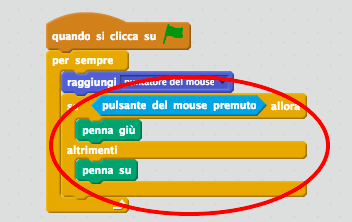
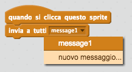

# Introduction { .intro }

In questo progetto, imparerai a creare il tuo programma di pittura!

<div class="scratch-preview">
  <iframe allowtransparency="true" width="485" height="402" src="https://scratch.mit.edu/projects/embed/63473366/?autostart=false" frameborder="0"></iframe>
  
</div>

# Passo 1: Creare una matita { .activity }

Iniziamo a creare una matita che può essere usata per disegnare sul quadro.

## Lista delle attività { .check}

+ Apri il progetto Scratch online 'Scatola dei Colori' a <a href="http://jumpto.cc/paint-go" target="_blank">jumpto.cc/paint-go</a> o scaricalo da <a href="http://jumpto.cc/paint-get" target="_blank">jumpto.cc/paint-get</a> e poi aprilo se stai usando l'editore offline.

	Vedrai gli sprite della matita e della gomma:

		

+ Siccome userai il mouse per disegnare, vorrai che la matita segua il mouse 'per sempre' {.blockcontrol}. Aggiungi questo codice allo sprite della tua matita:

	```blocks
		quando si clicca sulla bandiera verde
		per sempre 
  			raggiungi [mouse pointer v]
		end
	```

+ Prova questo codice cliccando la bandiera e muovendo poi il mouse attorno al quadro. 

+ Poi, facciamo in modo che la tua matita disegni 'se' {.blockcontrol} il mouse è stato cliccato. Aggiungi questo codice allo sprite della tua matita:

		

+ Prova di nuovo il codice. Questa volta, muovi la matita attorno al quadro e tieni premuto il tasto del mouse. Puoi disegnare con la matita?

	
	

## Salva il progetto { .save }

# Passo 2: Penne colorate { .activity }

Aggiungiamo diverse penne colorate al tuo progetto, e permettiamo all'utente di scegliere quella che preferisce!

## Lista delle attività { .check}

+ Clicca sullo sprite della matita, clicca 'Costumi' e duplica il tuo costume 'matita-blu'.

	

+ Rinomina il tuo nuovo costume 'matita-verde' e colora la matita verde.

	

+ Crea due nuovi sprite, che userai per selezionare la matita blu o verde.

	

+ Quando l'icona verde è cliccata, dovrai 'invia a tutti'  {.blockevents} un messaggio allo sprite della matita, dicendo di cambiare costume e colore di matita.

	Per fare ciò, aggiungi prima questo codice all'icona verde.

	```blocks
		quando si clicca questo sprite
		invia a tutti [verde v]
	```

	Per creare il blocco 'trasmetti' {.blockevents}, clicca la freccia in basso e seleziona 'nuovo messaggio...'.

	

	Puoi dunque digitare 'verde' per creare il tuo nuovo messaggio.

	

+ Ora dovrai dire allo sprite della matita cosa fare quando riceve il messaggio. Aggiungi questo codice allo sprite della tua matita:

	```blocks
		quando ricevo [verde v]
		passa al costume [matita-verde v]
		usa penna di colore [#00ff00]
	```

	Per fare in modo che la matita colori verde, clicca la casella colorata nel blocco 'imposta colore'  {.blockpen}, e clicca sull'icona verde per scegliere il verde come colore della matita. 

+ Ora puoi fare la stessa cosa per l'icona della matita blu, aggiungendo questo codice allo sprite selezionatore blu:

	```blocks
		quando si clicca questo sprite
		invia a tutti [blu v]
	```

	...e aggiungi questo codice allo sprite della tua matita:

	```blocks
		quando ricevo [blu v]
		passa al costume [matita-blu v]
		usa penna di colore [#0000ff]
	```

+ Infine, dovrai dire allo sprite della tua matita quale costume e quale colore di matita scegliere quando il progetto è iniziato, e anche di ripulire la schermata. Aggiungi questo codice all'inizio del codice della matita 'quando si clicca la bandiera' {.blockevents} (prima del loop 'per sempre' {.blockcontrol}:

	```blocks
		pulisci
		passa al costume [matita-blu v]
		usa penna di colore [#0000ff]	```

	Se preferisci, puoi iniziare con una matita colorata diversa!

+ Prova il tuo progetto. Puoi intercambiare le penne blu e verde?

	

## Salva il progetto { .save }

# Passo 3: Fare errori { .activity .new-page }

A volte si può sbagliare, dunque aggiungiamo al tuo progetto il tasto 'ripulisci' e una gomma!

## Lista delle attività { .check}

+ Aggiungiamo un tasto per ripulire il quadro. Per fare ciò, aggiungi al quadro lo sprite della lettera 'blocco-X' e coloralo in rosso.

	

+ Aggiungi il codice al tuo nuovo tasto cancella per ripulire il quadro quando viene cliccato.

	```blocks
		quando si clicca questo sprite
		pulisci
	```

	Nota che non è necessario mandare un messaggio per ripulire il quadro, perché può farlo qualsiasi sprite!

+ Avrai probabilmente notato che lo sprite della matita include un costume da gomma:

	
	

+ Il tuo progetto include anche uno sprite per selezionare la gomma, cliccalo col tasto destro e scegli 'mostra'. Il tuo quadro dovrebbe essere così:

	

+ Ora puoi aggiunger un codice allo sprite selezionatore della gomma, per comunicare alla matita di diventare gomma.

	```blocks
		quando si clicca questo sprite
		invia a tutti [gomma v]
	```

+ Quando la matita riceve questo messaggio, puoi creare una gomma passando dall'costume matita a quello di gomma, e cambiando il colore della matita con lo stesso colore del quadro!

	```blocks
		quando ricevo [gomma v]
		passa al costume [gomma v]
		usa penna di colore [#FFFFFF]
	```

+ Prova il tuo progetto per vedere se puoi cancellare sul quadro.

	

+ C'è un altro problema con la matita - puoi disegnare dappertutto sul quadro, anche vicino alle icone selezionatrici!

	

	Per risolverlo, devi comunicare alla matita di disegnare solo se il mouse è cliccato_e_se la posizione y del mouse è maggiore di -120 ('mouse y' {.blocksensing}'> -120' {.blockoperators}). Cambia l'affermazione 'se' {.blockcontrol} della matita per farla diventare così:

	

+ Prova il tuo progetto; ora dovresti essere in grado di disegnare vicino ai blocchi selettori.

	

## Salva il progetto { .save }

# Passo 4: Cambiare la larghezza della matita { .activity .new-page }

Facciamo in modo che l'utente possa disegnare usando una varietà di misure di matita diverse.

## Lista delle attività { .check}

+ Per prima cosa, aggiungiamo una nuova variabile chiamata 'larghezza'. Se non sai come si fa, il progetto 'Ghostbusters' ti sarà utile.

+ Aggiungi questa linea_dentro_il loop 'per sempre' {.blockcontrol} del codice della matita:

	```blocks
		usa penna di dimensione (larghezza)
	```

	La larghezza della matita ora verrà costantemente regolata al valore della tua variabile 'larghezza'.

+ Puoi cambiare il numero conservato in questa variabile facendo clic col pulsante destro sulla tua variabile (sul quadro) e cliccando la barra di regolazione (SLIDER in inglese).

	

	Puoi ora trascinare lo slider sotto la variabile per cambiarne il valore.

	

+ Prova il tuo progetto e vedi se riesci a modificare la larghezza della matita.

	

	Se preferisci, puoi impostare il valore massimo e minimo permesso per la 'larghezza'. Per fare ciò, clicca di nuovo col pulsante destro sulla tua variabile e clicca 'imposta slider minimo e massimo'. Regola il valore minimo e massimo della tua variabile per qualcosa di più sensibile, come 1 e 20.

	

	Continua a provare la tua variabile 'larghezza' fino a raggiungere il valore desiderato.

## Salva il progetto { .save }

## Sfida: Scorciatoie { .challenge }
Puoi creare dei tasti di scelta rapida per i tuoi comandi? Ad esempio:

+ b = passa a penna blu
+ g = passa a penna verde
+ e = passa a gomma
+ c = ripulisci schermo

Puoi perfino permettere all'utente di cambiare la larghezza della penna con i tasti freccia!

## Salva il progetto { .save }

## Sfida: Altre penne { .challenge }
Puoi aggiungere le penne rossa, gialla e nera al tuo programma di pittura? Dai un'occhiata al passo 2 se non ti ricordi come si fa. Ricordati di aggiungere delle scorciatoie a queste nuove penne!

Puoi usare le tue penne per fare un disegno?


