---
title: Rock Band
description: In questo progetto imparerai come programmare il tuo strumento musicale!
layout: project
notes: "Rock Band - notes.md"
project-type: sample
---

# Introduzione { .intro }

In questo progetto imparerai come programmare il tuo strumento musicale!

<div class="scratch-preview">
	<iframe allowtransparency="true" width="485" height="402" src="http://scratch.mit.edu/projects/embed/26741186/?autostart=false" frameborder="0"></iframe>
	
</div>

# Passo 1: Sprites { .activity }

Prima di cominciare a programmare devi aggiungere un 'oggetto', in Scratch questi 'oggetti' si chiamano __sprites__.

## Lista delle Attivita' { .check }

+ Prima di tutto apri l'editor di Scratch. Lo trovi online all'indirizzo: <a href="http://jumpto.cc/scratch-new" target="_blank">jumpto.cc/scratch-new</a>. Si presenta così:

	

+ Lo sprite del gatto che vedi è la mascotte di Scratch. Buttiamolo via premendo col tasto destro del mouse sullo sprite per selezionare l'opzione 'cancella'.

	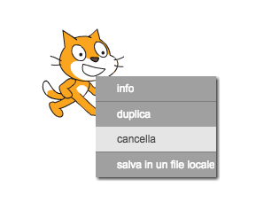

+ Poi fai click col mouse su 'scegli uno sprite dalla libreria' per aprire la lista con tutti gli sprite di Scratch.

	

+ Scorri verso il basso fino a che non trovi lo sprite di un tamburo. Seleziona uno dei due sprite e per aggiungerlo al progetto premi il tasto 'OK' in basso a destra.

	

+ Premi l'icona 'espandi' e poi fai click varie volte sul tamburo per rimpicciolirlo.

	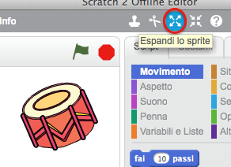

## Salva il tuo progetto { .save }

Dai un nome al tuo programma, scrivendo nella casella di testo nell'angolo in alto a sinistra.

Per salvare il progetto puoi anche selezionare la voce 'Salva ora' dal menu 'File'.


(Se invece non hai un account Scratch, puoi comunque salvare una copia del tuo progetto selezionando 'Download sul tuo computer').

# Passo 2: Lo Stage { .activity }

Lo __stage__ è l'area sulla sinistra, ed è lì che il tuo progetto prende vita. Immagina che sia lo spazio per una performance, proprio come un vero palcoscenico!

## Lista delle Attività { .check }

+ Lo stage inizialmente è bianco, e piuttosto noioso! Aggiungiamo uno sfondo facendo click col mouse sull'icona 'Scegli uno sfondo dalla libreria'.

	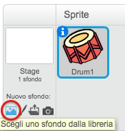

+ Scegli 'Interni' dal menu di sinistra, seleziona come sfondo un palcoscenico e fai click col mouse sul tasto 'OK'.

	

+ Adesso il tuo stage dovrebbe presentarsi così:

	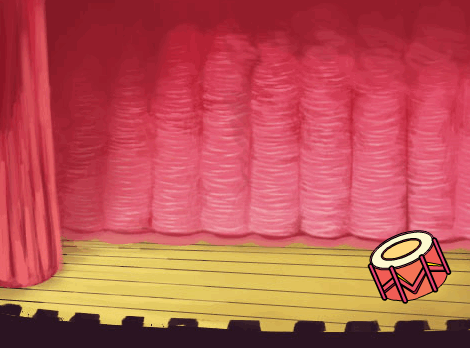

# Passo 3: Creare un Tamburo { .activity }

Programmiamo il tamburo perché suoni quando viene colpito.

## Lista delle Attività { .check }

+ Puoi trovare i blocchi di codice nel pannello 'Scripts', e sono di vari colori a seconda del tipo!

	Fai click col mouse sullo sprite del tamburo e trascina i due blocchi che vedi nell'immagine all'interno dell'area dedicata al codice che si trova sulla destra, verifica che siano collegati tra loro (come dei mattoncini Lego).

	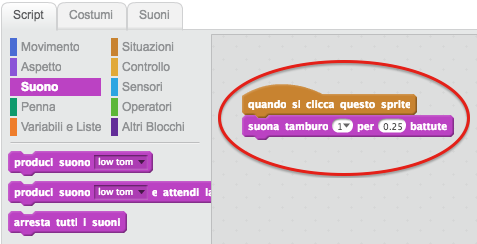

+ Fai click col mouse sul tamburo nello stage per provare il tuo nuovo strumento!

## Salva il tuo progetto  { .save }

##Sfida: Perfeziona il tamburo { .challenge }

+ Riesci a cambiare il suono che produce il tamburo quando viene premuto?

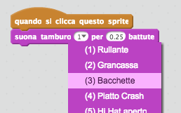

+ Riesci a fare in modo che il tamburo produca un suono premendo la barra spazio? Dovrai utilizzare questo blocco `situazione` {.blockevents}:

```blocks
	Quando si preme il tasto [spazio v]
```

Puoi anche copiare il codice usando il tasto destro del mouse su quello che hai già creato e scegliendo 'duplica'.


## Salva il tuo progetto { .save }

# Passo 4: Creare un cantante { .activity .new-page }

Aggiungiamo un cantante alla tua band!

## Lista delle Attività { .check }

+ Aggiungi altri due sprite nello stage: un cantante ed un microfono.

	

+ Prima che la tua cantante possa cantare, dovrai aggiungere un suono allo sprite. Assicurati di aver selezionato lo sprite della cantante, scegli il pannello 'Suoni' e fai click col mouse su 'Scegli un suono dalla libreria':

	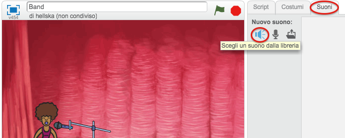

+ Scegliendo 'Canti' dalla lista a sinistra potrai scegliere un suono adatto da aggiungere allo sprite.

	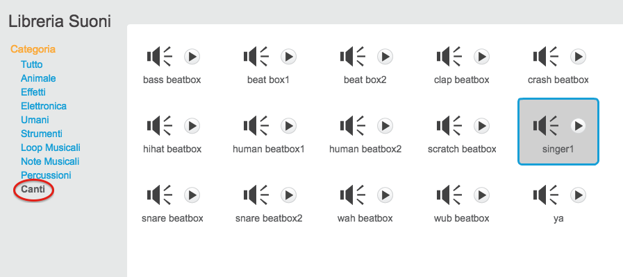

+ Dopo aver caricato il suono, aggiungi questo codice alla tua cantante:

	```blocks
		quando si clicca questo sprite
		produci suono [singer1 v] e attendi la fine
	```

+ Clicca sulla cantante per assicurarti che canti quando viene premuta.

## Salva il tuo progetto { .save }

# Passo 5: I Costumi { .activity .new-page }

Facciamo in modo che la cantante sembri cantare!

## Lista delle Attività { .check }

+ Creando un nuovo costume puoi cambiare l'aspetto della cantante quando viene cliccata. Seleziona il pannello 'Costumi' e vedrai l'immagine della cantante.

	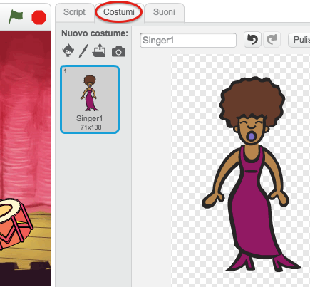

+ Clicca col tasto destro del mouse sul costume e scegli 'Duplica' per farne una copia.

	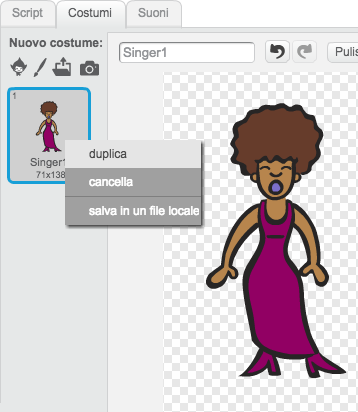

+ Clicca sul nuovo costume (che si chiamerà 'Singer2') e scegli lo strumento 'Linea' e disegna delle linee per simulare che la cantante stia emettendo dei suoni.

	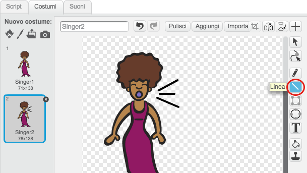

+ I nomi dei costumi non sono molto significativi per ora. Rinomina i due costumi rispettivamente come 'non canta' e 'canta' scrivendo direttamente nella casella di testo di ciascuno.

	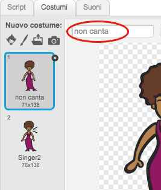

+ Adesso che hai due costumi per la tua cantante, potrai decidere quale visualizzare! Aggiungi questi due blocchi alla cantante:

	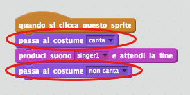

	Il blocco di codice per cambiare il costume si trova nella sezione `Aspetto` {.blocklooks}.

+ Prova la cantante. Ora la cantante quando viene cliccata dovrebbe apparire come se cantasse!

##Sfida: Cambiare il costume del tamburo { .challenge }
Riesci a fare apparire il tamburo come se venisse colpito? Se hai bisogno di aiuto, utilizza le precedenti istruzioni per cambiare il costume della cantante.


Ricordati di provare che il nuovo codice funzioni!

## Salva il tuo progetto { .save }

##Sfida: Crea la tua band { .challenge }
Usa quello che hai imparato in questo progetto per creare la tua band! Puoi creare tutti gli strumenti che vuoi, ma prima guarda i suoni e gli strumenti disponibili come ispirazione.

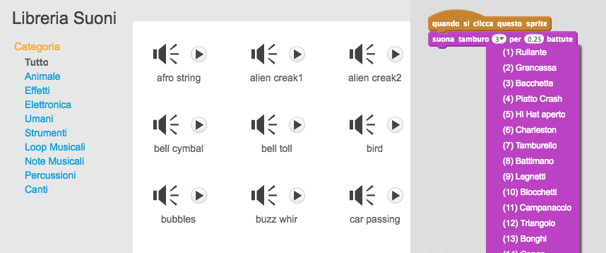

Comunque i tuoi strumenti non devono essere sensati. Per esempio potresti creare un pianoforte fatto di muffins!


Oltre ad usare gli sprite presenti nella libreria, puoi anche disegnarne di nuovi.


Se possiedi un microfono puoi anche registrare i tuoi suoni personalizzati, o addirittura usare una webcam per percuotere il tuo strumento!


## Salva il tuo progetto { .save }
