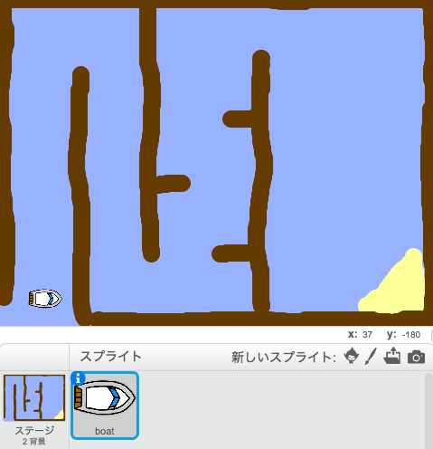
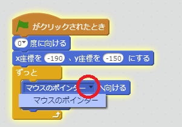
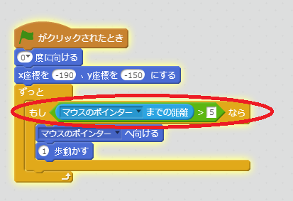
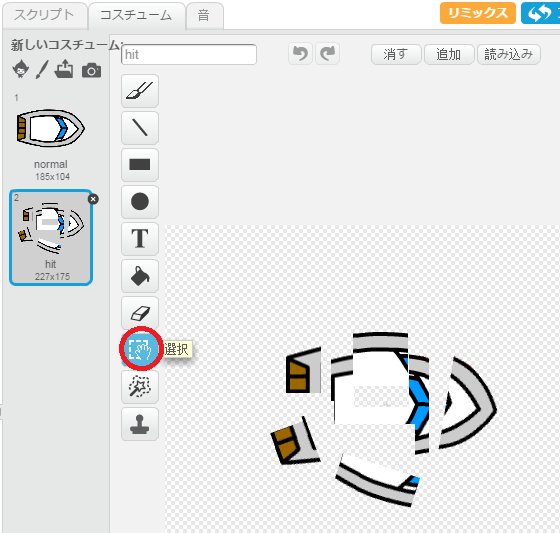
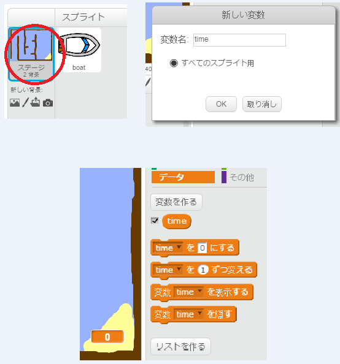
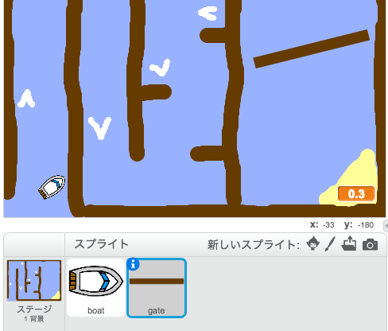
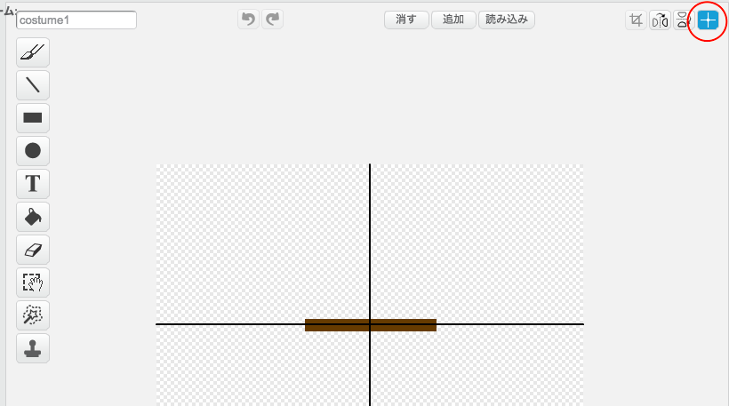

---
title: ボートレース
level: Scratch 1
language: ja-JP
stylesheet: スクラッチ
embeds: "*.png"
materials: ["Club Leader Resources/*","Project Resources/*"]
...

# まえがき { .intro }

このプロジェクトではプログラミングを使ったゲームを作ります。マウスを使ってボートをゴールの島まで動かしましょう！

<div class="scratch-preview">
  <iframe allowtransparency="true" width="485" height="402" src="http://scratch.mit.edu/projects/embed/63957956/?autostart=false" frameborder="0"></iframe>
  
</div>

# ステップ１：まずはじめに { .activity }

## チェックリスト { .check }

+ 「ボートレース」プロジェクトを<a href="http://jumpto.cc/boat-go">jumpto.cc/boat-get</a>からオンラインで開くか<a href="http://jumpto.cc/boat-get">jumpto.cc/boat-get</a>からダウンロードしてオフラインで開きましょう。

+ このプロジェクトにはボートと２つのアイテムが入っています。
	+ ボートが当たってはいけない木のかべ。
	+ ボートが向かっていくゴールの島。

	ゲームをこんなふうに作ってみましょう！

	 

# ステップ２：ボートを動かす { .activity }
 
## チェックリスト { .check }

+ ボートをマウスで動かしてみましょう。コードをこのようにします。

	```blocks
		⚑ がクリックされたとき
		(0 v) 度に向ける
		x座標を (-190) 、y座標を (-150) にする
		ずっと
   			[マウスのポインター v] へ向ける
   			(1) 歩動かす
		end
	```

+ フラグ(⚑)ボタンをクリックしたら、マウスを使ってボートを動かしてみましょう。ボートはマウスに向かって付いてきますか？

	

	注意：スクラッチにはバグがあり、ボートがマウスポインターに向かって付いてこなくなることがあります。その場合は、`マウスのポインターへ向ける`{.blockmotion}というブロックの下ボタンから「マウスのポインター」をもう一度えらんでください。

		

+ ボートがマウスポインターにつくと、おかしなことになってしまいます。

	そうならないように、`もし…なら`{.blockcontrol}のブロックを入れて、ボートがマウスから5ピクセルはなれた時だけ動くようにしましょう。

		

+ もう一度テストして、うまく動くようになったか、たしかめてみましょう。

## プロジェクトを保存してください { .save }

# ステップ３：クラッシュ! { .activity .new-page }

ボートは木のかべを通りぬけることができてしまいます！直してみましょう。

## チェックリスト { .check }

+ ボートのコスチュームとして、はじめのコスチュームの他にもう１つ、クラッシュしたときのコスチュームを作りましょう。「boat」スプライトの「normal」コスチュームで右クリックして「<ruby>複製<rp>（</rp><rt>ふくせい</rt><rp>）</rp></ruby>」をえらび、「hit」という名前にしてください。

+ 「hit」コスチュームをクリックし、「せんたく選択」ツールを使ってボートのいろいろな部分を動かしたり回したりして、ボートがこわれたようにしてください。

	

+ ボートの`ずっと`{.blockcontrol}ループ内のコードを次のようにし、ボートが木のかべに<ruby>触<rp>（</rp><rt>ふ</rt><rp>）</rp></ruby>れたらクラッシュするようにしましょう。

	```blocks
		もし <[#603C15] 色に触れた> なら
   			コスチュームを [hit v] にする
   			[Noooooo!] と (1) 秒言う
   			コスチュームを [normal v] にする
   			(0 v) 度に向ける
   			x座標を (-215) 、y座標を (-160) にする
		end
	```

	コードを`ずっと` {.blockcontrol} ループ内に足すと,ポートが木の壁にクラッシュ
	したか<ruby>常<rp>（</rp><rt>つね</rt><rp>）</rp></ruby>に<ruby>確認<rp>（</rp><rt>かくにん</rt><rp>）</rp></ruby>します。

+ ボートはかならず「normal」のコスチュームでスタートするように、上のずっとループ内でNoooooo!と言った後にコスチュームを「normal」にもどします。

+ 木のかべを通りぬけようとすると、ボートはクラッシュしスタートへもどります。

	

## プロジェクトを保存してください { .save }

## チャレンジ：ゴール! {.challenge}
もう一つ `もし…なら` {.blockcontrol}ブロックを使って、ボートが島についたらゴールにしましょう。

ボートが黄色の島についたら、「YEAH!」と言ってゲームが止まるようにします。このようなコードを使ってみましょう。

```blocks
	[YEAH!] と (1) 秒言う
	[すべて v] を止める
```


## プロジェクトを保存してください { .save }

## チャレンジ：音をならす {.challenge}
ボートがクラッシュしたときや、ゴールの島についたときに、音をならしてください。バックグラウンドミュージックをならすことができます（前回の「ロックバンド」プロジェクトを見てみましょう）

## プロジェクトを保存してください { .save }

# ステップ４：タイマー! { .activity }

プレイヤーがゴールに着くのにかかった時間を、タイマーで計れるようにしましょう。

## チェックリスト { .check }

+ 「ステージ」に新しい<ruby>変数<rp>（</rp><rt>へんすう</rt><rp>）</rp></ruby>`time` {.blockdata}を追加しましょう。 ダブル・クリックすると、４つの使い方をえらぶことができます。わからなくなったら、「ゴーストバスターズ」プロジェクトを見てみましょう。

	

+ __「ステージ」__のコードをこのようにし、ボートが島に着くまでタイマーがカウントをつづけるようにします。

	```blocks
		⚑ がクリックされたとき
		[time v] を [0] にする
		ずっと
   			(0.1) 秒待つ
   			[time v] を (0.1) ずつ変える
		end
	```

+ できあがりです！どれくらい早くゴールに着けるか、ためしてみましょう！

	

## プロジェクトを保存してください { .save }

# ステップ５：動くかべとスピードアップ { .activity }

_まだまだ_ゲームはかんたんすぎるので、いろいろつけ足してもっとおもしろくしましょう。

## チェックリスト { .check }

+ まずはボートの'スピード'を上げる白いやじるしをステージに足しましょう。

	

+ スクリプトのタブの中にプログラムのためのブロックがあります。以下のブロックを`ずっと` {.blockcontrol} ループの中に入れて、白いスピードアップにふ触れたら3歩よぶんに進むようにします。

	```blocks
		もし <[#FFFFFF] 色に触れた> なら
   			(3) 歩動かす
		end
	```

+ 回転するゲートを作って、ボートをじゃましましょう。

	

	ゲートの色と木のかべの色が同じ茶色であることをたしかめましょう。

+ ゲートスプライトを中心にセットしてください。

	

+ ゲートがゆっくり回転しつづけるように、`ずっと` {.blockcontrol}ブロックを作ってください。

+ プログラムをテストしてみましょう。回転ゲートをうまくよけないと進めません。

	

## プロジェクトを保存してください { .save }

## チャレンジ：<ruby>障害物<rp>（</rp><rt>しょうがいぶつ</rt><rp>）</rp></ruby>の<ruby>追加<rp>（</rp><rt>ついか</rt><rp>）</rp></ruby>！ {.challenge .new-page}
ゲームに<ruby>障害物<rp>（</rp><rt>しょうがいぶつ</rt><rp>）</rp></ruby>を<ruby>追加<rp>（</rp><rt>ついか</rt><rp>）</rp></ruby>しましょう。例をいくつか示します。

+ <ruby>背景<rp>（</rp><rt>はいけい</rt><rp>）</rp></ruby>にグリーンスライムを<ruby>追加<rp>（</rp><rt>ついか</rt><rp>）</rp></ruby>し、プレーヤーがふれるとスピードダウンします。`...秒待つ` {.blockcontrol}ブロックを使用します。

```blocks
	(0.01) 秒待つ
````


+ 丸太やサメなど移動する<ruby>障害物<rp>（</rp><rt>しょうがいぶつ</rt><rp>）</rp></ruby>も追加できます！


このようにブロックを組むと移動するでしょう。

```blocks
	(1) 歩動かす
	もし端に着いたら、跳ね返る
````

新しい<ruby>障害物<rp>（</rp><rt>しょうがいぶつ</rt><rp>）</rp></ruby>が茶色でない場合は、ボートのコードに<ruby>追加<rp>（</rp><rt>ついか</rt><rp>）</rp></ruby>してください。

```blocks
	もし <<[#603C15] 色に触れた> または <[shark v] に触れた>> なら
	end
```

## プロジェクトを保存してください { .save }

## チャレンジ：ボートの<ruby>追加<rp>（</rp><rt>ついか</rt><rp>）</rp></ruby>！ {.challenge .new-page}
二人のプレーヤーでレースをするゲームにしてください。

+ ボートを<ruby>複製<rp>（</rp><rt>ふくせい</rt><rp>）</rp></ruby>し名前を「プレーヤー２」として、色を変えてください。


+ このコードを変更して、「プレーヤー２」のスタート位置を変えてください。

```blocks
	x座標を (-190) 、y座標を (-150) にする
```

+ このコードを削除して、マウスによるボート操作を止めてください。

```blocks
	もし <([マウスのポインター v] までの距離) > [5]> なら
   		[マウスのポインター v] へ向ける
   		(1) 歩動かす
	end
```

代わりに矢印キーでボート操作をするように、このコードを入力してください。

ボートを前に進ませるコードはこのようになります。

```blocks
	もし <[上向き矢印 v] キーが押された> なら
   		(1) 歩動かす
	end
```

また左右の矢印キーの対応として、`...度回す`{.blockmotion}コードを追加する必要があります。

## プロジェクトを保存してください { .save }

## チャレンジ：レベルの<ruby>追加<rp>（</rp><rt>ついか</rt><rp>）</rp></ruby>！ {.challenge .new-page}
<ruby>背景<rp>（</rp><rt>はいけい</rt><rp>）</rp></ruby>を<ruby>追加<rp>（</rp><rt>ついか</rt><rp>）</rp></ruby>して、プレーヤーがレベルをえらべるようにしてください。

```blocks
	[スペース v] キーが押されたとき
	次の背景
```

## プロジェクトを保存してください { .save }
