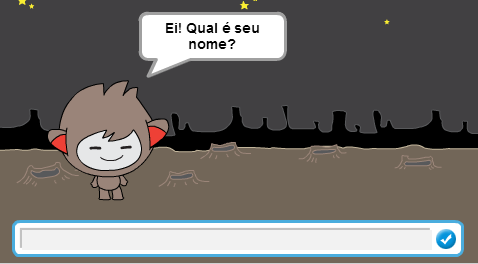
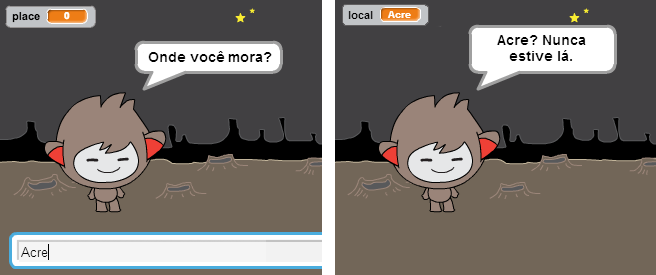
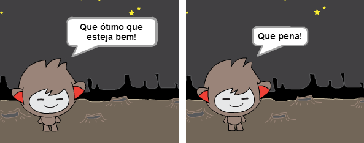
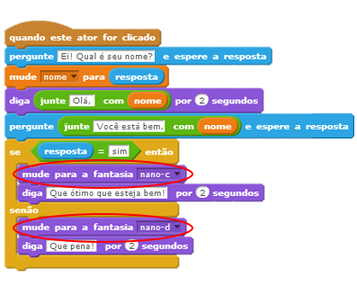
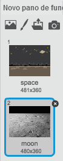
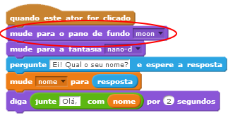
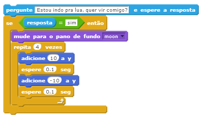

---
title: Robô Falante
level: Scratch 1
language: pt-BR
stylesheet: scratch
embeds: "*.png"
materials: ["Club Leader Resources/*"]
...

# Introdução { .intro }

Você aprenderá a programar o seu próprio robô falante! 

<div class="scratch-preview">
  <iframe allowtransparency="true" width="485" height="402" src="http://scratch.mit.edu/projects/embed/26762091/?autostart=false" frameborder="0"></iframe>
  
</div>

# Passo 1: Seu robô { .activity }

## Lista de atividades { .check }

+ Antes de começar a fazer seu robô, você precisa decidir sobre a personalidade dele: 
	+ Qual será seu nome?
	+ Onde ele vive?
	+ Ele é feliz? Sério? Divertido? Tímido? Amigável? 

+ Crie um novo projeto no Scratch e delete o ator do gato, assim o seu projeto fica vazio. Você pode entrar no editor online do Scratch através do endereço <a href="http://jumpto.cc/scratch-new">jumpto.cc/scratch-new</a>.

+ Escolha para o ator um desses personagens abaixo, adicione ao seu projeto: 

	

+ Escola um pano de fundo que combine com a personalidade do seu robô. Aqui temos um exemplo, mas o seu programa não precisa ser exatamente assim, sinta-se livre pra escolher outro!

	

## Salve seu projeto { .save }

# Passo 2: Um robô conversativo { .activity }

Agora que você tem um robô com personalidade, vamos programá-lo para conversar com você. 

## Lista de atividades { .check }

+ Clique no ator que representa o seu robô, adicione este código: 

	```blocks
		quando este ator for clicado
		pergunte [Ei! Qual o seu nome?] e espere a resposta
		diga [Que nome lindo!] por (2) segundos
	```

+ Clique no seu robô para testar. Depois que ele pergunta pelo seu nome, digite na caixa de texto que aparece na parte de baixo do palco. 

	

+ O seu robô apenas responde `Que nome lindo!` todas as vezes. Você pode personalizar a resposta do seu robô e utilizar o nome que foi colocado pelo usuário. Mude o código do robô, ele deverá ficar mais ou menos assim: 

	```blocks
		quando este ator for clicado
		pergunte [Ei! Qual o seu nome?] e espere a resposta
		diga <junte [Olá] com (resposta)> por (2) segundos

	```

	Para criar o último bloco, você precisará pegar um bloco verde `junte` {.blockoperators}, e arraste ele para dentro do bloco `diga` {.blocklooks}.

	

	Você pode mudar o texto `hello` que vem neste bloco para o que quiser, como fizemos com o `Olá`, e arrastar o bloco azul claro `resposta` {.blocksensing} (da secção de 'Sensores') para o lugar da palavra `world`.

	

+ Teste o seu novo programa. Ele funciona como esperado? Você consegue consertar os problemas encontrados? (Dica: tente adicionar alguns espaços em branco!)

+ Pode ser que você queira guardar o nome do usuário em uma variável, então você poderia utilizar ele novamente em outro momento no seu programa. Crie uma nova variável chamada `nome` {.blockdata}. Se você tiver esquecido como fazer isso, dê uma olhada no projeto "Balões" para relembrar.

+ A informação que você passa para o robô há está guardada nessa variável especial chamada `resposta` {.blocksensing}. Vá até o conjunto de blocos chamado Sensores e clique no bloco resposta, um marcador aparecerá. O valor atual em `resposta` {.blocksensing} deve então ser mostrado no canto superior esquerdo do palco. 

+ Uma vez que você tenha criado a nova variável, veja se o seu código para o robô está dessa forma: 

	```blocks
		quando este ator for clicado
		pergunte [Ei! Qual é o seu nome?] e espere a resposta
		mude [nome v] para (resposta)
		diga <junte [Olá] com (nome)> por (2) segundos
	```

+ Se você testar o seu programa novamente, você irá notar que a resposta será guardada na variável `nome` {.blockdata}, e é mostrada no canto superior esquerdo do palco. A variável `nome` {.blockdata} deve agora conter o mesmo valor que a variável `resposta` {.blocksensing}.

	

	Se você preferir não ver a variável no palco, você pode clicar em cima dela na aba 'Scripts' e desmarcar o sinal que está nela, assim ela não aparecerá mais.

## Salve seu projeto { .save }

## Desafio: Mais questões { .challenge }

Programe o seu robô para fazer outra pergunta. Você consegue guardar a nova resposta em uma variável?



## Salve seu projeto { .save }

# Passo 3: Tomando decisões { .activity }

Você pode programar o seu robô para decidir o que fazer baseado na resposta do usuário. 

## Lista de atividades { .check }

+ Vamos fazer o seu robô perguntar algo que tenha como resposta um `sim` ou um `não`. Aqui temos um exemplo, mas você pode criar a sua própria questão, se quiser: 

	```blocks
		quando este ator for clicado
		pergunte [Ei! Qual é seu nome?] e espere a resposta
		mude [nome v] para (resposta)
		diga <junte [Olá] com (nome)> por (2) segundos
		pergunte <junte [Você está bem, ] com (nome)> e espere a resposta
		se ((resposta) = [sim]) então
		   diga [Que ótimo que esteja bem!] por (2) segundos
		end
	```

	Repare que agora que você guardou o nome do usuário em uma variável, você pode usá-la quantas vezes quiser e da forma que desejar! 

+ Para testar o seu programa da maneira correta, você precisará testá-lo duas vezes - uma digitando `não` como resposta, e outra para o `sim`. Você deve apenas ouvir uma resposta do seu robô `se` {.blockcontrol} sua resposta for `sim`.

+ O problema com o seu robô agora é que ele não dá uma resposta quando o usuário responde `não`. Você pode arrumar isso, ao mudar o bloco `se` {.blockcontrol}  para um bloco `se/senão` {.blockcontrol}, então o seu código deve ficar assim: 

	```blocks
		quando este ator for clicado
		pergunte [Ei! Qual é seu nome?] e espere a resposta
		mude [nome v] para (resposta)
		diga <junte [Olá] com (nome)> por (2) segundos
		pergunte <junte [Você está bem, ] com (name)> e espere a resposta
		se ((resposta) = [sim]) então
		   diga [Que ótimo que esteja bem!] por (2) segundos
		senão
		   diga [Que pena!] por (2) segundos
		end
	```

+ Se você testar o seu código, você verá que agora você vcai receber uma resposta de qualquer maneira, seja a sua resposta `sim` ou `não`. Seu robô deve responder com  `Que ótimo que esteja bem!` quando você responde `sim`, mas deve responder um `Que pena!`, se você digitar qualquer coisa que não seja um `sim` (`senão` {.blockcontrol} tem um significado como `qualquer coisa que não seja isso que eu falei`).

	

+ Você pode colocar qualquer código dentro de um bloco `se` {.blockcontrol} ou `senão` {.blockcontrol}, não apenas código para fazer o seu robô falar. Por exemplo, você pode mudar a fantasia do seu robô para combinar com as respostas dadas. 

	Se você der uma olhada nas fantasias do seu robô, verá que ele tem mais de uma. Caso ele não tenha, você sempre pode adicionar mais! 

	

	Você pode usar essas fantasias como parte da resposta do seu robô. Adicione esse código: 

	

+ Teste o seu programa, você deve ver que o rosto do robô mudou dependendo da resposta que você dá pra ele. 

	

## Salve o seu projeto { .save }

## Desafio: Mais decisões { .challenge }

Programe o seu robô para fazer outra pergunta, algo com `sim` ou `não` como resposta. Você consegue fazer o seu robô responder a pergunta? 


## Salve seu projeto { .save }

# Passo 4: Mudando o local { .activity }

Você também pode programar o seu robô para mudar o local onde ele está. 

## Lista de atividades { .check }

+ Adicione outro pano de fundo ao seu palco, por exemplo, o pano de fundo da lua ('moon').

	

+ Você pode programar agora que o robô mude de lugar adicionando esse código: 

	```blocks
		pergunte [Estou indo pra lua, quer vir comigo?] e espere a resposta
		se ((resposta) = [sim]) então
		   mude para o pano de fundo [moon v]
		end
	```

+ Você também precisa ter certeza de que o robô está do lado de fora quando você começar a falar com ele. Adicione esse código ao topo do código do seu robô:

	

+ Teste seu programa, e responda `sim` quando perguntado se quer acompanhar o seu robô até a Lua. Vôcê deve ver o local onde ele está mudar. 

	

+ Seu robô muda de lugar se você digita `não`? E se você digitar `Eu não tenho certeza`?

+ Você também pode adicionar esse código dentro do seu bloco `se` {.blockcontrol}, isso fará o seu robô pular de cima para baixo quatro vezes se a resposta for `sim`:

	```scratch
		repita (4) vezes
		   adicione (10) a y
		   espere (0.1) seg
		   adicione (-10) a y
		   espere (0.1) seg
		end
	```

	

+ Teste seu código novamente. Seu robô pula quando a sua resposta é `sim`?

## Salve seu projeto { .save }

## Desafio: Faça seu próprio robô {.challenge}
Use o que você acabou de aprender para finalizar a criação do seu robô interativo. Algumas idéias pra melhorá-lo:


Assim que tiver acabado, chame seus amigos para conversar com seu robô! Eles gostaram da personalidade dele? Eles encontraram algum problema nele?

## Salve seu projeto { .save }
