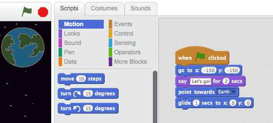
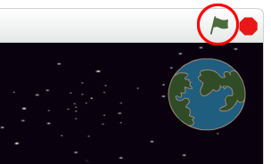
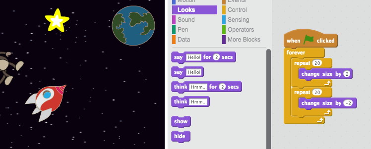

---
title: Perdido no espaço
level: Scratch 1
language: pt-BR
stylesheet: scratch
embeds: "*.png"
materials: ["Club Leader Resources/*"]
...

# Introdução { .intro }

Você vai aprender a programar sua própria animação!

<div class="scratch-preview">
  <iframe allowtransparency="true" width="485" height="402" src="http://scratch.mit.edu/projects/embed/26818098/?autostart=false" frameborder="0"></iframe>
  
</div>

# Passo 1: Animando uma nave espacial { .activity .new-page}

Vamos fazer uma nave espacial que voa em direção à Terra!

## Checklist do atividade { .check }

+ Iniciar um novo projecto Scratch, e apague o sprite do gato para que seu projeto está vazio. Você pode encontrar o editor do Scratch on-line em <a href="http://jumpto.cc/scratch-new">jumpto.cc/scratch-new</a>.

+ Adicionar sprites 'Spaceship' e 'Earth' para seu estrado. Você também deve adicionar o pano de fundo 'Stars' também. Isto é como seu estrado deve olhar:

	

+ Clique no seu novo sprite de nave espacial, e clique na presilha 'Costumes'.

	

+ Use a ferramenta da seta para selecionar a imagem. Em seguida, clique sobre a alça de rotação, e girar-la até imagem esteja em seu lado.

	

+ Adicione este código ao seu sprite nave espacial:

	

	Alterar os números nos blocos de código, de modo que o código é exactamente o mesmo como na imagem acima.

+ Se você clicar sobre os blocos de código para executar o código, você deve ver a falar nave espacial, girar e mover-se em direcção ao centro da estrado.

	

	A posição da tela `x:(0) y:(0)` {.blockmotion} é o centro do estrado. Uma posição como `x:(-150) y:(-150)` {.blockmotion} está localizado na parte inferior esquerda do estrado, e uma posição como `x:(150) y:(150)` {.blockmotion} está localizado na parte superior-direita.

	

	Se você precisa saber as coordenadas de uma posição no palco, mova o mouse para a posição desejada e anote as coordenadas, que são exibidos abaixo do estrado.

	

+ Experimente a sua animação, clicando na bandeira verde logo acima do estrado.

	

## Desafio: Melhorar a sua animação {.challenge}
Você pode alterar os números em seu código de animação, de modo que:
+ A nave espacial se move até que toque a Terra?
+ A nave espacial se move mais lentamente em direção à Terra?

Você precisará alterar os números de participação neste bloco:

```blocks
	glide (1) secs to x:(0) y:(0)
```

## Salve o seu projeto { .save }

# Passo 2: Animando usando loops { .activity .new-page }

Outra maneira de animar a nave espacial é dizer que ele se mova uma pequena quantidade, muitas vezes.

## Checklist do atividade { .check }

+ Apagar o bloco `glide` {.blockmotion} do seu código, clique com botão direito sobre o bloco e 'delete'. Você também pode apagar o código, arrastando-o fora da área de script, de volta para a área de blocos de código.

	

+ Uma vez que você tenha removido o seu código, adicione este código:

	

	O comando de bloco `repeat` {.blockcontrol} é usado para repetir algo muitas vezes, e também é conhecido como um __loop__.

+ Se você clicar na bandeira para experimentar este novo código, você verá que ele faz praticamente a mesma coisa que antes.

+ Você pode adicionar mais código ao seu loop, para fazer coisas interessantes. Adicione o bloco de código `change color effect by 25` {.blocklooks} no loop (a partir da secção 'Looks'), para alterar repetidamente a cor da nave espacial como ele se move:

	

+ Clique na bandeira para ver sua nova animação.

	

+ Você também pode fazer a sua nave espacial ficar mais menor à medida que se move em direção à Terra.

	

+ Testar sua animação. O que acontece se você clicar na bandeira de uma segunda vez? Faz a sua nave espacial começar o tamanho certo? Cvocê pode utilizar este bloco de código para corrigir sua animação:

	```scratch
	set size to (100) %
	```

## Salve o seu projeto { .save }

# Passo 3: macaco flutuante{ .activity .new-page }

Vamos adicionar um macaco para sua animação, que está perdido no espaço! 

## Checklist do atividade { .check }

+ Comece adicionando o sprite de macaco da biblioteca.

	

+ Se você clicar sobre o seu novo sprite de macaco e, em seguida, clique em 'Costumes', você pode editar a aparência de macaco. Clique na ferramenta 'Elipse', e desenhe um capacete branco de espaço ao redor da cabeça do macaco.

	

+ Agora clique 'scripts', e adicione este código no macaco, de modo que ele gira lentamente em um círculo para sempre:

	```blocks
		when FLAG clicked
		forever
		    turn right (1) degrees
		end
	```

	O bloco de código `forever` {.blockcontrol} é outro loop, mas que nunca termina.

+ Clique na bandeira para testar seu macaco. Você terá que clicar no botão stop (ao lado da bandeira) para acabar com essa animação.

	

# Passo 4: Bouncing Asteroids { .activity .new-page }

Vamos adicionar umas pedras do espaço en sua animação.

## Checklist do atividade { .check }

+ Adicionar um sprite 'rock' para a sua animação.

	

+ Adicione este código ao seu pedra, para fazê-lo saltar ao redor do estrado:

	```scratch
	when flag clicked
	point towards [Earth v]
	forever
		move (2) steps
		if on edge, bounce
	```

+ Clique na bandeira para testar seu pedra. Será que saltam ao redor do estrado?

# Passo 5: Estrelas que brilham { .activity .new-page }

Vamos combinar loops para fazer uma estrela brilhante.

## Checklist do atividade { .check }

+ Adicionar um sprite "star" para a sua animação

	

+ Adicione este código ao seu estrela:

	

+ Clique na bandeira para testar esta animação. O que este código faz? Bem, a estrela é feita ligeiramente maior 20 vezes, e em seguida, fez um pouco menor 20 vezes, de volta ao seu tamanho original. Estes 2 loops estão dentro de um loop `forever` {.blockcontrol}, assim que a animação está se repetindo.

## Salve o seu projeto { .save }

## Desafio: Faça a sua própria animação {.challenge}
Pare sua animação, e clique em 'File' e 'New', para começar um novo projeto.

Use o que você aprendeu neste projeto para fazer sua própria animação. Pode ser qualquer coisa que você quiser, mas tentar fazer a sua animação coincidir com a configuração. Aqui estão alguns exemplos:


## Salve o seu projeto { .save }

## Community Contributed Translation { .challenge .pdf-hidden }

This project was translated by Silvio Casagrande. Our amazing translation volunteers help us give children around the world the chance to learn to code.  You can help us reach more children by translating a Code Club project via [Github](https://github.com/CodeClub/curriculum_documentation/blob/master/contributing.md) or by getting in touch with us at hello@codeclubworld.
