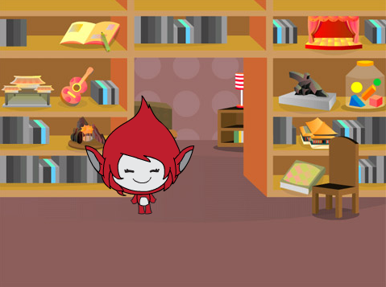
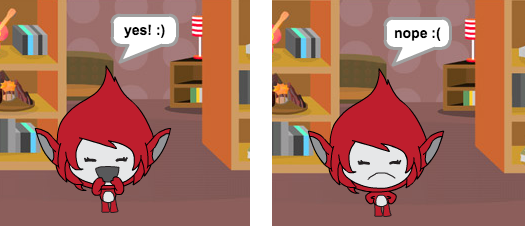

---
title: Jogo de calculo mental
level: Scratch 2
language: pt-PT
stylesheet: scratch
embeds: "*.png"
materials: ["Recursos Clube Líder/*"]
...

# Introdução { .intro }

Neste projeto vais aprender a criar um jogo de perguntas sobre a tabuada de multiplicar, no qual terás que conseguir responder um numero máximo de perguntas corretas como possas em 30 segundos.

<div class="scratch-preview">
  <iframe allowtransparency="true" width="485" height="402" src="http://scratch.mit.edu/projects/embed/42225768/?autostart=false" frameborder="0"></iframe>
  
</div>

# 1ºPasso: Criar as perguntas { .activity }

Começamos criando perguntas aleatórias as quais o jogador terá de responder.

## Lista de tarefas da atividade { .check }

+ Cria um novo projeto no Scratch, e apaga o objeto gato de maneira a que o projeto fique totalmente vazio. Podes encontrar o editor online do Scratch em <as href="http://jumpto.cc/scratch-new">jumpto.cc/scratch-new</a>.

+ Escolhe uma personagem e um fundo para o teu jogo. Podes escolher a que mais gostares! Exemplo:

	

+ Cria duas novas variáveis chamadas `numero 1` {.blockdata} e `numero 2` {.blockdata}. Estas variáveis guardaram os dois números que vão ser multiplicados.

	

+ Insere este código a tua personagem, para fixar estas duas variáveis num numero `aleatório ` {.blockoperators} entre 2 e 12.

	```blocks
		when flag clicked
		set [number 1 v] to (pick random (2) to (12))
		set [number 2 v] to (pick random (2) to (12))
	```

+ Depois podes pedir ao jogador que de uma resposta, e dizer lhe se esta correta ou não.

	```blocks
		when flag clicked
		set [number 1 v] to (pick random (2) to (12))
		set [number 2 v] to (pick random (2) to (12))
		ask (join (number 1)(join [ x ] (number 2))) and wait
		if <(answer) = ((number 1)*(number 2))> then
			say [yes! :)] for (2) secs
		else
			say [nope :(] for (2) secs
		end
	```

+ Experimenta o teu projeto duas vezes, na primeira escrevendo uma resposta correta e depois uma resposta incorreta.

+ Insere um bloco `por sempre` {.blockcontrol} a volta deste código, para que sejam feitas muitas perguntas ao jogador.

+ Cria um cronometro de conta decrescente no cenário, utilizando uma variável que se chame `tempo` {.blockdata}.

+ Experimenta novamente o teu projeto. Deveras de poder continuar a fazer perguntas até que o tempo acabe.

## Guarda o teu projeto { .save }

## Desafio: Mudar os trajes {.challenge}
Podes mudar o traje da tua personagem, para que se adaptem a resposta do jogador?



## Challenge: Desafio: Inserir pontuação {.challenge}
Podes inserir pontuação ao teu jogo? Podes somar um ponto por cada resposta correta.

## Guarda o teu projeto { .save }

# 2ºPasso: Jogadas múltiplas { .activity .new-page}

Vamos inserir um botão de 'Jogar' ao teu jogo, para que possas jogar muitas vezes.

## Lista de tarefas da atividade { .check }

+ Cria um novo objeto com um botão de 'Jogar', através do qual o jogador clicara nele para começar um novo jogo.

	

+ Insere este código ao teu novo botão.

	```blocks
		when flag clicked
		show

		when this sprite clicked
		hide
		broadcast [start v]
	```

	Este código mostra o botão de jogar quando o projeto começa. Ao carregar no botão, ele esconde se e envia uma mensagem para que o jogo comece.

+ Precisas de editar o código da tua personagem para que o jogo comece quando receber a mensagem de  `Iniciar` {.blockevents} , e não quando a bandeira for pressionada.

	Substitui o código `ao pressionar a bandeira verde` {.blockevents} por `ao receber Iniciar` {.blockevents}.

	

+ Faz clique na bandeira verde e depois pressiona o teu novo botão de jogo para o experimentares. O jogo só deve de começar ao fazeres clique encima do botão.

+ Já reparas te que o cronometro começa a contagem quando fazes clique na bandeira verde, e não quando começas o jogo?

	

	Podes solucionar este problema?

+ Faz clique no cenário, e substitui o bloco `parar todos` {.blockcontrol} por uma mensagem de `fim` {.blockevents} .

	

+ Agora podes inserir código ao botão para que ele volte a aparecer no fim de cada jogo.

	```blocks
		when I receive [end v]
		show
	```

+ Também terás de fazer que a tua personagem deixe de fazer perguntas no fim de cada jogo.

	```blocks
		when I receive [end v]
		stop [other scripts in sprite v]
	```

+ Prova o botão jogando varias vezes. Deveras de ver aparecer o botão de jogar depois de cada jogo.

	```blocks
		set [time v] to [10]
	```

+ Podes também fazer que a forma do botão mude quando lhe aproximes o rato.

	```blocks
		when flag clicked
		show
		forever
		if <touching [mouse-pointer v]?> then
			set [fisheye v] effect to (30)
		else
			set [fisheye v] effect to (0)
		end
		end
	```

	

## Guarda o teu projeto { .save }

## Desafio: Ecrã de inicio {.challenge}
Podes inserir outro fundo ao teu cenário, para que se converta no ecrã de inicio do jogo? Podes utilizar os blocos `ao receber inicio` {.blockevents} e `ao receber fim` {.blockevents} para mudar de um cenário para outro.

Também podes mostrar e esconder a tua personagem e o cronometro se utilizares estes blocos:

```blocks
show variable [time v]
```
```blocks
hide variable [time v]
```


## Guarda o teu projeto { .save }

# 3ºPasso: Inserir ícones { .activity .new-page}

Em vez de a tua personagem dizer `sim! :)` ou `não :(` ao jogador, vamos inserir alguns ícones para que ajudem o jogador a saber como lhe esta a correr.

+ Cria um novo objeto com o nome 'Resultado', que contenha o traje de 'certo' ou 'errado'.
	

+ Muda o código da tua personagem para que, em vez de dizer ao jogador como lhe esta a correr o jogo, lhe envie mensagens `certo` {.blockevents} and `errado` {.blockevents} .

	

+ Agora já podes usar estas mensagens para que apareçam os ícones de 'certo' e 'errado'. Insere este código ao teu novo objeto 'resultado'.

	

+ Experimenta de novo o teu jogo. Funciona bem?

	

+ Já reparas te que o código `ao receber correto` {.blockevents} e `ao receber errado` {.blockevents} é quase igual? Vamos criar uma função que te ajudara a fazer trocas no teu código mais facilmente.

	No objeto 'Resulto' faz clique em `mais blocos` {.blockmoreblocks}, e depois faz clique em 'criar um bloco'. Cria uma nova função chamada `animar` {.blockmoreblocks}.

	

+ Assim já poderás inserir o código da animação a tua nova função, e utilizar essa função duas vezes.

	

+ Se quiseres que o ícone de certo e o ícone de errado apareçam mais ou menos tempo, só precisaras de fazer uma mudança no teu código. Experimenta!!!

+ Em vez de só mostrar e esconder o certo e o errado poderias mudar a tua função de animação para que os ícones se desvaneçam.

	```blocks
		define [animate]
		set [ghost v] effect to (100)		
		show
		repeat (25)
			change [ghost v] effect by (-4)
		end
		hide
	```

## Guarda o teu projeto { .save }

## Desafio: Melhorar a animação {.challenge}
Podes melhorar a animação dos teus ícones? Poderias programar o certo e o errado para que aparecessem e desaparecessem progressivamente. Ou te poderias utilizar mais efeitos divertidos:


## Guarda o teu projeto { .save }

## Challenge: Desafio: Som e música {.challenge}
Podes inserir efeitos de som e música ao teu jogo? Por exemplo:

+ Reproduzir um som quando o jogador deia uma resposta certa ou errada;
+ Inserir um som de tic-tac ao cronometro de contagem decrescente;
+ Reproduzir um som quando o tempo do jogo acabe;

	```blocks
		play drum (10 v) for (0.1) beats
	```

+ Também poderias reproduzir musica continuamente num bloco.

## Guarda o teu projeto { .save }

## Desafio: Correr por 10 pontos {.challenge}
Podes mudar o teu jogo para que o jogador em vez de responder a tantas perguntas como possa em 30 segundos, veja quanto tempo demora a conseguir 10 respostas corretas?

Para fazer isto o único que precisas é de mudar o código do cronometro.

```blocks
	when I receive [start v]
	set [time v] to (30)
	repeat until <(time) = [0]>
		wait (1) secs
		change [time v] by (-1)
	end
	broadcast [end v]
```

## Guarda o teu projeto { .save }

## Desafio: Ecrã de instruções {.challenge}
Podes inserir um ecrã de instruções ao teu jogo no qual expliques ao jogador como se joga? Precisaras de um botão de 'instruções' e outro de 'fundo de cenário'.


Podes também precisar de um botão de 'Voltar' que te mostre novamente o menu principal.

```blocks
	broadcast [main menu v]
```

## Guarda o teu projeto { .save }
