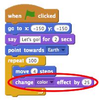
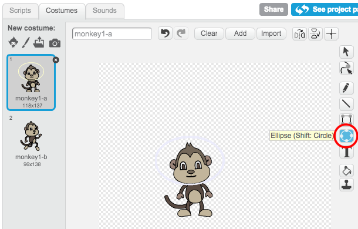

---
title: Lost in Space
level: Scratch 1
language: ro-RO
stylesheet: scratch
embeds: "*.png"
materials: ["Club Leader Resources/*.*"]
...

# Introducere { .intro }

Vei învăța cum să faci propria ta animație!

<div class="scratch-preview">
  <iframe allowtransparency="true" width="485" height="402" src="http://scratch.mit.edu/projects/embed/26818098/?autostart=false" frameborder="0"></iframe>
  
</div>

# Pasul 1: Animează o navetă spațială { .activity .new-page}

Să facem o navetă spațială care navighează spre Pământ!

## Lista de activități { .check }

+ Pornește un nou proiect Scratch și șterge sprite-ul pisică astfel încât proiectul tău să fie gol. Poți găsi editorul online de Scratch la <a href="http://jumpto.cc/scratch-new">jumpto.cc/scratch-new</a>.

+ Adaugă sprite-urile 'Spaceship' (naveta spațială) și 'Earth' (Pământ) pe scena ta. Ar trebui să adaugi și fundalul 'Stars' (stele) la scenă. Scena ta ar trebui să arate așa:

	

+ Fă click pe noul tău sprite naveta spațială, apoi fă click pe tab-ul 'Costumes'.

	

+ Folosește unealta săgeată (arrow tool) pentru a selecta imaginea. Apoi fă click pe mânerul circular și rotește imaginea până ajunge în poziție orizontală.

	

+ Adaugă acest cod la sprite-ul tău naveta spațială:

	

	Schimbă numerele în blocurile de cod, astfel încât codul să fie exact ca în imaginea de deasupra.

+ Dacă faci click pe blocurile de cod pentru a executa codul, ar trebui să vezi naveta spațială vorbind, întorcându-se și mișcându-se către centrul scenei.

	

	Poziția de pe ecran `x:(0) y:(0)` {.blockmotion} este centrul scenei. O poziție ca `x:(-150) y:(-150)` {.blockmotion} este spre partea din stânga-jos a scenei, iar o poziție ca `x:(150) y:(150)` {.blockmotion} este aproape de colțul din dreapta sus.

	

	Dacă vrei să afli coordonatele unei poziții de pe scena, mută cursorul mouse-ului în poziția pe care o dorești și notează coordonatele, care sunt afișate sub scenă.

	

+ Pornește animația, făcând click pe steagul verde situat chiar deasupra scenei.

	

## Provocare: Îmbunătățește animația {.challenge}
Poți modifica numerele în codul animației tale, astfel încât:
+ naveta spațială se mișcă până atinge Pământul?
+ naveta spațială se mișcă mai încet spre Pământ?

Va trebui să modifici numerele în acest bloc de cod:

```blocks
	glide (1) secs to x:(0) y:(0)
```

## Salvează proiectul { .save }

# Pasul 2: Animați folosind bucle { .activity .new-page }

Un alt mod de a anima naveta spațială este prin a o instrui să se miște în pași mici, de multe ori.

## Lista de activități { .check }

+ Șterge blocul `glide` {.blockmotion} din codul tău, făcând click dreapta pe bloc, iar apoi click pe 'delete'. De asemenea poți șterge cod trăgându-l afara din zona de script, înapoi în zona blocurilor de cod.

	

+ Odată ce ai șters codul, adaugă acest cod în locul lui:

	

	Blocul `repeat` {.blockcontrol} este folosit pentru a repeta o acțiune de multe ori și este cunoscut sub numele de __bucla__.

+ Dacă faci click pe steag pentru a încerca acest nou cod, vei observa că face aproximativ aceleași acțiuni ca înainte.

+ Poți adauga mai mult cod în bucla ta, pentru a face lucruri interesante. Adaugă blocul `change color effect by 25` {.blocklooks} în buclă (din sectiunea 'Looks'), pentru a schimba culoarea navetei spațiale în mod repetat în timp ce se mișcă:

	

+ Fă click pe steag pentru a vedea noua ta animație.

	

+ Poți și să faci naveta să se micșoreze în timp ce se mișcă spre Pământ.

	

+ Testează animatia. Ce se întâmplă dacă faci click pe steag a doua oară? Naveta pornește cu dimensiunea corectă? Poți folosi acest bloc să corectezi animația:

	```scratch
	set size to (100) %
	```

## Salvează proiectul { .save }

# Pasul 3: Maimuța Plutitoare { .activity .new-page }

Hai să adaugam o maimuta animației tale, care e pierduta în spatiu! 

## Lista de activități { .check }

+ Începe prin a adăuga sprite-ul monkey (maimuța) din librărie.

	

+ Dacă faci click pe noul 'sprite' maimuță și pe urmă pe 'Costumes'(costume), poți schimba cum arată maimuța. Apasă pe unealta 'Elipse' și desenează o cască spațiala albă în jurul capului maimuței.

	

+ Acum fă click pe 'Scripts' și adaugă acest cod maimuței, astfel încât ea să se învârtă încet, în cerc, pentru todeauna :

	```blocks
		when FLAG clicked
		forever
		    turn right (1) degrees
		end
	```

	Blocul `forever` {.blockcontrol} este alta buclă, dar de data aceasta una care nu se termină.

+ Fă click pe steag pentru a-ți testa maimuța. Va trebui să dai pe click pe butonul de stop (lângă steag) ca să oprești animația.

	

# Pasul 4: Asteroizi Săltăreți { .activity .new-page }

Hai să adăugăm niște roci spațiale plutitoare animației tale.

## Lista de activități { .check }

+ Adaugă un sprite 'rock' (piatra) animației tale.

	

+ Adaugă acest cod asteroidului tău ca să îl faci să salte (bounce) în jurul scenei:

	```scratch
	when flag clicked
	point towards [Earth v]
	forever
		move (2) steps
		if on edge, bounce
	```

+ Fă click pe steag să îți testezi asteroidul. Saltă în jurul scenei ?

# Pasul 5: Stele strălucitoare { .activity .new-page }

Hai să combinăm bucle ca să creem o stea strălucitoare.

## Lista de activități { .check }

+ Adaugă un sprite 'star' (stea) animației tale

	

+ Adaugă acest cod stelei tale:

	

+ Fă click pe steag să testezi această animație pentru stea. Ce face acest cod? Păi, această stea este mărită puțin de 20 de ori, și apoi este micșorată puțin de 20 de ori, înapoi la dimensiunea originală. Aceste 2 bucle sunt înăuntrul buclei `forever` {.blockcontrol}, astfel încât animația se tot repetă.

## Salvează proiectul { .save }

## Provocare: Creează animația ta {.challenge}
Oprește animația spațială, și apoi fă click pe 'File' și pe urmă pe 'New', pentru a începe un nou proiect.

Folosește ce ai învățat în acest proiect pentru a crea propria ta animație. Poate să fie orice îți place, dar încearcă să îți faci animația să corespundă contextului. Aici ai câteva exemple:


## Salvează proiectul { .save }

## Community Contributed Translation { .challenge .pdf-hidden }

This project was translated by Catalin Dragomir. Our amazing translation volunteers help us give children around the world the chance to learn to code.  You can help us reach more children by translating a Code Club project via [Github](https://github.com/CodeClub/curriculum_documentation/blob/master/contributing.md) or by getting in touch with us at hello@codeclubworld.
