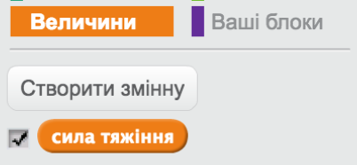
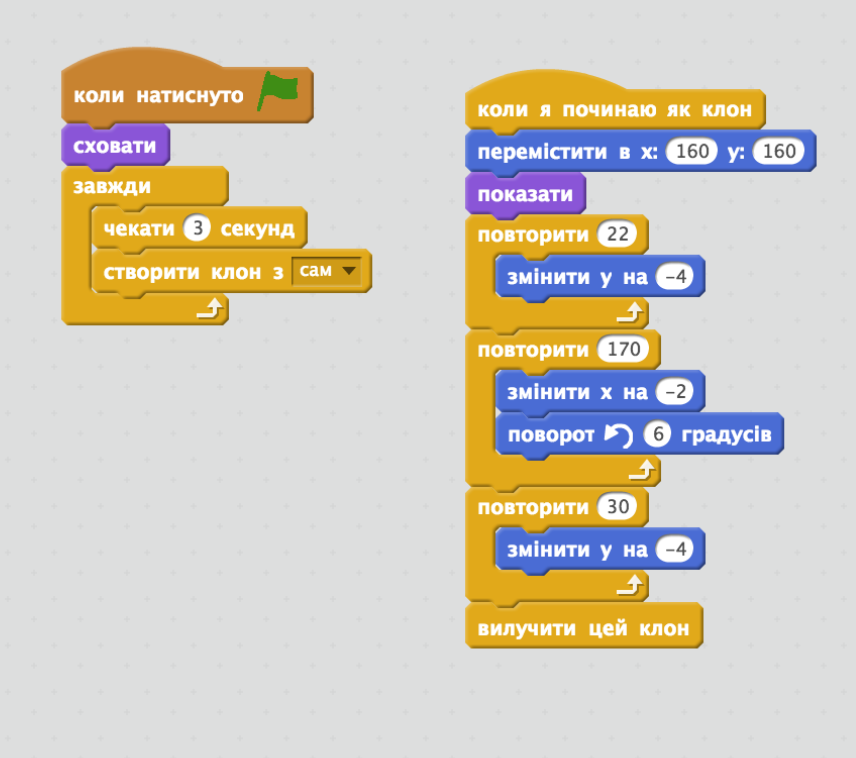
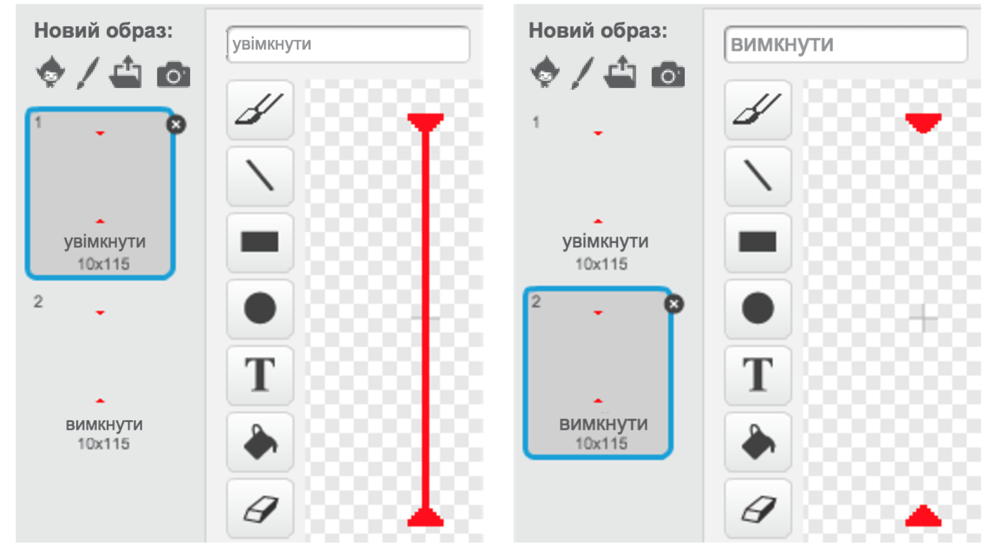
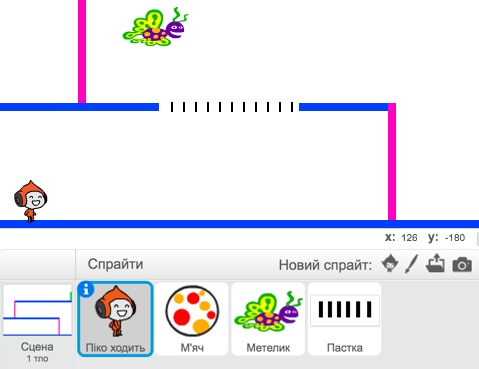
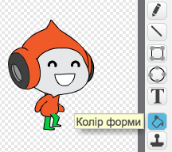

---
title: Викидайли
level: Scratch 2
language: uk-UA
stylesheet: scratch
embeds: "*.png"
materials: ["Club Leader Resources/*","Project Resources/*"]
...

# Передмова {.intro}

В цьому проекті ви дізнаєтеся, як створити гру-платформер, в якій потрібно буде дістатися кінця рівня ухиляючись від рухомих куль.

<div class="scratch-preview">
  <iframe allowtransparency="true" width="485" height="402" src="http://scratch.mit.edu/projects/embed/39740618/?autostart=false" frameborder="0"></iframe> 
</div>

# Крок 1: Рух персонажа {.activity}

Почнімо зі створення персонажа, який зможе переміщатися ліворуч й праворуч, а також підніматися вгору по стовпах.

## Завдання для виконання {.check}

+ Створіть новий проект у Скретч та видаліть спрайт кота, так щоб проект став пустим. Онлайн Скретч-редактор знаходиться за посиланням [jumpto.cc/scratch-new](http://jumpto.cc/scratch-new).

+ Для цього проекту вам необхідна тека "Ресурси проекту", яка містить усі зображення, що можуть знадобитися. Переконайтеся, що ви знайшли цю теку, а якщо ні — запитайте вчителя.
    
    

+ Використайте для фону малюнок "background.png", або намалюйте власний! Якщо ви вирішите намалювати власний, переконайтеся, що стовпи та платформи будуть різних кольорів, і що в кінці шляху будуть двері (або щось подібне). Нижче показано, як проект має виглядати:
    
    

+ Додайте новий спрайт, який буде вашим персонажем. Буде краще, якщо ви виберете спрайт з декількома образами, щоб виглядало ніби персонаж ходить.
    
    

+ Ми будемо використовувати клавіші зі стрілками, щоб примусити персонажа рухатись. Коли ви натискаєте стрілку вправо, ви хочете, щоб персонаж повертався праворуч, робив декілька кроків і змінював образ:
    
    ```blocks
    коли натиснуто ⚑
    завжди
        if <key [стрілка вправо v] pressed? > then
            повернути в напрямку (90 v)
            перемістити на (3) кроків
            наступний образ
        end
    end
```

+ Перевірте свого персонажа, натиснувши на прапор і утримуючи клавішу зі стрілкою вправо. Ваш гравець рухається праворуч? Чи виглядає, що ваш персонаж іде?
    
    

+ Щоб перемістити персонажа ліворуч, потрібно додати ще один блок `Якщо` {.blockcontrol} всередині циклу `завжди` {.blockcontrol}, він перемістить вашого персонажа ліворуч. Не забудьте перевірити, чи працює ваш новий код!

+ Щоб піднятися на стовп, ваш персонаж має повільно рухатись вверх, кожного разу при натисканні клавіші зі стрікою вверх, а також торкатися правильного кольору. Додайте цей код до циклу вашого персонажа `назавжди` {.blockcontrol}:
    
    ```blocks
    if < <key [стрілка вгору v] pressed?> and <touching color [#FFFF00] ?> > then
        змінити y на (4)
    end
```

+ Перевірте свого персонажа - чи можете ви дістатися до жовтих стовпів і дійти до кінця рівня?
    
    

## Збережіть свій проект {.save}

## Виклик: Завершення рівня {.challenge}

Додаймо більше коду до вашого персонажа, щоб він щось говорив `якщо` {.blockcontrol} він потрапляє до коричневих дверей?


## Збережіть свій проект {.save}

# Крок 2: Гравітація і стрибки {.activity}

Зробімо рух персонажа більш реалістичним, додавши гравітацію та навчивши його стрибати.

## Завдання для виконання {.check}

+ Ви могли помітити, що ваш персонаж може виходити з платформи в повітря. Спробуйте вийти з платформи і подивитися, що відбудеться.
    
    

+ Щоб це виправити додаймо гравітацію до гри. Створіть нову змінну під назвою `gravity` {.blockdata}. Якщо ви захочете то можете приховати цю змінну з вашої сцени.
    
    

+ Додати цей новий блок коду, який встановлює гравітацію до від'ємного числа, а потім використовує його, щоб постійно змінювати Y-координату для вашому персонажу.
    
    ```blocks
    коли натиснуто ⚑
    встановити [gravity v] в [-4]
    завжди
       змінити y на (gravity)
    end
```

+ Клацніть на прапор і перетягніть персонажа до верхньої частини сцени. Що відбувається? Гравітація працює як ви очікували?
    
    

+ Гравітація не повинна пересувати персонажа через платформу, або стовп! Додайте блок `Якщо` {.blockcontrol} до коду, щоб гравітація могла працювати тільки коли ваш персонаж знаходиться в повітрі. Код гравітації тепер має виглядати наступним чином:
    
    ```blocks
    коли натиснуто ⚑
    встановити [gravity v] в [-4]
    завжди
       if < not < <touching color [#0000FF] ?> or <touching color [#FFFF00] ?> > > then
            змінити y на (gravity)
        end
    end
```

+ Перевірте гравітацію ще раз. Чи зупиняється ваш персонаж, коли він попадає на платформу, або стовп? Ви можете вийти за межі платформ до рівня нижче?
    
    

+ Також зробімо, щоб персонаж стрибав, коли ви натискаєте клавшу пробілу. Один дуже простий спосіб зробити це, полягає в переміщенні вашого персонажа вверх кілька разів, за допомогою цього коду:
    
    ```blocks
    коли натиснуто клавішу [пропуск v]
    повторити (10)
       змінити y на (4)
    end
```

Так як гравітація постійно штовхає персонажа вниз на 4 пікселі, вам потрібно вибрати число більше ніж 4 у блоці `змінити y (4)` {.blockmotion}. Змінюйте цю цифру допоки не станете задоволені висотоб на яку персонаж стрибає.

+ Коли ви перевірите цей код, ви помітите, що все працює, але рухи не надто гладкі. Щоб стрибки стали рівномірнішими, вам потрібно перемістити персонаж на менші і менші кількості цифр, до того моменту, поки персонаж взагалі перестане стрибати.

+ Для цього створіть ще одну змінну з ім'ям `висота стрибка` {.blockdata}. Знову ж таки, можете приховати цю змінну, якщо забажаєте.

+ Видаліть код стрибків, який ви додали до персонажа і замініть його на цей код:
    
    ```blocks
    коли натиснуто клавішу [пропуск v]
    встановити [jump height v] в [8]
    repeat until < (jump height) = [0] >
        змінити y на (jump height)
        змінити [jump height v] на (-0.5)
    end
```

Цей код переміщає персонажа на 8 пікселів, а потім на 7,5 пікселів, потім на 7 пікселів і так далі, поки ваш персонаж не завершить стрибки. Це робить стрибки більш рівномірними.

+ Змініть початкове значення змінної `висота стрибка` {.blockdata} і перевіряйте її до тих пір, не будете задоволені висотою на яку стрибає персонаж.

## Збережіть свій проект {.save}

## Виклик: Реалістичніші стрибки {.challenge}

Ваш персонаж може стрибати кожного разу, коли ви натискаєте пробіл, навіть якщо він вже у повітрі. Ви можете це перевірити, просто утримуючи клавішу пробілу. Чи можемо це виправити, таким чином, що персонаж зміг стрибати тільки в тому випадку, `Якщо` {.blockcontrol} він торкається синьої платформи?

## Збережіть свій проект {.save}

# Крок 3: Уникнення куль {.activity.new-page}

Тепер, коли у вас є персонаж, що вміє рухатись, додаймо кілька м'ячів, яких він буде уникати.

## Завдання для виконання {.check}

+ Створіть новий спрайт м'яча. Ви можете вибрати будь-який м'яч, який вам сподобається.
    
    

+ Змініть розмір м'яча, так щоб персонаж міг через нього перестрибнути. 
    
    

+ Додайте цей код до вашого м'яча:
    
    
    
    Цей код створює кожні три секунди новий клон м'яча. Кожен новий клон рухається уздовж верхньої платформи.

+ Натисніть на прапорець, щоб перевірити це.
    
    

+ Допишіть код вашого м'яча, так щоб вони переміщалися через усі три платформи.
    
    

+ І, нарешті, вам знадобиться код для випадку, коли персонаж стикається з м'ячем. Додайте цей код до спрайту м'яча:
    
    ```blocks
    коли я починаю як клон
    завжди
       if < touching [Pico walking v] ? > then
           оповістити [hit v]
        end
    end
```

+ Також потрібно додати код до персонажа для його повернення на початок гри після зіткнення:
    
    ```blocks
    коли одержую [hit v]
    повернути в напрямку (90 v)
    перемістити в x:(-210) y:(-120)
```

+ Перевірте свого персонажа і подивіться, чи він повертається на початок, коли вдаряється з м'ячем.

## Збережіть свій проект {.save}

## Виклик: Випадкові м'ячі {.challenge}

Усі м'ячі, яких персонаж має уникати, виглядають однаково і завжди з'являються кожні три секунди. Чи можете ви вдосконалити їх, так щоб вони:

+ не виглядали однаково?
+ з'являлися після випадкового проміжку часу?
+ були випадкового розміру?


## Збережіть свій проект {.save}

# Крок 4: Лазери! {.activity.new-page}

Зробімо вашу гру трохи складнішою, додавши лазери!

## Завдання для виконання {.check}

+ Додайте новий спрайт до гри, і назвіть його "Лазер". Він повинен містити два образи: "вимкнений" та "ввімкнений".
    
    

+ Розмістіть новий лазер де завгодно між 2 платформами.
    
    

+ Додайте код до лазера, щоб можна було перемикатися між 2 виглядами.
    
    ```blocks
    коли натиснуто ⚑
    завжди
        змінити образ на [Увімкн v]
        чекати (2) секунд
        змінити образ на [Вимк v]
        чекати (2) секунд
    end
```

Якщо ви бажаєте, ви можете `чекати` {.blockcontrol} `випадковий` {.blockoperators} проміжок часу між зміною виглядів.

+ Врешті, додайте код до лазера, так щоб з'являлось повідомлення "поранений", тоді коли лазер торкнеться персонажа. Цей код буде таким же, як і код, що ви додали до спрайта з м'ячем.
    
    Не потрібно додавати більше коду вашому персонажу - вони вже знають, що робити, коли вдаряються у перешкоду!

+ Перевірте гру і подивіться, чи можете ви оминути лазер. Змініть час, який треба `чекати` {.blockcontrol} в коді, якщо уникнути лазера дуже легко, або дуже складно.

## Виклик: Більше перешкод {.challenge}

Якщо ви думаєте, що ваша гра все ще занадто легка, ви можете додати більше перешкод на даному рівні. Можете додати все що завгодно, але ось деякі ідеї:

+ Літаючий метелик-вбивця;
+ Платформи, які з'являються і зникають;
+ Падіння тенісних м'ячів, яких слід уникати.



Можна навіть створити більше одного фону і переходити на наступний рівень, коли ваш персонаж досягне коричневих дверей:

```blocks
    if <touching color [#714300] ?> then
        змінити тло на [наступне тло v]
        перемістити в x:(-210) y:(-120)
        чекати (1) секунд
    end
```

## Збережіть свій проект {.save}

## Виклик: Вдосконалюємо гравітацію {.challenge}

Існує ще одна невелика помилка у вашій грі: гравітація не тягне персонажа до низу, коли *будь-яка* його частина торкається синьої платформи - навіть голова! Ви можете це перевірити, рухаючись по стовпу вгору, а потім ліворуч.


Як цю помилку виправити? Для цього вам потрібно дати персонажу різні кольорові штани (для *всіх* виглядів)...



.. а потім замінити код:

```blocks
    < доторкнутися кольору [#0000FF]? >
```

на:

```blocks
    < колір [#00FF00] торкається [#0000FF]? >
```

Не забудьте перевірити чи працюють покращення і переконайтеся, що помилка виправлена!

## Збережіть свій проект {.save}

## Виклик: Більше життів {.challenge}

Чи можете ви дати гравцю 3 `життя` {.blockdata}, а не просто відправляти назад на початок гри кожного разу? Нижче описано, як ваша гра може працювати:

+ Ваш гравець починає з 3 життів;
+ Кожного разу, коли гравець отримує удар, одне життя втрачається, і він повертається на початок;
+ Якщо вже немає життів, гра закінчується.

## Збережіть свій проект {.save}